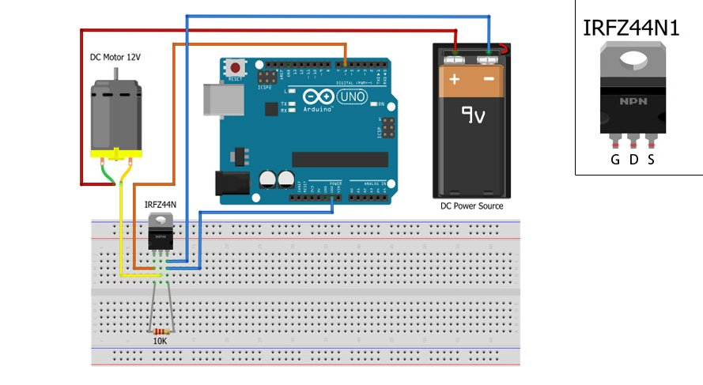

# MOSFET

Ima tri izvoda: 
1. gate (kapija)
2. drain (odvod) 
3. source (izvor)

## Primer: MOSFET (IRFZ44N, n kanalni) kao prekidač

Na osnovu signala iz Arduina, MOSFET uključuje/isključuje drugo kolo, koje se sastoji od baterije i potrošača.

- Kapija (*gate*) mosfeta se povezuje na izlazi pin Arduina. Ako ima napona, tranzistor pušta struju, ako nema ne pušta.
- Odvod (*drain*) mosfeta se povezuje na minus potrošača.
- Izvor (*source*) mosfeta se povezuje na minus baterije i uzemljenje arduina.
- Plus baterije se povezuje na plus potrošača.

Preporučljivo je povezati otpornik od 10k na kapiju mosfeta, da se ukloni šum signala.

Ako se koristi analogni izlaz arduina, mosfet može služiti kao potenciometar.

Glavni problem MOSFET-a je što ih lako može oštetiti statički elektricitet.
