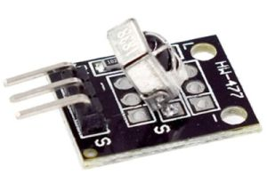
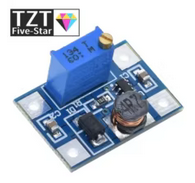

# Arduino moduli

Snaga Arduina leži u bogatoj ponudi **modula** koje možemo jednostavno povezati i koristiti. U nastavku su objašnjeni najpoznatiji Arduino moduli.

## Senzorski moduli

### Detektor rastojanja (ultrazvučni senzor HC-SR04)

Ultrazvučni senzor meri rastojanje pomoću odjeka zvučnog talasa. Koristi se za robote, parking asistente i slično.

### Senzor kretanja (PIR senzor)

Senzor pokreta, poznat kao PIR (pasivni infracrveni) senzor, je zasnovan na infracrvenom zračenju. Najčešće se koristi u alarmima protiv provalnika ili osvetljenju koje se pali na pokret.

### Senzor zvuka (KY-037, KY-38)

Visokosenzitivni mikrofon koji detektuje zvučne talase i omogućava detekciju zvuka.

### Senzor svetla (fotosenzor)

 

Arduino modul za detekciju svetla se pravi pomoću fotootpornika (*light dependent resistor*, LDR). Fotootpornik menja otpor zavisno od jačine svetla – što je više svetla, otpor je manji. Arduino meri napon na fotootporniku preko analognog pina i tako detektuje je li okolina svetla ili tamna.

### Senzor vlažnosti tla (YL-69, HL-69)

Senzor vlažnosti tla meri koliko je zemlja suva ili vlažna. Modul se sastoji od metalnih sondi koje idu u zemlju i pločice sa elektronikom (komparator + potenciometar) koja daje digitalni i analogni izlaz. Merenje se vrši tako što se dve metalne sonde zabodu u zemlju - što više vlage to je manji otpor između njih, pa Arduino očitava veći napon.

### Senzor temperature (DHT11 / DHT22)

 

Ovi senzori mere temperaturu i vlažnost vazduha. DHT11 je jednostavniji i manje precizan, dok DHT22 pruža širi opseg i veću tačnost.

## Komunikacioni moduli

### SIM modul (SIM800L)

GSM/GPRS modul SIM800L, sa ugrađenom PCB antenom i slotom za SIM karticu, omogućava Arduinu da šalje i prima SMS poruke, pravi pozive i pristupa internetu preko mobilne mreže.

### Wifi modul (ESP8266)

ESP8266 je wifi modul koji omogućava povezivanje Arduina na internet.

ESP8266 može pokrenuti web server koji nam omogućava da preko Wi-Fi mreže palimo i gasimo LED diode i druge uređaje.

### Infracrveni prijemnik (KY-022)

 

Infracrveni (IR) prijemnik služi za dekodiranje signala sa daljinskog upravljača.

### Bluetooth modul (HC-05, HC-06)

Bluetooth modul služi za bežičnu komunikaciju sa računarom ili mobilnim telefonom. Često se koristi za kontrolu robota ili drugih uređaja.

### Radio modul (NRF24L01)

Radio modul omogućava komunikaciju između dva ili više Arduina na daljinama do ~100 metara. Mikrokontroleri mogu da razmenjuju bilo kakve podatke: vrednosti senzora, komande za LED/motor, status uređaja, tekstualne poruke...

Na primer, jedan Arduino može slati očitanu vlažnost tla, a drugi primati i puštati navodnjavanje kada vlažnost padne ispod određene granice.

## Izlazni moduli

### Buzzer

 

Buzzer je mini zvučnik koji se priključuje direktno na matičnu ploču računara i koristi za BIOS zvuke (bipove). 

U Arduino projektima može poslužiti kao jednostavan zvučni izlaz.

### LCD modul (IIC/I2C 1602)

Ovaj modul je LCD ekran sa 16×2 karaktera (1602) sa pozadinskim osvetljenjem u plavoj ili zelenoj boji. Povezuje se preko interfejsa koji koristi samo dva pina (SDA i SCL) umesto klasičnih 6–8 pinova za paralelni priključak. Idealan je za prikaz teksta i osnovnih podataka u Arduino projektima.

Prednosti I2C verzije:

* Manje žica, jednostavnija veza
* Mogućnost povezivanja više I2C uređaja na istu magistralu
* Lakša kontrola sa softverskih biblioteka poput `LiquidCrystal_I2C`

Link: https://www.aliexpress.com/item/33062782229.html

### Tekući LED modul (NE555 + CD4017)

Tekući LED modul kombinuje NE555 tajmer i CD4017 brojač da bi pravio sekvencijalno treptanje LED dioda. Obično se koristi za vizualni efekat “tekuće vode” ili pokretnih svetlosnih traka.

Link: https://www.aliexpress.com/item/33006209085.html

### Relej

Relejni modul je elektronski prekidač kojim Arduino sa naponom od 5 V može da uključi ili isključi uređaje koji rade na 220 V, poput sijalica ili pumpi za vodu.

Link: https://www.aliexpress.com/item/32649659086.html

### Upravljač motora

 

Upravljač motora (*motor driver*) omogućava upravljanje DC motorima i stepper motorima. Može da kontroliše smer i brzinu rotacije.

Koristi se u robotici i vozilima na daljinsko upravljanje.

### Upravljač steper motora (A4988)

Specijalizovani upravljač steper motora (A4988) poznat je po preciznoj kontroli koraka. Obično se koristi za robote, 3D štampače i CNC mašine.

## Napajanje

### Podesivi regulator napajanja (dizač/spuštač)

Podesivi DC-DC konverter može povećavati (step-up) ili smanjivati (step-down) napon između 1 V i 24 V sa ulaza od 5 V (npr. USB). Koristi potenciometar za podešavanje izlaznog napona i omogućava stabilno napajanje različitih uređaja, uključujući LED diode i Arduino module.

Povećanje napona se postiže korišćenjem step-up (boost) konverzije. U suštini, električni impuls se transformiše tako da izlazni napon bude veći od ulaznog, dok struja proporcionalno opada.

Link: https://www.aliexpress.com/item/4000544635931.html

### Podesivi linearni regulator napajanja (LM317)

Podesivi modul napajanja koristi LM317 integrisani regulator i omogućava kontinuirano podešavanje izlaznog napona od 1,25 V do 12 V pri struji do 1 A. Modul je jednostavan za korišćenje – samo se dva spoljašnja otpornika koriste za podešavanje napona, a dodatni potenciometar omogućava fino podešavanje. LM317 ima zaštitu od preopterećenja i sigurnosne zone, a linearnom regulacijom obezbeđuje stabilan izlaz i pri promenama opterećenja.

Specifikacije:

* Ulazni napon: AC ≤ 17 V, DC ≤ 25 V
* Izlazni napon: 1,25 V – 12 V, kontinuirano podesiv
* Izlazna struja: do 1 A

Kod linearnog regulatora poput LM317 izlazni napon je uvek manji od ulaznog.

Link: https://www.aliexpress.com/item/1005002225497691.html

### Podesivi dizač napona (DD06AJSB)

Ovo je podesivi step-up (boost) konverter koji ulazni napon od 3,3 V, 3,7 V ili 5 V može povećati na izlazni napon od 6 V, 9 V ili 12 V. Modul služi za stabilno napajanje uređaja koji zahtevaju veći napon od izvora.

Link: https://www.aliexpress.com/item/32789859292.html

### Podesivi dizač napona (SX1308)

Podesivi dizač napona (SX1308) je step-up modul koji može povećati ulazni napon od 2–24 V na izlazni napon od 2–28 V pri struji do 2 A. Koristi se za napajanje Arduino projekata i drugih uređaja koji zahtevaju viši napon od izvora.

### Punjač telefonskih baterija (TP4056)

 

To je mali modul za punjenje litijum-jonskih (Li-Ion) i litijum-polimerskih (Li-Po) baterija preko micro USB porta, zasnovan na čipu TP4056. Omogućava punjenje strujom do 1 A. Ima ugrađenu zaštitu od prepunjavanja, prekomernog pražnjenja i kratkog spoja. 

Često se koristi u prenosnim i bežičnim Arduino projektima.

Link: https://www.aliexpress.com/item/1005001557483971.html

## Memorijski moduli

### Čitač Micro SD kartica

Modul za čitanje Micro SD kartica, sa SPI interfejsom, omogućava Arduinu da čita i zapisuje podatke na standardnu microSD karticu. Koristi se u data logovima i projektima gde se podaci prikupljaju i čuvaju duže vreme.
