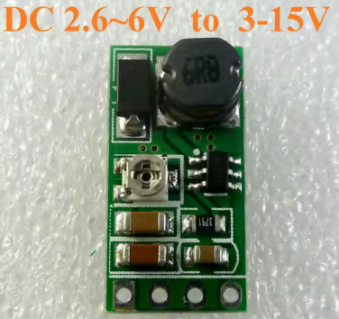

# Arduino moduli

Snaga Arduina leži u bogatoj ponudi **modula** koje možemo jednostavno povezati i koristiti. U nastavku su objašnjene glavne grupe modula i pojedinačni primeri.

## Senzorski moduli

### DHT11 / DHT22

Ovi senzori mere temperaturu i vlažnost vazduha. DHT11 je jednostavniji i manje precizan, dok DHT22 pruža širi opseg i veću tačnost.

### HC-SR04

Ultrazvučni senzor koji meri rastojanje pomoću odjeka zvučnog talasa. Koristi se za robote, parking asistente i pametne merni sisteme.

### PIR senzor

Senzor pokreta zasnovan na infracrvenom zračenju. Najčešće se koristi u alarmima i osvetljenju koje se pali na pokret.

### KY-037 Mikrofon

Visokosenzitivni mikrofon koji detektuje zvučne talase i omogućava detekciju zvuka.

### KY-026 IR senzor plamena

Senzor koji detektuje infracrveno zračenje plamena u opsegu od 760 nm do 1100 nm.

### KY-010 Senzor svetlosne barijere

Senzor koji detektuje prekid svetlosnog snopa između emitera i detektora.

### Water Level senzor

Senzor za detekciju nivoa vode ili curenja, sa analognim i digitalnim izlazom.

## Komunikacioni moduli

### SIM modul (SIM800L)

GSM/GPRS modul SIM800L, sa ugrađenom PCB antenom i slotom za SIM karticu, omogućava Arduinu da šalje i prima SMS poruke, pravi pozive i pristupa internetu preko mobilne mreže.

### ESP8266 / ESP32

Wi-Fi moduli koji omogućavaju povezivanje Arduina na internet. ESP32 dodatno ima Bluetooth i više procesorske snage.

### HC-05 / HC-06

Bluetooth moduli za bežičnu komunikaciju sa računarom ili mobilnim telefonom. Često se koriste u kontrolisanju robota ili daljinskih uređaja.

### NRF24L01

Radio modul koji omogućava komunikaciju između dva ili više Arduina na daljinama do nekoliko stotina metara.

### SIM800L

GSM modul koji koristi mobilnu mrežu za slanje SMS poruka, pravljenje poziva ili pristup internetu.

### KY-022 IR prijemnik

Infracrveni prijemnik za dekodiranje signala sa daljinskog upravljača.

## Izlazni moduli

### Buzzer

 

Buzzer je mini zvučnik koji se priključuje direktno na matičnu ploču računara i koristi za BIOS zvuke (bipove). 

U Arduino projektima može poslužiti kao jednostavan zvučni izlaz.

### LCD modul (IIC/I2C 1602)

Ovaj modul je LCD ekran sa 16×2 karaktera (1602) sa pozadinskim osvetljenjem u plavoj ili zelenoj boji. Povezuje se preko interfejsa koji koristi samo dva pina (SDA i SCL) umesto klasičnih 6–8 pinova za paralelni priključak. Idealan je za prikaz teksta i osnovnih podataka u Arduino projektima, kompatibilan je sa Arduino UNO, Mega2560 i sličnim pločama.

Link: https://www.aliexpress.com/item/33062782229.html

Prednosti I²C verzije:

* Manje žica, jednostavnija veza
* Mogućnost povezivanja više I²C uređaja na istu magistralu
* Lakša kontrola sa softverskih biblioteka poput `LiquidCrystal_I2C`

### Tekući LED modul (NE555 + CD4017)

Tekući LED modul kombinuje NE555 tajmer i CD4017 brojač da bi pravio sekvencijalno treptanje LED dioda. Obično se koristi za vizualni efekat “tekuće vode” ili pokretnih svetlosnih traka.

Link: https://www.aliexpress.com/item/33006209085.html

### Relejni modul

Relejni modul je elektronski prekidač kojim Arduino sa naponom od 5 V može da uključi ili isključi uređaje koji rade na 220 V, poput sijalica ili pumpi za vodu.

Link: https://www.aliexpress.com/item/32649659086.html

### Servo i stepper drajveri (L298N, A4988)

Posebni moduli koji omogućavaju Arduinu da precizno kontroliše kretanje motora – od robota do CNC mašina i 3D štampača.

### KY-019 Relej

5V relejni modul koji omogućava kontrolu visokih napona pomoću niskonaponskog digitalnog signala.

## Memorijski moduli

### Čitač Micro SD kartica

Modul za čitanje Micro SD kartica, sa SPI interfejsom, omogućava Arduinu da čita i zapisuje podatke na standardnu microSD karticu. Koristi se u data logovima i projektima gde se podaci prikupljaju i čuvaju duže vreme.

### EEPROM modul

Služi za trajno čuvanje manjih količina podataka, kao što su podešavanja i parametri sistema. Podaci se ne brišu kada se Arduino isključi.

## Napajanje

### Podesivi regulator napajanja (dizač/spuštač)

Podesivi DC-DC konverter može povećavati (step-up) ili smanjivati (step-down) napon između 1 V i 24 V sa ulaza od 5 V (npr. USB). Koristi potenciometar za podešavanje izlaznog napona i omogućava stabilno napajanje različitih uređaja, uključujući LED diode i Arduino module.

Povećanje napona se postiže korišćenjem step-up (boost) konverzije. U suštini, električni impuls se transformiše tako da izlazni napon bude veći od ulaznog, dok struja proporcionalno opada.

Link: https://www.aliexpress.com/item/4000544635931.html

### Podesivi linearni regulator napajanja (LM317)

Podesivi modul napajanja koristi LM317 integrisani regulator i omogućava kontinuirano podešavanje izlaznog napona od 1,25 V do 12 V pri struji do 1 A. Modul je jednostavan za korišćenje – samo se dva spoljašnja otpornika koriste za podešavanje napona, a dodatni potenciometar omogućava fino podešavanje. LM317 ima zaštitu od preopterećenja i sigurnosne zone, a linearnom regulacijom obezbeđuje stabilan izlaz i pri promenama opterećenja.

Specifikacije:

* Ulazni napon: AC ≤ 17 V, DC ≤ 25 V
* Izlazni napon: 1,25 V – 12 V, kontinuirano podesiv
* Izlazna struja: do 1 A

Kod linearnog regulatora poput LM317 izlazni napon je uvek manji od ulaznog.

Link: https://www.aliexpress.com/item/1005002225497691.html

### Podesivi dizač napona (DD06AJSB)

Ovo je podesivi step-up (boost) konverter koji ulazni napon od 3,3 V, 3,7 V ili 5 V može povećati na izlazni napon od 6 V, 9 V ili 12 V. Modul služi za stabilno napajanje uređaja koji zahtevaju veći napon od izvora.

Link: https://www.aliexpress.com/item/32789859292.html

### Podesivi dizač napona (SX1308)

Podesivi dizač napona (SX1308) je step-up modul koji može povećati ulazni napon od 2–24 V na izlazni napon od 2–28 V pri struji do 2 A. Koristi se za napajanje Arduino projekata i drugih uređaja koji zahtevaju viši napon od izvora.

### Modul za punjenje baterija (TP4056)

 

To je mali modul za punjenje litijum-jonskih (Li-Ion) i litijum-polimerskih (Li-Po) baterija preko micro USB porta, zasnovan na čipu TP4056. Omogućava punjenje strujom do 1 A. Ima ugrađenu zaštitu od prepunjavanja, prekomernog pražnjenja i kratkog spoja. 

Često se koristi u prenosnim i bežičnim Arduino projektima.

Link: https://www.aliexpress.com/item/1005001557483971.html

## Upravljač motora

 

Upravljač motora (*motor driver*) omogućava upravljanje DC motorima i stepper motorima. Može da kontroliše smer i brzinu rotacije.

Koristi se u robotici i vozilima na daljinsko upravljanje.

### Upravljač motora (A4988)

Specijalizovan drajver za stepper motore, poznat po preciznoj kontroli koraka. Često se koristi u 3D štampačima i CNC mašinama.

## Logička kola

## Logičko kolo CD4069

Integrisano logičko elektronsko kolo CD4069 sadrži šest invertora (NOT gate) u DIP14 kućištu. Koristi se za logičke operacije, oscilatore i različite digitalne sklopove.

Na primer, može se koristiti za pravljenje jednostavnog oscilatora koji trepće LED diodom. Invertori u čipu povezuju se sa otpornikom i kondenzatorom da bi stvarali periodične impulsne signale.