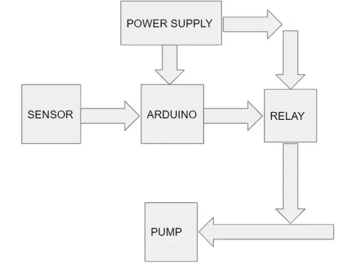
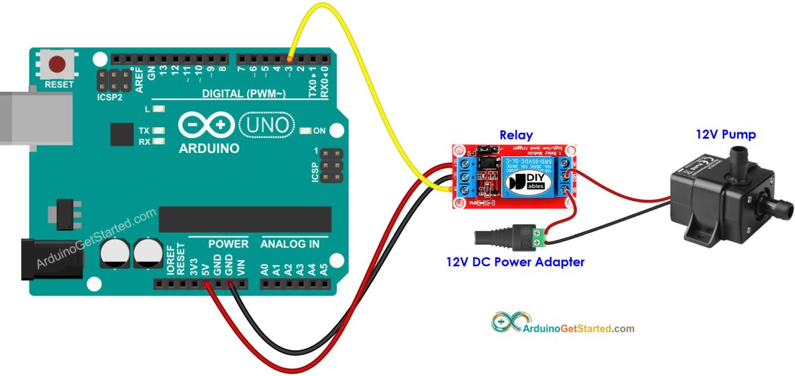
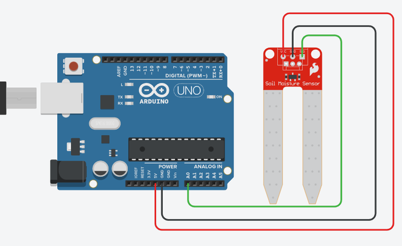
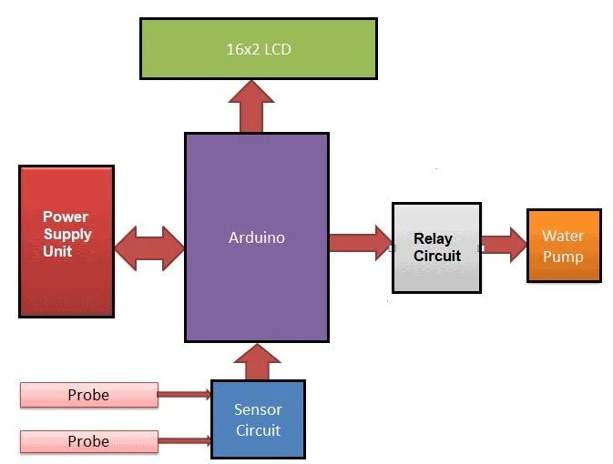

# Sistem za navodnjavanje pomoću pumpe

Ovaj sistem za navodnjavanje radi tako što pumpom vučemo vodu iz rezervoara (bunara, bazena, potoka...) i njom zalivamo baštu.

Zalivanje može biti vremenski zadato ili na osnovu nekih uslova (obično vlažnosti tla).

## Delovi



Glavni delovi sistema za navodnjavanje su:
- **napajanje**, obezbeđuje struju i napon svim komponentama
- **mikrokontroler**, kontroliše ceo sistem
- **relej** (MOSFET ili upravljač motora), aktivira pumpu spojenu preko njega
- **pumpa** (elektromotor sa impelerom), vuče vodu iz rezervoara i gura kroz crevo
- **rezervoar** iz kog pumpa crpi vodu

Dodatni delovi irigacionog sistema mogu biti:
- **[vlagomer](vlagomer.md)**, kako bi zalivanje bilo pametnije
- **LCD ekran** za ispis trenutnih vrednosti
- **komunikacioni modul** za aktiviranje na daljinu
- **solarno napajanje** radi samoodrživosti

## Primer (kontrola pumpe pomoću Arduina)



Ovaj kod samo uključuje i isključuje pumpu na svakih 5 sekundi, radi testiranja.

> Napomena: Na većini relej modula LOW uključuje relej, a HIGH isključuje.

```c
const int RELAY_PIN = 3;

void setup() {
  pinMode(RELAY_PIN, OUTPUT);
}

void loop() {
  digitalWrite(RELAY_PIN, HIGH); // uključi
  delay(5000);
  digitalWrite(RELAY_PIN, LOW);  // isključi
  delay(5000);
}
```

## Primer (merenje vlažnosti tla)



Ovaj progam čita vrednost senzora i odlučuje treba li zalivati.

> Napomena: Vrednosti 350 i 650 zavise od senzora i tla, pa ih treba kalibrisati na licu mesta.

```c
#define vlazno 350
#define suvo 650

void setup()
{
  Serial.begin(9600);
}

void loop()
{
  int vrednost = analogRead(A0);
  Serial.print("Izmerena vrednost: ");
  Serial.println(vrednost);

  if (vrednost < vlazno)
  {
    Serial.println("Status: Tlo je prevlazno");
  }
  else if (vrednost > suvo)
  {
    Serial.println("Status: Tlo je presuvo - vreme za zalivanje!");
  }
  else
  {
    Serial.println("Status: Tlo je odlicno");
  }

  delay(1000);
}
```

## Primer (vlagomer, pumpa i LCD ekran)



```c
#include <LiquidCrystal.h>

LiquidCrystal lcd(12, 11, 10, 9, 8, 7);

const int AirValue = 600;
const int WaterValue = 310;
const int RelayPin = 2;

const int MoistureOn = 30;   // uključuje se ispod ovog %
const int MoistureOff = 50;  // isključuje se iznad ovog %

int soilMoistureValue = 0;
bool pumpActive = false;

void setup()
{
  Serial.begin(9600);
  lcd.begin(16, 2);
  pinMode(RelayPin, OUTPUT);
  digitalWrite(RelayPin, HIGH); // pumpa inicijalno isključena
}

void loop()
{
  soilMoistureValue = analogRead(A0);

  int moisturePercentage = map(soilMoistureValue, AirValue, WaterValue, 0, 100);
  moisturePercentage = constrain(moisturePercentage, 0, 100);

  Serial.print("Vlaznost tla: ");
  Serial.print(moisturePercentage);
  Serial.println("%");

  lcd.setCursor(0, 0);
  lcd.print("Moisture: ");
  lcd.print(moisturePercentage);
  lcd.print("%   ");

  lcd.setCursor(0, 1);

  if (moisturePercentage < MoistureOn)
  {
    pumpActive = true;
  }
  else if (moisturePercentage > MoistureOff)
  {
    pumpActive = false;
  }

  if (pumpActive)
  {
    digitalWrite(RelayPin, LOW); // uključi
    lcd.print("Pump: ON ");
  }
  else
  {
    digitalWrite(RelayPin, HIGH); // isključi
    lcd.print("Pump: OFF");
  }

  delay(1000);
}
```

## Izvori
- [Control A Pump With Arduino And Relay](https://arduinogetstarted.com/tutorials/arduino-controls-pump)
- [Control A Pump With Arduino And MOSFET](https://www.makerguides.com/how-to-control-a-water-pump-with-arduino/)
- [Automatic Plant Watering System Using Soil Moisture Sensor & Arduino](https://www.instructables.com/Automatic-Plant-Watering-System-Using-Soil-Moistur/)
