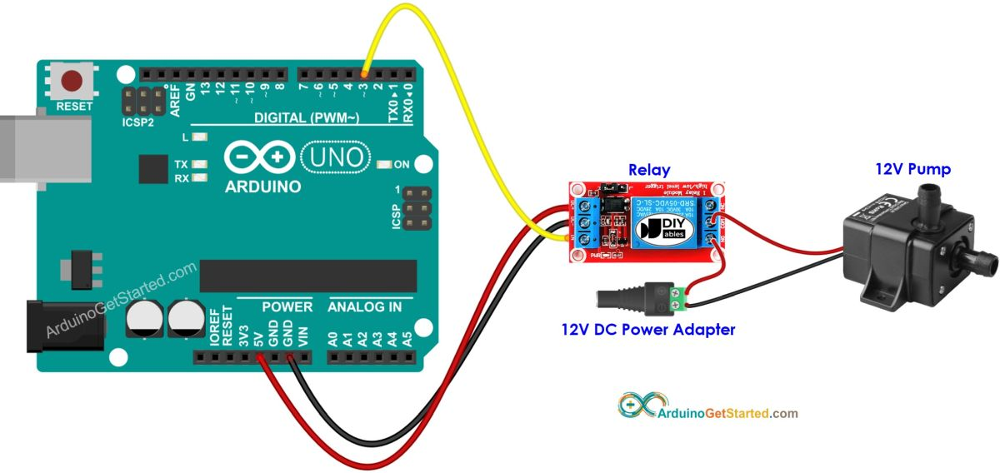

# Sistem za navodnjavanje sa pumpom

## Delovi


Glavni delovi sistema za navodnjavanje su:
- **napajanje**, obezbeđuje struju i napon svim komponentama
- **mikrokontroler**, kontroliše ceo sistem
- **relej**, aktivira pumpu koja je spojena preko njega
- **pumpa** (elektromotor sa impelerom), vuče vodu iz rezervoara i gura kroz crevo
- **rezervoar** iz kog pumpa crpi vodu

Dodatni delovi irigacionog sistema mogu biti:
- **[vlagomer](vlagomer.md)**, kako bi zalivanje bilo pametnije
- **LCD ekran** za ispis trenutnih vrednosti
- **komunikacioni modul** za aktiviranje na daljinu
- **solarno napajanje** radi samoodrživosti

## Primer (kontrola pumpe pomoću Arduina)



Ovaj kod samo uključuje i isključuje pumpu na svakih 5 sekundi, radi testiranja:

```c
const int RELAY_PIN = 3;

void setup() {
  pinMode(RELAY_PIN, OUTPUT);
}

void loop() {
  digitalWrite(RELAY_PIN, HIGH); // turn on
  delay(5000);
  digitalWrite(RELAY_PIN, LOW);  // turn off
  delay(5000);
}
```

## Primer (merenje vlažnosti tla)


Arduino čita vrednost senzora i štampa ih:

```c
#define vlazno 350
#define suvo 650

void setup()
{
  Serial.begin(9600);
}

void loop()
{
  int vrednost = analogRead(A0);
  Serial.print("Izmerena vrednost: ");
  Serial.println(vrednost);

  if (vrednost < vlazno)
  {
    Serial.println("Status: Tlo je prevlazno");
  }
  else if (vrednost > suvo)
  {
    Serial.println("Status: Tlo je presuvo - vreme za zalivanje!");
  }
  else
  {
    Serial.println("Status: Tlo je odlicno");
  }

  delay(1000);
}
```

## Izvori
- [Automatic Plant Watering System Using Soil Moisture Sensor & Arduino](https://www.instructables.com/Automatic-Plant-Watering-System-Using-Soil-Moistur/)
- [Self Watering System for Plants Using Arduino UNO](https://www.instructables.com/Self-Watering-System-for-Plants-Using-Arduino-Uno/)
- [Arduino - Controls Pump](https://arduinogetstarted.com/tutorials/arduino-controls-pump)
