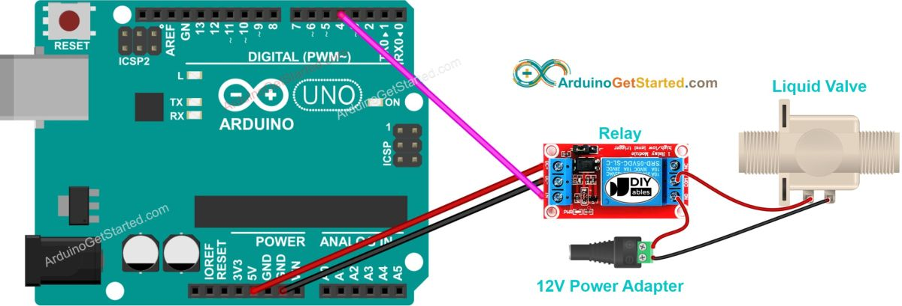
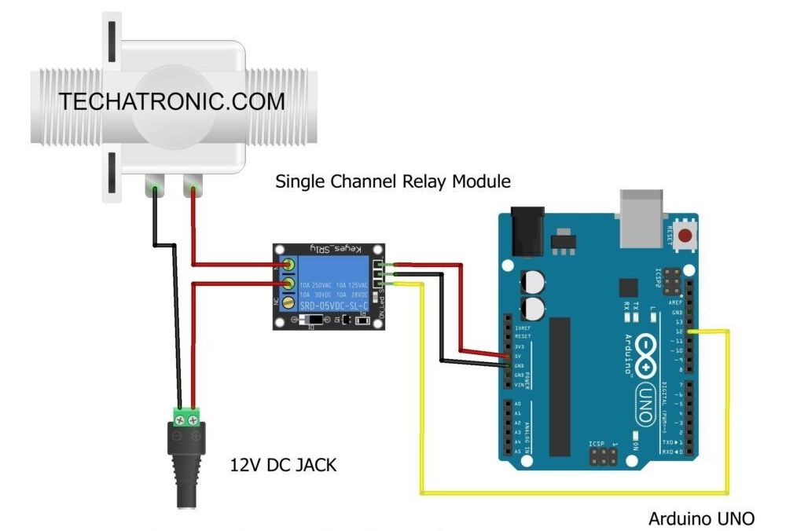

# Sistem za navodnjavanje pomoću ventila

Ovaj sistem za navodnjavanje radi tako što imamo prikačeno crevo na slavini pod pritiskom, koje Arduino kontroliše pomoću solenoidnog ventila.

## Delovi

Glavni delovi ovog sistema za navodnjavanje su:
- **napajanje**, obezbeđuje struju i napon svim komponentama
- **mikrokontroler**, kontroliše ceo sistem
- **slavina pod protiskom** sa prikačenim ventilom
- **[solenoidni ventil](../solenoidi.md)** (normalno zatvoren), po potrebi pušta vodu

Dodatni delovi irigacionog sistema mogu biti:
- **[vlagomer](vlagomer.md)**, kako bi zalivanje bilo pametnije
- **LCD ekran** za ispis trenutnih vrednosti
- **komunikacioni modul** za aktiviranje na daljinu
- **solarno napajanje** radi samoodrživosti
- **relej** (ili MOSFET) za solenoidni ventil višeg napona

## Primer (MOSFET otvara ventil)


Delovi:
* Arduino Uno (ili kompatibilna ploča)
* Solenoid ventil (12V DC)
* MOSFET tranzistor (npr. IRLZ44N)
* Dioda (1N4007 ili slična)
* Otpornik (220Ω)
* Napajanje (12V za solenoid)
* Napajanje (5V za Arduino)

Električna šema:

- Solenoid: Jedan kraj solenoida povežite na pozitivan pol napajanja (12V).
- MOSFET: Drugi kraj solenoida povežite na drajv (drain) MOSFET tranzistora. GATE pin MOSFET-a povežite na digitalni pin Arduina (npr. pin 9) preko otpornika od 220Ω. SOURCE pin MOSFET-a povežite na GND Arduina.
- Dioda: Diodu povežite paralelno sa solenoidom, sa katodom (obeleženom linijom) na pozitivnom terminalu, kako biste zaštitili krug od naponskog udara.

U ovom projektu imamo dva odvojena napajanja, jer solenoid troši više struje nego što Arduino pin može dati. Napajanje od 5 V za Arduino i posebno napajanje od 12 V za solenoid. Arduino ne napaja direktno solenoid, zato koristimo MOSFET kao prekidač. Dioda štiti Arduino i MOSFET od povratnog napona kada se ventil isključi.

```c
int solenoidPin = 4;

void setup() {
    pinMode(solenoidPin, OUTPUT);
}

void loop() {
    digitalWrite(solenoidPin, HIGH);
    delay(1000);
    digitalWrite(solenoidPin, LOW);
    delay(1000);
}
```

## Primer (relej otvara ventil)

<!--  -->



Delovi za ovo kolo uglavnom su slični kao za prethodno, osim što umesto MOSFET-a ide relej.

```c
const int RELAY_PIN = 4;

void setup() {
  pinMode(RELAY_PIN, OUTPUT);
}

void loop() {
  digitalWrite(RELAY_PIN, HIGH); // otvara ventil 5 sekundi
  delay(5000);
  digitalWrite(RELAY_PIN, LOW);  // zatvara ventil 5 sekundi
  delay(5000);
}
```

## Standardne veličine navoja

Prefiks **G** označava **BSP** (*British Standard Pipe*) navoj, što je standardni navoj za kuhinjske slavine i ventile u Evropi. Naziv oznake (npr. 1/2″ - pola inča) nije stvarna mera prečnika navoja, nego istorijska oznaka veličine cevi.

| Oznaka navoja | Spoljašnji prečnik (mm) | Spoljašnji prečnik (inča) | Korak navoja (mm) | Navoja po inču (TPI) |
|----------------|--------------------------|----------------------------|-------------------|----------------|
| G 1/8″         | 9.728 mm                 | 0.383″                    | 0.907 mm          | 28             |
| G 1/4″         | 13.157 mm                | 0.518″                    | 1.337 mm          | 19             |
| G 3/8″         | 16.662 mm                | 0.656″                    | 1.337 mm          | 19             |
| **G 1/2″**     | **20.955 mm**            | **0.825″**                | **1.814 mm**      | **14**         |
| **G 3/4″**     | **26.441 mm**            | **1.041″**                | **1.814 mm**      | **14**         |
| G 1″           | 33.249 mm                | 1.310″                    | 2.309 mm          | 11             |
| G 1 1/4″       | 41.910 mm                | 1.650″                    | 2.309 mm          | 11             |

### Rezervoar za vodu

Standardni izlaz rezervoara je plastični navoj **S60x6** (prečnik 60 mm, korak 6 mm), po metričkom industrijskom standardu za plastične IBC (*Intermediate Bulk Container*) rezervoare.

### Baštenske slavine

Baštenske slavine imaju dva navoja, za ulaz i za izlaz, oba muška. Najčešće veličine navoja su: ulaz G 1/2″ ili G 3/4″ → izlaz **G 3/4″** ili **G 1″**.

Na slavinu se uvrće odgovarajući ženski navoj (G 3/4″ ili G 1″), na kojem je obično adapter za crevo. 

Naša baštenska slavina ima muški navoj G 1″. Redosled povezivanja je sledeći: 

- **slavina** (G 1″ muški navoj) → **adapter za crevo** (G 1″ ženski navoj) → **crevo** (navučeno ili sa klik-spojnicom).

### Kućne slavine

Standardni navoj za kuhinjske slavine u Evropi je ženski navoj **G 1/2″**, u koji se uvrće odgovarajući muški navoj G 1/2″.

Standardni navoj za tuš je muški navoj G 1/2″, na koji se uvrće ženski navoj G 1/2″ sa crevom.

### Tajmer

Naš automatski tajmer ima ženski navoj 3/4″ na ulazu i muški navoj 3/4″ na izlazu (sa spojnicom za crevo od 16mm). Radi pod pritiskom od 2 do 4 bara.

- Da bi priključili tajmer na kuhinjsku slavinu, potreban je adapter: muški navoj G 1/2″ -> muški navoj 3/4″.
- Da bi priključili tajmer na našu baštensku slavinu G 1″ potreban je adapter: ženski navoj 1″ -> muški navoj 3/4″ (nakon čega ide ženski navoj tajmera).
- Da bi priključili tajmer na baštensku slavinu G 3/4″ nije potreban adapter (direktno ide ženski navoj tajmera).

## Izvori

- [Controlling A Solenoid Valve With Arduino](https://bc-robotics.com/tutorials/controlling-a-solenoid-valve-with-arduino/)
- [Arduino Water Liquid Valve](https://arduinogetstarted.com/tutorials/arduino-water-liquid-valve)
- [Solenoid Valve Interfacing With Arduino](https://techatronic.com/solenoid-valve-interfacing-with-arduino/)