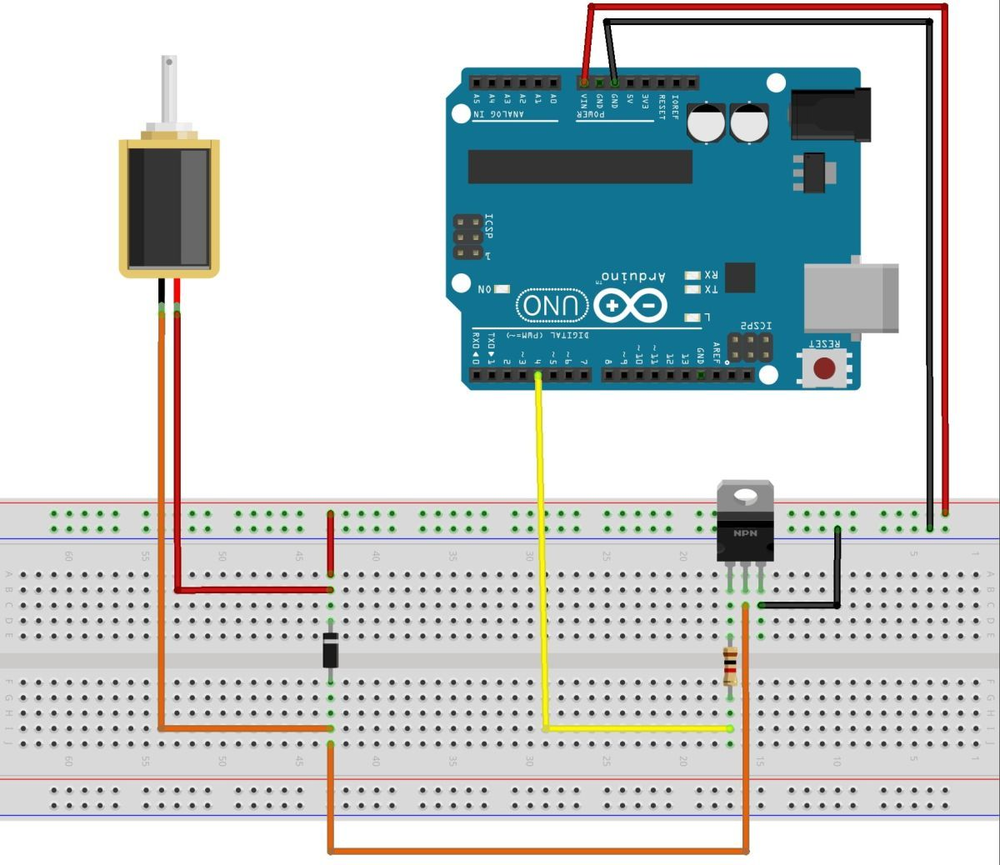

# Sistem za navodnjavanje pomoću ventila

Ovaj sistem za navodnjavanje radi tako što imamo prikačeno crevo na slavini pod pritiskom, koje Arduino kontroliše pomoću solenoidnog ventila.

## Delovi

Glavni delovi ovog sistema za navodnjavanje su:
- **napajanje**, obezbeđuje struju i napon svim komponentama
- **mikrokontroler**, kontroliše ceo sistem
- **slavina pod protiskom** sa prikačenim ventilom
- **[solenoidni ventil](../solenoidi.md)** (normalno zatvoren), po potrebi pušta vodu

Dodatni delovi irigacionog sistema mogu biti:
- **[vlagomer](vlagomer.md)**, kako bi zalivanje bilo pametnije
- **LCD ekran** za ispis trenutnih vrednosti
- **komunikacioni modul** za aktiviranje na daljinu
- **solarno napajanje** radi samoodrživosti
- **relej** (ili MOSFET) za solenoidni ventil višeg napona

## Primer (MOSFET otvara ventil)



Delovi:
* Arduino Uno (ili kompatibilna ploča)
* Solenoid ventil (12V DC)
* MOSFET tranzistor (npr. IRLZ44N)
* Dioda (1N4007 ili slična)
* Otpornik (220Ω)
* Napajanje (12V za solenoid)
* Napajanje (5V za Arduino)

Električna šema:

- Solenoid: Jedan kraj solenoida povežite na pozitivan pol napajanja (12V).
- MOSFET: Drugi kraj solenoida povežite na drajv (drain) MOSFET tranzistora. GATE pin MOSFET-a povežite na digitalni pin Arduina (npr. pin 9) preko otpornika od 220Ω. SOURCE pin MOSFET-a povežite na GND Arduina.
- Dioda: Diodu povežite paralelno sa solenoidom, sa katodom (obeleženom linijom) na pozitivnom terminalu, kako biste zaštitili krug od naponskog udara.

U ovom projektu imamo dva odvojena napajanja, jer solenoid troši više struje nego što Arduino pin može dati. Napajanje od 5 V za Arduino i posebno napajanje od 12 V za solenoid. Arduino ne napaja direktno solenoid, zato koristimo MOSFET kao prekidač. Dioda štiti Arduino i MOSFET od povratnog napona kada se ventil isključi.

```c
int solenoidPin = 4;

void setup() {
    pinMode(solenoidPin, OUTPUT);
}

void loop() {
    digitalWrite(solenoidPin, HIGH);
    delay(1000);
    digitalWrite(solenoidPin, LOW);
    delay(1000);
}
```

## Primer (relej otvara ventil)


Delovi za ovo kolo su uglavnom slični kao za prethodno, osim što umesto MOSFET-a ide relej.

```c
const int RELAY_PIN = A5;

void setup() {
  pinMode(RELAY_PIN, OUTPUT);  // Postavljanje pina kao izlaznog
}

void loop() {
  digitalWrite(RELAY_PIN, HIGH);  // uključuje relej (otvara ventil)
  delay(5000);
  digitalWrite(RELAY_PIN, LOW);  // isključuje relej (zatvara ventil)
  delay(5000);
}
```

## Izvori

- [Controlling A Solenoid Valve With Arduino](https://bc-robotics.com/tutorials/controlling-a-solenoid-valve-with-arduino/)
- [Solenoid Water Liquid Valve – Arduino Tutorial](https://www.circuits-diy.com/solenoid-water-liquid-valve-arduino-tutorial/)
- [oT Based Smart Irrigation System Using NodeMCU ESP8266 & Adafruit IO](https://www.instructables.com/IoT-Based-Smart-Irrigation-System-Using-NodeMCU-ES/)
