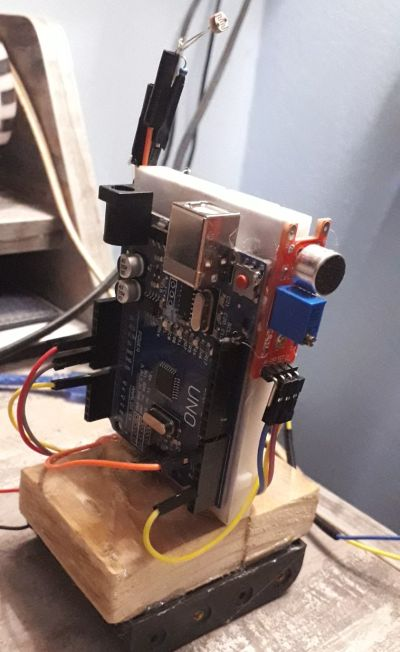

# Noćni kontrolor

Noćni kontrolor pali svetiljke kada je noć, a gasi kada je dan. Pored toga, u svako doba reaguje na glasan zvuk (pljesak) i menja stanje svetiljki.

Glavne komponente su:
- Arduino Uno
- Senzor zvuka (KY-037)
- Fotootpornik (sa otpornikom za razdelnik napona)
- MOSFET kao prekidač
- sijaličice (sa zasebnim napajanjem)

## Primer koda

