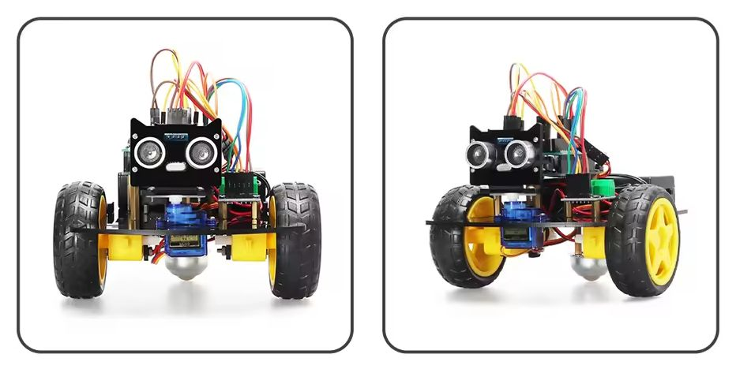
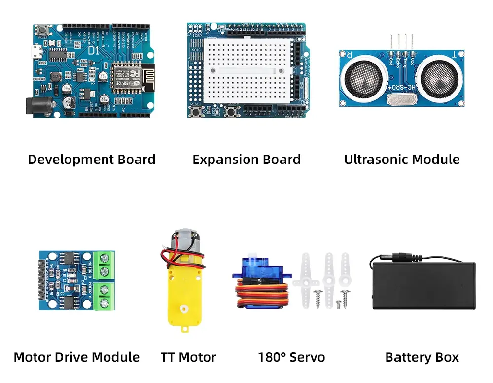
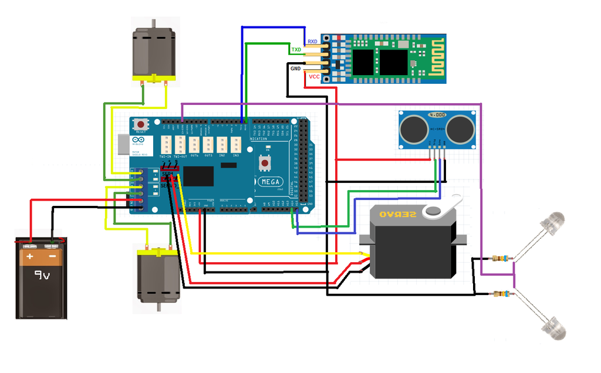

# Robot auto



Arduino robot je kombinacija elektromotora koji pokreću točkove i senzora na osnovu kojih može donositi odluke o izbegavanju prepreka.

## Delovi



1. **Razvojna ploča**: Najčešće Arduino mikrokontroler (ili kompatibilna ploča poput Wemos D1) koja služi kao „mozak“ projekta. Na njoj se učitava i izvršava kod.
2. **Ekspanziona ploča**, poznata kao **štit** (*shield*): ubacuje se u razvojnu ploču radi lakšeg povezivanja drugih komponenti. Često sadrži i prototipsku ploču (*breadboard*) na sebi.
3. **Ultrazvučni modul (HC-SR04)**, poznat kao **senzor udaljenosti**: koristi zvučne talase za merenje rastojanja do objekta. Često se koristi za izbegavanje prepreka kod robota.
4. **Modul za upravljanje motorima**: kontroliše brzinu i smer elektromotora. Potreban jer razvojna ploča obično ne može obezbediti dovoljno struje za direktno napajanje motora.
5. **TT motor**, odnosno mali **elektromotor sa zupčanikom**: koristi se za pogon točkova kod robotskih vozila.
6. **Servo motor**: može da se rotira pod određenim uglom, obično između $0^\circ$ i $180^\circ$. Koristi se za upravljanje, pomeranje ruke ili male mehanizme.
7. **Kutija za baterije**: drži baterija i napaja celo kolo.

## Elektronsko kolo



## Kompletan kod

Napomena: Servo biblioteka onemogućuje `analogWrite()` (PWM) na pinovima 9 i 10!

```c
#include <Servo.h>

byte trigPin = 8; // beli
byte echoPin = 7; // sivi senzor
byte servoPin = 9;

byte motor1desni = 11; // plavi
byte motor1levi = 3;   // zeleni
byte motor2levi = 6;   // sivi motor
byte motor2desni = 5;  // roze

Servo servo;

const byte NUM_ANGLES = 7;
byte uglovi[NUM_ANGLES] = {0, 30, 60, 90, 120, 150, 180};
unsigned int rastojanja[NUM_ANGLES];

unsigned int rastojanje()
{
    digitalWrite(trigPin, LOW);
    delayMicroseconds(5);
    digitalWrite(trigPin, HIGH);
    delayMicroseconds(10);
    digitalWrite(trigPin, LOW);

    unsigned int vreme = pulseIn(echoPin, HIGH); // da ode i da se vrati
    return (vreme * 0.034) / 2;                  // to cm
}

void pogledajDesnoLevo()
{
    servo.write(0);
    delay(500);
    for (byte i = 0; i < NUM_ANGLES; i++)
    {
        rastojanja[i] = rastojanje();
        servo.write(uglovi[i]);
        delay(120);
    }
    servo.write(90);
    delay(500);
}

void setup()
{
    Serial.begin(9600);
    pinMode(motor1levi, OUTPUT);
    pinMode(motor1desni, OUTPUT);
    pinMode(motor2levi, OUTPUT);
    pinMode(motor2desni, OUTPUT);
    pinMode(trigPin, OUTPUT);
    pinMode(echoPin, INPUT);
    servo.attach(servoPin);
    pogledajDesnoLevo();
}

void idi(byte brzina, bool napred)
{
    analogWrite(motor1levi, napred ? 0 : brzina);
    analogWrite(motor1desni, napred ? brzina : 0);
    analogWrite(motor2levi, napred ? 0 : brzina);
    analogWrite(motor2desni, napred ? brzina : 0);
}

void napred(byte brzina)
{
    idi(brzina, true);
}

void nazad(int trajanje)
{
    byte brzina = 80;
    idi(brzina, false);
    delay(trajanje);
}

void stani(int trajanje)
{
    idi(0, true);
    delay(trajanje);
}

void skreni(int trajanje, bool levo)
{
    byte brzina = 120;
    analogWrite(motor1levi, levo ? brzina : 0);
    analogWrite(motor1desni, levo ? 0 : brzina);
    analogWrite(motor2levi, levo ? 0 : brzina);
    analogWrite(motor2desni, levo ? brzina : 0);
    delay(trajanje);
}

byte nadjiNajdalji()
{
    byte nadjenIndex = 0;
    unsigned int najdalje = rastojanja[0];
    for (byte i = 0; i < NUM_ANGLES; i++)
    {
        if (rastojanja[i] > najdalje)
        {
            najdalje = rastojanja[i];
            nadjenIndex = i;
        }
    }
    return nadjenIndex;
}

void loop()
{
    if (rastojanje() < 20)
    {
        stani(500);
        nazad(300);
        stani(0);
        pogledajDesnoLevo();
        skreni(500, nadjiNajdalji() > 3);
        stani(500);
    }
    else
    {
        napred(255);
    }
}
```

## Izvori

- [How to Use the L298 Motor Driver Module](https://www.instructables.com/How-to-use-the-L298-Motor-Driver-Module-Arduino-Tu/)
- [Obstacle Avoiding Arduino Robot](https://www.instructables.com/Bluetooth-Controlled-Obstacle-Avoiding-Arduino-Rob/)