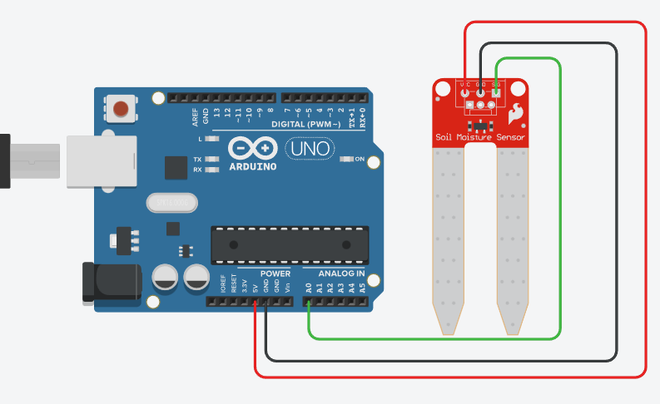

# Vlagomer

Pored osnovnog merača vlažnosti tla bez kontrolera, možemo napraviti i verziju sa Arduinom.

## Prosta verzija



Napajanje senzora je povezano na 5 V pin Arduina, a izlaz senzora na A0. Program čita vrednost senzora i štampa:

```c
void setup() {
  Serial.begin(9600); // inicijalizuje serijski port (postavlja brzinu na 9600 bita/s)
}

void loop() {
  int sensorValue = analogRead(A0); // čita ulaz analognog pina 0
  Serial.println(sensorValue);
  delay(100);                       // mala pauza između čitanja zbog stabilnosti
}
```

## Proširena verzija (sa logikom)

Ovde dodajemo granične vrednosti i na osnovu njih gradimo logiku:

```c
#define sensorPin A0

#define vlazno 350
#define suvo 650

void setup()
{
  Serial.begin(9600);
}

void loop()
{
  int vrednost = analogRead(sensorPin);
  Serial.print("Izmerena vrednost: ");
  Serial.println(vrednost);

  if (vrednost < vlazno)
  {
    Serial.println("Status: Tlo je prevlazno");
  }
  else if (vrednost > suvo)
  {
    Serial.println("Status: Tlo je presuvo - vreme za zalivanje!");
  }
  else
  {
    Serial.println("Status: Tlo je odlicno");
  }

  delay(1000);
}
```

## Puna verzija (sa tri svetiljke)

Ovde dodajemo još i crvenu, žutu i zelenu svetiljku kao indikatore vlažnosti tla. Takođe senzoru šaljemo napajanje na pin 7 samo kad je potrebno, ne sve vreme.

```c
#define sensorPower 7
#define sensorPin A0

#define bluePin 11
#define greenPin 12
#define redPin 13

#define vlazno 350
#define suvo 650

void setup()
{
  pinMode(sensorPower, OUTPUT);

  pinMode(bluePin, OUTPUT);
  pinMode(greenPin, OUTPUT);
  pinMode(redPin, OUTPUT);

  Serial.begin(9600);
}

void loop()
{
  digitalWrite(sensorPower, HIGH);          // uključi senzor
  delay(10);                                // kratko sačekaj stabilizaciju
  int vrednost = analogRead(sensorPin);
  digitalWrite(sensorPower, LOW);           // isključi senzor

  Serial.print("Izmerena vrednost: ");
  Serial.println(vrednost);

  if (vrednost < vlazno)
  {
    Serial.println("Status: Tlo je prevlazno");
    blue();
  }
  else if (vrednost > suvo)
  {
    Serial.println("Status: Tlo je presuvo - vreme za zalivanje!");
    red();
  }
  else
  {
    Serial.println("Status: Tlo je odlicno");
    green();
  }

  delay(1000);
}

void red()
{
  digitalWrite(redPin, HIGH);
  digitalWrite(greenPin, LOW);
  digitalWrite(bluePin, LOW);
}

void green()
{
  digitalWrite(redPin, LOW);
  digitalWrite(greenPin, HIGH);
  digitalWrite(bluePin, LOW);
}

void blue()
{
  digitalWrite(redPin, LOW);
  digitalWrite(greenPin, LOW);
  digitalWrite(bluePin, HIGH);
}
```

## Izvori

- [Guide for Soil Moisture Sensor YL-69 or HL-69 with Arduino](https://randomnerdtutorials.com/guide-for-soil-moisture-sensor-yl-69-or-hl-69-with-the-arduino/)
- [Arduino Soil Moisture Sensor](https://www.instructables.com/Arduino-Soil-Moisture-Sensor/)
- [Arduino Soil Moisture Sensor](https://www.instructables.com/Soil-Moisture-Sensor)