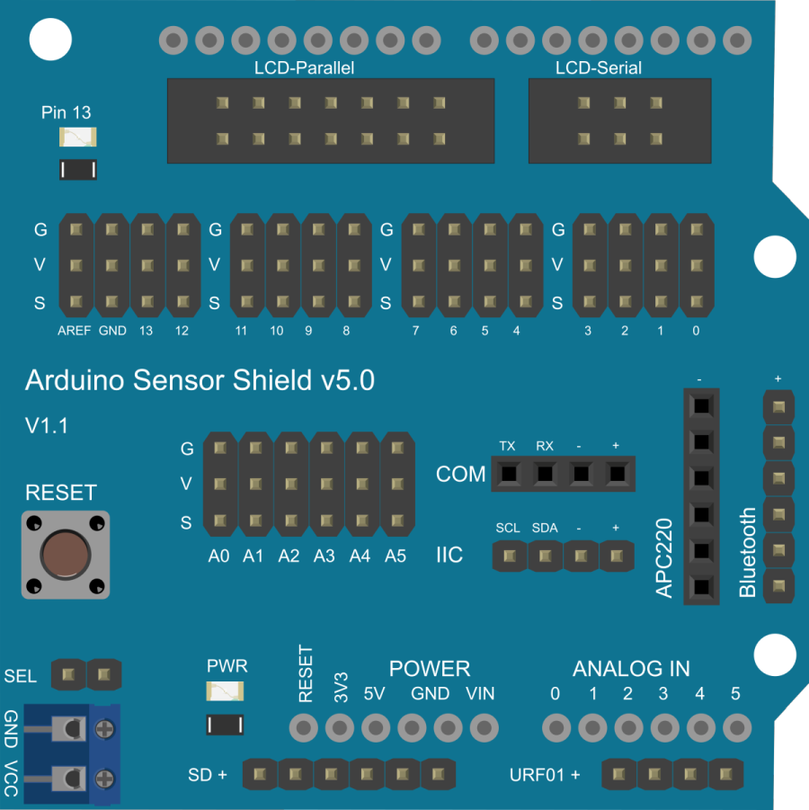

# Arduino štit

**Arduino senzorni štit** (*Arduino Sensor Shield*) je dodatna ploča koja služi kao interfejs između Arduina i senzora, servo motora, releja i drugih modula, omogućujući lako povezivanje bez lemljenja (poput prototipske ploče).

Svaki od pinova na štitu je zapravo arduino pin podeljen u tri linije: **S** (signal), **V** (napajanje, obično 5 V) i **G** (uzemljenje).
Tako svaki modul možemo direktno priključiti trožilnim kablom, bez zasebnog spajanja napajanja i uzemljenja.

## Tehničke karakteristike

Arduino Sensor Shield v5.0 ima sledeće karakteristike:

* **Napajanje**: 5V putem Arduino ploče ili eksternog napajanja (ako je jumper za napajanje servoa postavljen na "EXT").
* **Izlazni pinovi**: svaki trostruki pin konektor ima napajanje (5V ili 3.3V), uzemljenje i signal.
* **Digitalni pinovi**: D0–D13 (ukupno 14 digitalnih pinova).
* **Analogni pinovi**: A0–A5 (ukupno 6 analognih pinova).
* **I2C komunikacija**: SDA (A4) i SCL (A5).
* **PWM izlazi**: D3, D5, D6, D9, D10, D11.
* **LCD interfejs**: Podrška za paralelni i serijski LCD ekran.
* **Serijski portovi**: UART (TX/RX), APC220, Bluetooth.
* **Napajanje servoa**: Mogućnost napajanja servoa sa Arduina ili eksternog izvora.

Podrazumevano izlazno napajanje pinova 5V. Može se prebaciti na 3.3V pomoću džampera.

## Raspored pinova

| Pinovi   | Funkcija                                  |
| -------- | ----------------------------------------- |
| D0–D13   | Digitalni I/O pinovi                      |
| A0–A5    | Analogni I/O pinovi                       |
| SDA, SCL | I2C komunikacija                          |
| VCC, GND | Napajanje i uzemljenje                    |
| 3.3V, 5V | Napajanje za senzore                      |
| GND      | Zajedničko uzemljenje                     |
| S1, S2   | Dugmad za resetovanje i odabir napajanja  |
| LCD      | Paralelni i serijski LCD interfejs        |
| BT       | Bluetooth interfejs                       |
| APC220   | Bežični serijski interfejs                |

## Saveti za korišćenje

* **Napajanje servoa**: Ako koristite više servomotora, preporučuje se korišćenje eksternog napajanja kako bi se izbeglo preopterećenje Arduino ploče.
* **I2C uređaji**: Pazite da I2C uređaji imaju jedinstvene adrese kako bi se izbegli konflikti.
* **Kratke žice**: Koristite što kraće žice (do 20–30 cm) za analogne signale kako biste smanjili šum i poboljšali preciznost očitavanja.

## Izvori

* [Cirkit Designer – Arduino Sensor Shield v5.0](https://docs.cirkitdesigner.com/component/44e5ee43-3bf5-1d3f-656b-d65979ac8ef4/arduino-sensor-shield-v50)
* [The Engineering Projects – Introduction to Arduino Sensor Shield](https://www.theengineeringprojects.com/2020/10/introduction-to-arduino-sensor-shield.html)
* [Soldered Electronics – Arduino Shield Guide](https://soldered.com/learn/arduino-shield-everything-you-need-to-know/)
