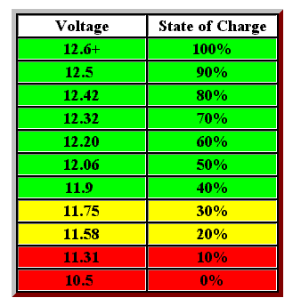

# Baterije za solarni sistem

Kada biramo banke baterija za solarni sistem, imamo tri mogućnosti: 
- **Olovno-kiselinske baterije** (tzv. olovni akumulatori)
  - **AGM** (*absorvent glass mat*) baterije, podvrsta olovnih
- **Litijum-jonske baterije**

Litijum-jonske baterije su najnovija i najbolja tehnologija kada su u pitanju solarne baterije. "Mokre" olovno-kiselinske baterije imaju ogroman nedostatak: treba ih održavati, odnosno zalivati i raditi prevenciju sulfacije, koja je glavni uzrok propadanja. Litijum-jonske baterije imaju **iskoristivost energije** oko 80% kapaciteta, dok je kod ostalih oko 50%, jer kada padnu ispod tog nivoa dolazi do oštećenja.

**Životni vek**: olovne baterije mogu trajati od 7 do 10 godina, ili oko 1000 ciklusa, uz dobro održavanje. AGM baterije traju oko 700 ciklusa, odnosno 6 do 8 godina. Litijum-jonske mogu trajati od 3.000 do 5.000 ciklusa, odnosno preko 20 godina.

## Olovno-kiselinske baterije

[wiki](https://en.wikipedia.org/wiki/Lead%E2%80%93acid_battery)

Olovno-kiselinska baterija od 12V, poznata kao akumulator, radi u rasponu od 14+ volti (na par sekundi), kada je potpuno napunjena, do 10.5, kada je prepražnjena. U praksi, ne treba je nikad prazniti ispod 12.5V (u stanju mirovanja). 

Veliku razliku pravi temperatura. Ako je temperatura ispod nule, tri baterije su ekvivalentne dvema na toploj klimi.

Akumulatori nisu predviđeni za duboko pražnjenje (kao baterije mobilnih telefona), a potpuno pražnjenje im značajno skraćuje vek. Primera radi, ako automobil ostane preko noći s upaljenim farovima, ovo za posledicu ima formiranje sumpornih naslaga na olovnim pločama, što redukuje životni vek akumulatora za trećinu ili više.

**Održavanje**: u akumulatoru je potrebno redovno proveravati nivo tečnosti. Tečnost ne sme ići ispod plastičnog graničnika u obliku slova L. Ukoliko je nivo niži, neophodno je dosuti destilovanu vodu. Izjednačenje (*equalization*) je kontrolisano prepunjavanje baterije, u cilju desulfacije i vraćanja kapaciteta.

### AGM akumulatori

[wiki](https://en.wikipedia.org/wiki/Absorbent_glass_mat)

AGM akumulatori (*absorbent glass mat* - apsorbujuća staklena podloga) koriste specijalan materijal između rešetaka koji upija i u sebi zadržava elektrolit. Reč je o mikro-staklenim vlaknima, čije je uloga filtriranje sumporne kiseline. Oni su mnogo otporniji na duboko pražnjenje, ali su i skuplji.

### Gel akumulatori

[wiki](https://en.wikipedia.org/wiki/Gel_battery)

Gel akumulator je olovno-kiselinska baterija kod koje je elektrolit (sumporna kiselina) vezan u gel pomoću silicijumskog praha, pa nema tečne kiseline koja se može prosuti. Glavne osobine:

- Zatvorena – ne zahteva dolivanje vode.
- Manje isparavanje i korozija – bezbednija za unutrašnju upotrebu.
- Dobro podnosi duboka pražnjenja – pogodna za solarne sisteme, UPS, kamp vozila.

Hemija je ista kao kod klasične olovne baterije, samo je elektrolit u obliku gela.

## Litijum-jonske baterije

[wiki](https://sh.wikipedia.org/wiki/Litijum-jonska_baterija)

Litijum-jonske baterije su punjive baterije u kojima se joni litijuma pomeraju između katode i anode tokom punjenja i pražnjenja. Imaju veliku gustinu energije (lagane i kompaktne), relativno dug vek i nemaju izražen memorijski efekat. Mane su osetljivost na prepunjavanje i pregrevanje (potreban sistem zaštite) i postepeni gubitak kapaciteta vremenom. Koriste se u telefonima, laptopovima, električnim vozilima i sistemima za skladištenje energije.

Litijum-jonske baterije se povezuju sa solarnim sistemom preko kontrolera koji upravlja punjenjem i pražnjenjem. Više ćelija ili gotovih modula spaja se **serijski** da bi se postigao željeni napon (npr. 48 V za neke sisteme), a **paralelno** da bi se povećao kapacitet i struja. Često se kombinuju oba tipa veza. 

Baterijska banka se obično sastoji od jedne 12 V litijum-jonske baterije (zapravo četiri ćelije od oko 3,2 V povezane serijski). Razni potrošači — LED rasveta, pumpe, frižideri i drugi 12 V uređaji — priključuju se na bateriju preko DC razvodne kutije. DC razvodna kutija je mala tabla sa više izlaza koja raspodeljuje jednosmernu struju ka različitim uređajima, a svaki izlaz obično ima sopstveni osigurač ili automatski prekidač sa zaštitom od preopterećenja.