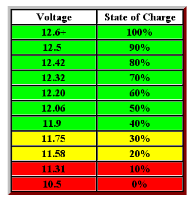

# Baterije

Kada birate banke baterija za solarni sistem, imate tri mogućnosti: 
- klasične olovno-kiselinske baterije (tzv. olovni akumulatori)
- AGM (apsorbujuće staklene podloge) baterije, podvrsta olovnih
- litijum-jonske baterije

Litijum-jonske baterije su najnovija i najbolja tehnologija kada su u pitanju solarne baterije. "Mokre" olovno-kiselinske baterije imaju ogroman nedostatak: treba ih održavati, odnosno zalivati i raditi prevenciju sulfacije, koja je glavni uzrok propadanja.

Litijum-jonske baterije imaju **iskoristivost energije** oko 80% kapaciteta, dok je kod ostalih oko 50%, jer kada padnu ispod tog nivoa dolazi do oštećenja.

**Životni vek**: olovne baterije mogu trajati od 7 do 10 godina, ili oko 1000 ciklusa, uz dobro održavanje. AGM baterije traju oko 700 ciklusa, odnosno 6 do 8 godina. Litijum-jonske mogu trajati od 3.000 do 5.000 ciklusa, odnosno preko 20 godina.

## Olovno-kiselinske baterije



Baterija od 12V radi u rasponu od 14+ volti (može trajati samo par sekundi), kada je potpuno napunjena, do 10.5, kada je prepražnjena. U praksi, ne treba je nikad prazniti ispod 12.5V (u stanju mirovanja). 

Veliku razliku pravi temperatura prostora. Ako je temperatura ispod nule, tri baterije su ekvivalentne dvema na toploj klimi.

**Održavanje**: u akumulatoru je potrebno redovno proveravati nivo tečnosti. Tečnost ne sme ići ispod plastičnog graničnika u obliku slova L. Ukoliko je nivo niži, neophodno je dosuti destilovanu vodu.

Izjednačavanje (*equalization*) je kontrolisano prepunjavanje baterije, u cilju desulfacije i vraćanja kapaciteta.

## Punjenje NiMH baterija

Primer:
- 12v punjač
- 4 x AA nikl-metal-hidridne (NiMH) baterije

Najjednostavniji način punjenja NiMH baterije je da ograničimo struju otpornikom. Da bismo izračunali vrednost otpornika, moramo odlučiti kojom strujom želimo puniti bateriju. NiMH baterija može se neograničeno puniti strujom manjom od 10% njenog kapaciteta. Npr, ako AA baterije imaju kapacitet 2000mAh, možemo ih puniti strujom od 200mA. Za svaki slučaj, ako planiramo da punimo baterije većinu vremena, bolje puniti strujom od 5% kapaciteta baterije, što iznosi 100mA.

Tipično vreme punjenja NiMH baterija je: 
```
3 * kapacitet (C) / struja
```

Dakle, sa strujom od 100mA, potrebno je:
```
Vreme punjenja = 3 × 2000mAh / 100mA = 6000mAh / 100mA = 60 časova
```

Da bismo izabrali otpornik, treba izračunati napon. Kada su baterije prazne imaju napon oko 1V, pa će napon kola biti:
```
V = 12V – 4V = 8V.
```

Sada možemo izračunati otpor: 
```
R = V / I = 8V / 0.1A = 80Ω.
```

Iz opreza možemo izabrati jači otpornik od 100Ω. Kada ga prikačimo u kolo, aktuelna struja će biti:
```
I = V / R = 8V / 100Ω = 80mA.
```

Na kraju, treba da saznamo koja maksimalna snaga nam je potrebna za otpornik:
```
P = I * V = 0.08A * 8V = 0.64W = 640 mW
```

Iz opreza, bolje koristiti otpornik koji može da podnese 1W.

P.S. Kada su baterije skroz pune, njihov napon je oko 1.3V, pa će struja u kolu biti manja:
```
I = V / R = (12V – 1.3V × 4) / 100Ω = 12V - 5.2V / 100Ω = 6.8V / 100Ω = 68mA.
```

## Litijum-polimerska (LiPo) baterija

Litijum-polimerske baterije se koriste u mobilnim telefonima. Tipična LiPo baterija je napona 3.7V i kapaciteta 1600mAh.

Ako se LiPo baterija previše isprazni (ispod 3V), može se trajno oštetiti. Većina novih LiPo baterija ima ugrađeno automatsko prekidačko kolo da spreči prekomerno pražnjenje, ali to možda nije slučaj sa starim baterijama.

## Kako izračunati trajanja baterije

Primer (Arduino i steper motor):

Motor koristi 1A po sekundi, a pali se dvaput dnevno po 3 sekunde. Kontroler troši 1mA sve vreme. Koliko zajedno potroše za dan?

Motor:
```
1A × 3 sekunde × 2 = 6As = 6/3600Ah = 0.0016 Ah = 1.6mAh dnevno
```

Kontroler: 
```
1mA × 24 časa = 24mAh dnevno
```

Recimo da je ukupna potrošnja 25mAh po danu. Ako baterija ima 3000mAh, možemo očekivati da traje:
```
3000mAh / 25mAh = 120 dana
```

## Punjenje baterija

Za stabilizaciju napona prilikom punjenje baterija potrebno je koristiti regulator napona, takođe zvan i regulator punjenja (*charge controller*).
