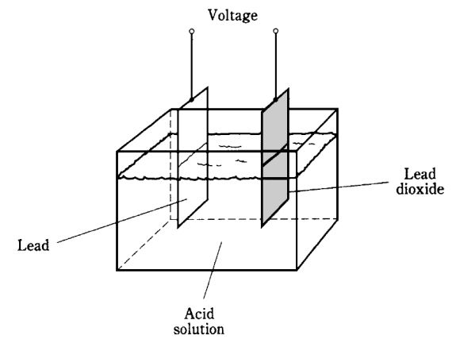
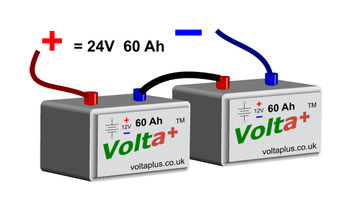
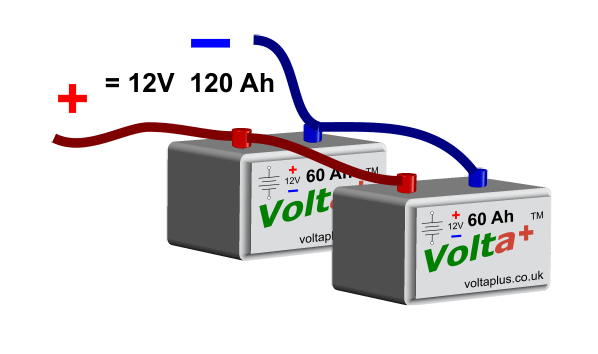
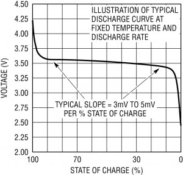

# Baterije

[wiki](https://sh.wikipedia.org/wiki/Baterija)

Baterija se sastoji iz više redno vezanih elektrohemijskih ćelija, koje poseduju potencijalnu energiju. Baterije su odličan izvor napajanja za elektronske projekte, lake su i prenosive.



Napon u baterijama stvara se u procesu elektrohemijske reakcije. Da bi se reakcija pokrenula, neophodno je dva različita metala staviti u određen hemijski rastvor. Napon ćelije zavisi od količine energije oslobođene hemijskom reakcijom, i ulavnom je između 0.8 V i 2.3 V, uz bitan izuzetak litijumske ćelije od 3+ V. Ova hemijska reakcija ne može biti poboljšana dizajnom baterije. S druge strane, na količinu struje utiče veličina baterije.

Punjive baterije omogućuju obnavljanje hemikalija u njima, tj. dobijanje napona bliskog izvornom. Ne pokušavajte da punite jednokratne baterije, mogu procuriti ili eksplodirati.

Sve baterije su podložne samopražnjenju, odnosno gubitku napona usled stajanja.

## Podela po hemijskom sastavu

Baterije uglavnom delimo na osnovu hemikalija koje sadrže. Od njih zavisi da li su jednokratne ili punjive.

JEDNOKRATNE (primarne) ćelije:
* **Cink-ugljenik**: Nekvalitetne baterije za jednokratnu upotrebu. Jeftine i kratko traju.
* **Alkalni metali**: Alkalne baterije, traju oko triput duže od cink-ugljeničnih.
* **Litijum**: Litijumske baterije imaju veći kapacitet i generišu veći napon od ostalih (najčešće oko 3 volta). Najskuplje su i nisu punjive.

PUNJIVE (sekundarne) ćelije:
* **Nikl-kadmijum** (Ni-Cd ili NiCd): Najpopularniji tip punjivih baterija, najčešće od 1,2 volta. Iako su mnogi proizvođaći to već rešili, njihov najveći nedostatak je tzv. memorijski efekat - morate ih potpuno isprazniti pre punjenja da bi dostigle pun kapacitet.
* **Nikl-metal-hidrid** (Ni-MH): Baterije ovoga tipa generišu napon od 1,2 volta. Nemaju memorijski efekat kao nikl-kadmijumske. Ako se odlučite za punjive baterije, predlažemo da počnete s ovim tipom.
* **Litijum-jon** (Li-Ion): Litijum-jonske baterije su punjive baterije koje se koriste u elektronici i električnim vozilima. Napon Li-Ion ćelije je 3.7V. Nemaju memorijski efekat i slabo se same prazne. Ne treba ih puniti do kraja jer im to smanjuje vek. Hladne su dok se pune, i svako zagrevanje je opasno. Nisu u stanju da podnesu prepunjavanje, zapaljive su i mogu eksplodirati ako se prepune.
* **Litijum-polimer** (LiPo), odntosno **litijum-jon-polimer**: Punjive baterije koje se koriste u mobilnim telefonima. Tipična litijum-polimerska ćelija je napona 3.7V i kapaciteta 1600mAh. Ako se previše isprazni (ispod 3V), može se trajno oštetiti. Većina novih ima ugrađeno automatsko prekidačko kolo da spreči prekomerno pražnjenje, ali to možda nije slučaj sa starijim.

## Povezivanje baterija

### Redna veza



Rednim povezivanjem baterija dobija se veći napon.

Baterije tipa AAA, AA, C i D daju napon od 1,5 V. Kada pozitivan pol jedne baterije povežemo s negativnim polom druge, dobićemo 3 V. Kada četiri baterije od 1,5 V stavimo u jedan držač one zajedno daju napon od 6 V. 

Ako nam treba napon od 9 volti obično je bolje povezati šest AA baterija od 1,5 V nego jednu bateriju od 9 V. AA baterije AA duže traju jer objedinjeno sadrže više hemikalija.

### Uporedna veza



Paralelnim povezivanjem baterija dobija se veća amperaža, dok napon ostaje isti.

## Kapacitet i trajanje baterije

Vrednost amper-sati neke baterije ukazuje na količinu struje koju baterija može da proizvede. Na primer, baterija od 9 volti obično ima vrednost od oko 500 miliampersati. Ta baterija može da napaja kolo koje troši 25 miliampera oko 20 sati pre nego što napon počne da joj opada. AA baterija može da ima vrednost i 1500 miliampersati. Sledstveno, grupa AA baterija može da napaja kolo koje troši 25 miliampera oko 60 sati.

### Primer 1: Arduino i steper motor:

Motor koristi 1A po sekundi, a pali se dvaput dnevno po 3 sekunde. Kontroler troši 1mA sve vreme. Koliko zajedno potroše za dan?

Motor:
```
1A × 3 sekunde × 2 = 6As = 6/3600Ah = 0.0016 Ah = 1.6mAh dnevno
```

Kontroler: 
```
1mA × 24 časa = 24mAh dnevno
```

Recimo da je ukupna potrošnja 25mAh po danu. Ako baterija ima 3000mAh, možemo očekivati da traje:
```
3000mAh / 25mAh = 120 dana
```

## Stanje napunjenosti

Stanje napunjenosti baterije može se odrediti na osnovu njene trenutne voltaže. Napon baterije tokom upotrebe neprestano lagano pada, sve dok pred kraj kapaciteta naglo ne opadne.

### Stanje napunjenosti baterije od 3.7 V



Ako imamo četiri podeoka na indikatoru:
- Kada je napon baterije preko 3.9 V, osvetliće 4 podeoka
- Kada je napon baterije preko 3.7 V, osvetliće 3 podeoka
- Kada je napon baterije preko 3.5 V, osvetliće 2 podeoka
- Kada je napon baterije preko 3.3 V, osvetliće 1 podeok
- Kada je napon baterije ispod 3.3 V, svi podeoci će biti isključeni

### Stanje napunjenosti baterije od 12 V


## Merenje napona i struje baterije

Baterija bez potrošača prikazuje veću voltažu od nominalne. Npr. baterija od 12V će pokazati napon od 12.6V. Ako napunjena pokaže 12V, na izmaku je. Da bi dobili pravu vrednost napona, koristimo otpornik od 100Ω kao simulaciju potrošača.

Da bi izmerili jačinu struje iz baterije, potrebno je redno povezati bateriju, otpornik i multimer u kolo.
