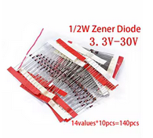

# Diode

[wiki](https://sh.wikipedia.org/wiki/Dioda)

**Dioda je najjednostavniji oblik poluprovodnika, koji struju provodi uglavnom u jednom smeru.** Dioda pruža veliki otpor struji u jednom smeru a veoma mali u suprotnom.

Najčešći tipovi dioda su:
* **Zener diode**: Ograničavaju napon na unapred utvrđenu vrednost. Od zener diode se lako i jeftino može napraviti regulator napona.
* **Svetleće diode (LED)**: Svi poluprovodnici emituju infracrvenu svetlost kada kroz njih prolazi struja. LED diode emituju svetlost bilo koje boje.
* **Diodni ispravljač**: Ispravlja naizmeničnu struju u jednosmernu. Diode se često nazivaju ispravljači jer ispravljaju struju.
* **Diodni most (Grecov most)** čine četiri diode povezane u kvadrat; najefikasnije ispravlja naizmeničnu struju u jednosmernu.

## Vršni napon i struja

Diode nemaju svoje „vrednosti“ kao otpornici i kondenzatori (sem zener dioda). One se biraju na osnovu vršnog napona i struje.
* **Vršni inverzni napon** je najveći napon koji dioda može izdržati u neprovodnom smeru, odnosno najveći radni napon diode.
* **Vršna struja** je najjača struja koju dioda može izdržati.

Diode se označavaju standardnim brojčanim oznakama, na primer, ispravljačka dioda 1N4001. Ispravljačke diode za struju od 3 do 5 ampera obično imaju crno ili sivo epoksidno telo i mogu se direktno zalemiti na štampanu ploču. Diode koje podnose jače struje, recimo 20, 30 ili 40 ampera, obično su u metalnom kućištu. U njemu se nalazi odvod za toplotu ili mesto za povezivanje diode s hladnjakom. Ima i dioda upakovanih kao tranzistori.

## Polaritet

Sve diode imaju polaritet - pozitivan i negativan kraj. Pozitivan kraj se zove **anoda** a negativan **katoda**. Katodu lako možete prepoznati jer se na toj strani nalaze crvene ili crne trake. Vrlo je važno da postavite diodu tako da bude usmerena u pravom smeru.

Pošto diode puštaju struju u jednom smeru a blokiraju u drugom, ako diodu pogrešno postavite kolo neće raditi ili ćete oštetiti neke komponente.

Na šemama polaritet diode se označava kratkom linijom koja predstavlja katodu, to jest negativan pol.

