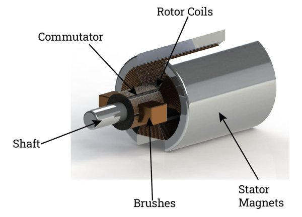

# Motori jednosmerne struje

[wiki](https://sh.wikipedia.org/wiki/Elektromotor_istosmjerne_struje)

Jeste li se ikada zapitali šta uzrokuje vibriranje telefona? **Motor jednosmerne struje**. Takav motor pretvara električnu energiju u kretanje. To kretanje može biti okretanje točkova robota, podrhtavanje telefona ili bilo koje drugo kretanje.

## Delovi

Elektromotor se sastoji od **elektromagneta** na osovini, koja rotira između dva stalna magneta. Pozitivan i negativan pol baterije povezuju se tako da svaki kraj elektromagneta ima isti polaritet kao stalan magnet pored njega. Isti polovi magneta međusobno se odbijaju. To odbijanje pokreće elektromagnet i izaziva obrtanje osovine. Kako se osovina obrće, tako pozitivna i negativna veza elektromagneta menjaju mesta, pa magneti nastavljaju da „guraju“ osovinu. 

Jednostavan mehanizam sastavljen od **komutatora** (kružnog prekidača kod koga je svaki segment povezan s različitim krajem elektromagneta) i **četkica** koje dodiruju komutator, uzrokuje promenu veza. Komutator se obrće zajedno sa osovinom dok su četkice stacionarne, s tim da je jedna povezana s pozitivnim polom baterije a druga s negativnim. Dok osovina sa komutatorom rotira, menja se segment koji je u kontaktu sa svakom četkicom. Tako se menjaju krajevi elektromagneta povezani s pozitivnim i negativnim naponom.

**Osovina** u DC motoru rotira brzinom od nekoliko hiljada obrtaja u minutu - što je prebrzo za većinu primena. Proizvođači zato prodaju i motore sa uređajem koji smanjuje brzinu osovine na manje od sto obrtaja u minutu - slično kao što se promenom stepena prenosa menja brzina automobila.

## Karakteristike

U katalozima proizvođača obično se navodi nekoliko specifikacija motora. Dve ključne stavke koje treba uzeti u obzir jesu:
* **Brzina**: Izražena u obrtajima u minutu (en. *revolutions per minute*, rpm). Potrebna brzina zavisi od predviđene namene. Na primer, kada želite da napravite model automobila, „gađajte“ brzinu od 60 obrtaja u minutu - tada će motor okretati točkove jednom u sekundi.
* **Radni napon**: navodi se kao opseg dozvoljenih napona. Uobičajen elektromotor radi u opsegu od 4,5 do 12 volti.
* Obratite pažnju i na **nominalni napon**. Motor se okreće navedenom brzinom kada se napaja nominalnim naponom. Ako je napon manji, ide sporije.

Efikasniji metod upravljanja brzinom zove se impulsno-širinska modulacija. Primenom te metode, napon se u kratkim impulsima uključuje i isključuje. Što su intervali duži, motor se brže okreće. Ako pravite uređaj kojim upravlja motor u kompletu ćete verovatno naći i komponentu za kontrolu brzine.

Motori jednosmerne struje imaju **dva izvoda** - pozitivan i negativan. Ako se napajanje obrne, motor se okreće na drugu stranu.