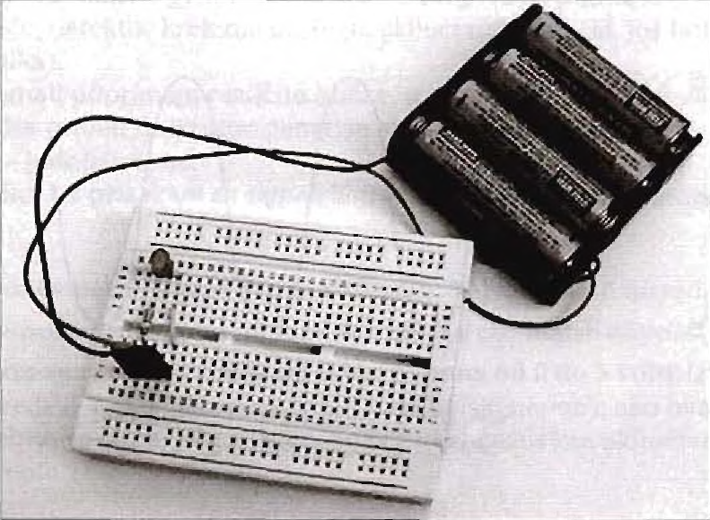

# Elektronsko kolo

[wiki](https://sh.wikipedia.org/wiki/Elektronsko_kolo)

Elektronsko kolo je skup komponenti međusobno povezanih žicama kroz koje teče električna struja. Elektronsko kolo je sastavljeno od elektronskih komponenti, kao što su otpornici, tranzistori, induktori i diode.

Kolo ima pet osnovnih delova:
* izvor napajanja
* komponente, kao što su otpornici i tranzistori
* žice koje povezuju sve elemente kola
* izlazni uređaj (koji se naziva opterećenje ili potrošač), na primer zvučnik 
* uzemljenje koje kompletira kolo

Mnoga kola, ali ne sva, imaju i ulaz.

## Paljenje sijalice

Jedno od najjednostavnijih kola sastoji se od sijalice i dve žice koje povezuju sijalicu i izvor napajanja. To kolo nije mnogo praktično pošto je sijalica stalno uključena. Kolo će biti mnogo korisnije ako dodate prekidač kojim se uključuje i isključuje sijalica. Na slici 7-1 prikazana je šema kola u kojem su sijalica i prekidač.

Kolo na slici 7-1 ima prekidač u zatvorenom položaju. Kada je prekidač u tom položaju, kolo je zatvoreno i elektroni mogu slobodno da se kreću od negativnog pola baterije, kroz sijalicu, do pozitivnog pola baterije. U sijalici se nalazi vlakno koje se greje i emituje svetlost kada elektroni prolaze kroz njega.

S druge strane, kada je prekidač u otvorenom položaju, kao što je prikazano na slici 7-2, kolo je otvoreno jer u njemu postoji prekid. Zbog toga električna struja ne može da protiče. Bez struje nema ni svetla.

I baterijska lampa radi na isti način. Kada uključite lampu, prekidač zatvara kolo koje čine sijalica i baterija i omogućava tok struje. Kada lampu isključite, otvarate kolo i nema toka struje.

## Svetleća dioda

Uzmite bateriju, otpornik i LED diodu, povežite ih žicama i dobili ste jednostavno elektronsko kolo. Elektronsko kolo se upravo na to i svodi - žice povezuju komponente tako da struja može da protiče kroz njih i da se vrati do izvora.

Jednostavno kolo je prikazano na slici. Komponente koje čine to kolo postavljaju se na prototipsku ploču (en. *breadboard*) i međusobno povezuju žicama. 

Na slici su prikazane žice povezane sa oba pola baterije u kolu. Ta veza omogućava da struja teče iz baterije, kroz LED diodu i druge komponente, do suprotnog pola baterije - tako se kolo zatvara. Kolo se može zatvoriti i tako što se njegovi delovi povežu s metalnim kućištem uređaja, recimo stereo sistema. Takvu vezu zovemo uzemljenje i ona se koristi kao referenca za sve napone u kolu. Uzemljenje može, ali ne mora biti povezano sa zemljom, ali je uvek referenca u odnosu na koju se mere svi ostali naponi.

Kolo se može predstaviti i šematski. Šema je crtež na kome se vidi kako su komponente povezane žicama.

## Smanjenje struje pomoću otpornika

Recimo da želite da prigušite svetlost sijalice. Dovoljno je da dodate otpornik u kolo. Dodavanjem otpornika smanjuje se broj elektrona koji protiče kroz kolo. Kada kroz vlakno sijalice protiče manje elektrona, ono emituje manje svetlosti.
