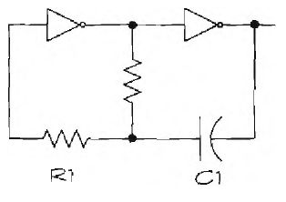

# Bitne elektronske formule

Jednačine otklanjaju nedoumice u elektronici. Umesto da prospete komponente na sto i slažete ih nasumično na ploči, kao iskusan elektroničar pravićete kolo primenjujući jednačine, na osnovu kojih utvrđujete tačne vrednosti veličina.

Neke od ovih jednačina korističete i pri menjanju postojećih kola. Na primer, pomoću osnovnog oblika jednačine Omovog zakona za struju (vidi tabelu) možete odabrati odgovarajući otpornik da bi LED diode sijale svetlije ili prigušenije.

## Računanje nepoznanica pomoću Omovog zakona

[Omov zakon](omov-zakon) određuje odnos između snage, napona, struje i otpora. U tabeli navedene su jednačine pomoću kojih se računaju ove vrednosti:

Nepoznata vrednost     | Formula
-----------------------|----------
Napon (V), u voltima   | V = I * R
Struja (I), u amperima | I = V / R
Snaga (P), u vatima    | P = V * I
Otpornost (R), u omima | R = V / I

Evo primera: Da bi našli snagu kola koje zahteva 100 volti na deset ampera, pomnožite voltažu s brojem ampera (100 x 10 = 1000). Dakle, 1000 vati. Na osnovu ove brojke utvrdićete kakav osigurač možete dodati kolu, ili koliki ćete račun za struju dobiti na kraju meseca.

Drugi primer: Da bi našli vrednost otpornika za predviđenu struju kroz LED diodu, pomoći ćete se Omovim zakonom na siedeći način:
```
R = V / I
```

Da bi povezali LED diodu, otpornik i bateriju, moramo izračunati otpornost otpornika. Poznate su nam sledeće vrednosti:
* V: Napon. Pošto dioda kroz koju protiče struja pravi pad napona, moramo oduzeti napon na diodi (oko 1,2 volta za tipičnu LED) od izvora napajanja. Na primer, ako je napajanje 5 volti, a pad napona na LED diodi 1,2 volta, ostaje 3,8 volti.
* I: Potrebna struja u amperima za LED diodu. Vrednost 20 mA je sasvim bezbedna za skoro svaku LED diodu; niža amperaža znači prigušenije svetlo, a viša od 40 ili 50 mA može uništiti diodu. Pošto struju moramo da izrazimo u amperima, 20 mA postaje 0,02 ampera.

Traženu otpornost, koja će ograničiti struju kroz LED diodu, možemo izračunati:
```
R = 3,8 volti / 0,02 ampera = 190 oma
```

## Računanje otpora

Otpornost jednog otpornika u kolu može se jednostavno izračunati. Ali, ako se otpornici spoje paralelno ili serijski, ukupna otpornost se menja. Vrednosti serijski vezanih otpornika se sabiraju, dok je ukupnu otpornost paralelne veze malo teže izračunati.

### Redna veza otpornika

Jednačina za serijsku vezu otpornika veoma je jednostavna - otpornosti se sabiraju:
```
Rt = R1 + R2 + R3 . . . (i koliko god je potrebno)
```

Pretpostavimo da imate dva otpornika od 1,2 i 2,2 kilooma. Sabiranjem se dobija ukupna otpornost od 3,4 kilooma.

### Uporedna veza otpornika

Ukupna otpornost dva otpornika u paralelnoj vezi računa se nešto teže. Evo jednačine:
```
Rt = (R1 * R2) / (R1 + R2)
```

Ako su pojedinačne otpornosti 1,2K (1200 oma) i 2,2K (2200 oma), ukupna otpornost je:
```
776,47 = 2640000 / 3400
```

Izračunajmo sada otpornost paralelne veze tri ili više otpornika:
```
Rt = 1 / (1/R1 + 1/R2 + 1/R3 + ...)
```

## Računanje kapacitivnosti

Pomoću ovih jednačina možete izračunati ukupnu kapacitivnost u kolu. Primetićete da odgovaraju inverznom obliku jednačina za otpornost.

### Uporedna veza kondenzatora

Ukupna kapacitivnost paralelno vezanih kondenzatora dobija se sabiranjem pojedinačnih kapacitivnosti:
```
Ct = C1 + C2 + C3...
```

### Redna veza kondenzatora

Sledeća formula omogućava da izračunate ukupnu kapacitivnost dva redno vezana kondenzatora:
```
Ct = (C1 * C2) / (C1 + C2)
```

Ako ima više od dva kondenzatora, ukupnu kapacitivnost izračunaćemo pomoću sledeće jednačine:
```
Ct = 1 / (1/C1 + 1/C2 + 1/C3 + ...)
```

## Jedinice energije

Vat-čas je jedna od najpraktičnijih mernih jedinica energije; opisuje mogućnost uređaja ili kola da obavi posao. Vat-časove izračunačete množenjem snage kola (u vatima) s vremenom rada kola. Jednačina za računanje vat-časova je:

```
Vat-časovi = P x T
```

gde je:
- P: snaga u vatima
- T: vreme u časovima rada na toj snazi

Vat-sekunde, odnosno džule, izračunaćemo ako vat-časove podelimo sa 3600.

## Računanje vremenske konstante RC



Elektronska kola često pomoću vremenskih konstanti odlažu pojavu signala ili produžavaju trajanje. Vremenske konstante najčešće se realizuju pomoću otpornika i kondenzatora - otud i njihov naziv, RC.

Da bi zatvorili kolo sa slike, povezaćete otpornik i kondenzator s nekom aktivnom komponentom, poput invertora ili tranzistora. Kad izmenite vrednosti otpornika i kondenzatora, menjate trajanje izlaznog signala.

Rad RC kola zasniva se na činjenici da pražnjenje kondenzatora kroz otpornik traje izvesno vreme. Što je veća otpornost i/ili kapacitivnost, kondenzator se duže prazni. Projektanti kola koriste RC vezu da bi napravili jednostavne tajmere i oscilatore ili da bi izmenili oblik signala.

Vremenska konstanta se računa množenjem otpora i kapaciteta:

```
T = R * C
```

Na primer, vremenska konstanta kola sa otpornikom od 2000 oma i s kondenzatorom od 0,1 µF (0,0000001 F) iznosi 0,002 sekunde, odnosno dve milisekunde. 

## Računanje frekvencije i talasne dužine

Frekvencija signala je direktno srazmerna talasnoj dužini. Jednačine mogu biti korisne ako eksperimentišete s radio-talasima.

### Frekvencija signala

Recimo kako hoćete da komunicirate s ljudima širom sveta putem amaterskog radio uređaja. U svetu radio amatera, kolege će vam pominjati da koristite određenu talasnu dužinu. Ovde ćemo objasniti kako da izračunate frekvenciju za datu talasnu dužinu:

```
frekvencija = 300.000 / talasna dužina
```

Talasna dužina izražava se u milimetrima, frekvencija u megahercima.

### Talasna dužina signala

Pomoću iste formule možemo izračunati talasnu dužinu, ako nam je poznata frekvencija radio signala:

```
talasna dužina = 300.000 / frekvencija
```

Rezultat je izražen u milimetrima. Frekvencija se navodi u megahercima. Evo primera: pretpostavimo da komunicitate s bićima iz svemira na 50 megaherca (50 miliona ciklusa po sekundi). Kada ubacimo te brojke u jednačinu, dobijamo:

```
6000 (milimetara) = 300.000 / 50
```

Mnogi talasnu dužinu izražavaju u metrima, tako da nam je potreban još jedan korak. Pošto u metru ima 1000 milimetara, rezultat je 6 metara. Dakle, razgovarate na amaterskom radio kanalu talasne dužine 6 metara.
