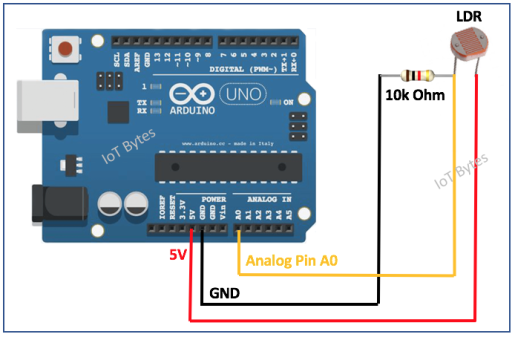
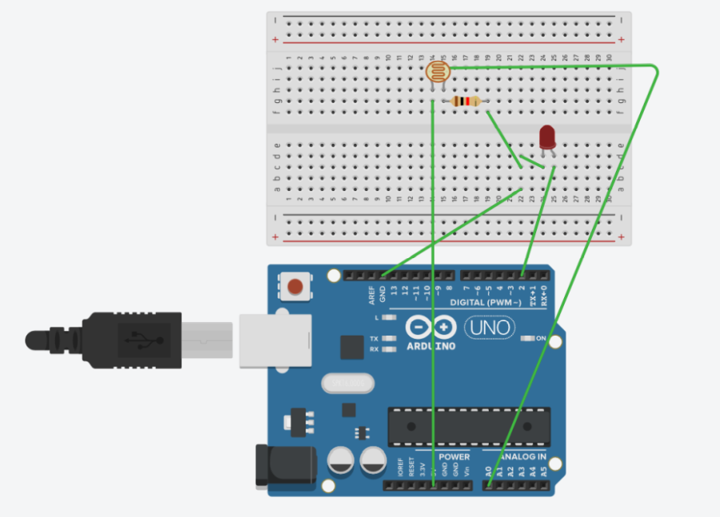

# Fotootpornik

[wiki](https://sh.wikipedia.org/wiki/Fotootpornik)

**Fotootpornik** (engl. *photoresistor* ili **LDR** – *Light Dependent Resistor*) je pasivna elektronska komponenta čiji se električni otpor menja u zavisnosti od jačine svetlosti. Kada čestice svetlosti (fotoni) padnu na poluprovodnički materijal fotootpornika, dolazi do povećanja broja slobodnih nosilaca električnog naboja, čime se smanjuje njegov otpor. 

- U mraku: otpor je veoma veliki (reda megaoma). 
- Na jakom svetlu: otpor se smanjuje na nekoliko stotina oma ili kilo-oma.

## Primena

Fotootpornici se koriste u:
- automatskoj regulaciji osvetljenja,
- svetlosnim senzorima i alarmima,
- mernim instrumentima,
- fotoaparatima,
- edukativnim i hobi projektima sa mikrokontrolerima.

## Karakteristike

Fotootpornici su jeftini i jednostavni za upotrebu, ali imaju relativno sporo vreme odziva (od nekoliko desetina milisekundi do sekundi), što ih čini neprikladnim za brze optičke signalne aplikacije. Takođe su manje precizni u poređenju sa fotodiodama i fototranzistorima.

Zbog prisustva kadijuma, koji je toksičan, upotreba kadijumskog fotootpornika je u nekim zemljama ograničena, pa se oni sve češće se zamenjuju fotodiodama i digitalnim svetlosnim senzorima.

## Povezivanje sa Arduinom

Tipična veza fotootpornika sa Arduinom izgleda ovako:

- Fotootpornik i otpornik (npr. 10 kΩ) povežu se redno.
- Jedna strana ide na 5V, druga na GND, a njihova tačaka spajanja na analogni pin (npr. A0) da bi se merio napon.

### Povezivanje sa Arduinom + LED

## Zašto koristimo razdelnik napona?

Često se postavlja pitanje: Zašto fotootpornik ne spojimo direktno na analogni pin Arduina, umesto pomoću [razdelnika napona](razdelnik-napona.md)? Otpor fotootpornika zavisi od osvetljenja, pa bi logično bilo direktno očitavati promene. Međutim — to ne funkcioniše tako.

Fotootpornici sami po sebi imaju previsok otpor da bi direktno radili sa analognim ulazom Arduina.

### Eksperiment: merenje fotootpornika

Pokušaj sledeće:

- Poveži pinove fotootpornika sa elektrodama multimetra. Podesi multimetar da meri otpor (om-metar).
- Izmeri otpor u različitim osvetljenjima.  
- Videćeš da iako se svetlost menja, otpor generalno ostaje vrlo velik, obično između **100 kΩ i 1 MΩ**. 

Usled velikog otpora, ako fotootpornik spojimo između 5V i pina A0, kroz njega će teći mala struja, a pad napona na njemu biće zanemarljiv. Arduino će na A0 skoro uvek očitavati ~5V, bez obzira na osvetljenje.

### Objašnjenje

Kada svetlost pada na fotootpornik i njegov otpor opada, napon na spoju se menja u skladu sa proporcijom između fiksnog i promenljivog otpornika. Korišćenjem razdelnika napona pretvaramo promenljiv otpor u promenljiv napon, u zavisnosti od svetlosti.

Tako fotootpornik postaje praktičan senzor osvetljenja.

## Izvori
- [Why use a voltage divider with a photoresistor?](https://techexplorations.com/guides/arduino/common-circuits/voltage-divider-photoresistor/)
- [How to Use a Photoresistor!](https://projecthub.arduino.cc/tropicalbean/how-to-use-a-photoresistor-1143fd)