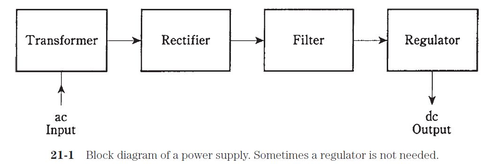
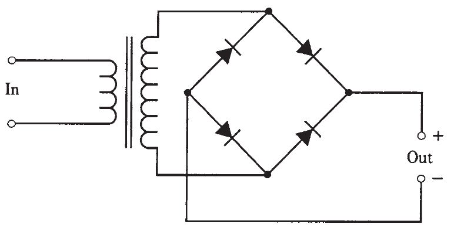

# Ispravljač

[wiki](https://sh.wikipedia.org/wiki/Ispravlja%C4%8D)

Ispravljač (en. *rectifier*) pretvara naizmeničnu struju u usmerenu.



## Ispravljački most (most dioda, Grecov most)



## Računanje napona

Pošto naizmenična struja ide naizmenično, jednosmerni napon će biti niži kada se pretvori. Da odrediš napon jednosmerne struje, podeli napon naizmenične korenom iz dva:

```
U (DC) = U (AC) / √2
```

Na primer ako je naizmenični napon 120 V, jednosmerni će biti:
```
120 V / √2 = 84.85 V (DC)
```

Aktuelni izlaz će biti manji od računice. Ako nemaš digitron, √2 možeš zaokružiti na 1.4. 
