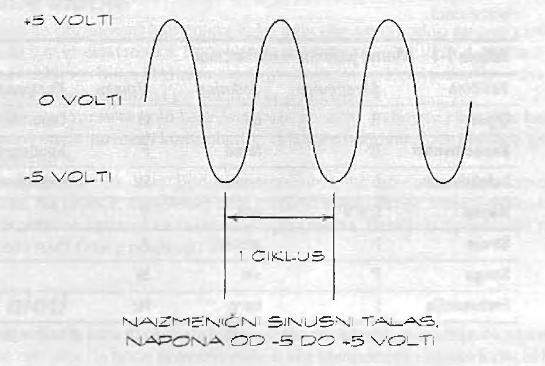

# Veličine i jedinice mere

Jedinice mere vam kazuju koliko nečega imate. Na primer, kada kupujete jabuke, njihovu masu izražavate kilogramima. Slično tome, pomoću multimetra merimo otpor u omima, napon u voltima, i jačinu struje u amperima. 

U tabeli su navedene uobičajene veličine i jedinice mere u elektronici:

Veličina | Jedinica | Komponenta
-------- | -------- | ------
otpor (R) | om (Ω) | otpornik
kapacitivnost (C) | farad (F) | kondenzator
induktivnost (L) | henri (H) | induktivni kalem
napon (E ili V) | volt (V)
struja (I) | amper (A) 
snaga (P) | vat (W) 
frekvencija (f) | herc (Hz)

## Naučna notacija

Kada merite jabuke, možete izmeriti i samo krišku i nekoliko kilograma jabuka. U elektronici se koristi mnogo širi opseg jedinica. U jednom kolu ukupan otpor može biti nekoliko miliona oma, a u drugom, struja koja protiče kroz njega može biti vrlo slaba (možda samo hiljaditi deo ampera). Pri korišćenju i označavanju vrlo velikih i vrlo malih brojeva primenjuje se specijalna terminologija.

U elektronici se za označavanje malih i velikih brojeva koriste prefiksi i naučna notacija:

Broj | Ime | Naučna notacija | Prefiks | Skraćenica
---- | --- | --------------- | ------- | --------
1.000.000000 | milijarda | 10^9 | giga | G
1.000.000 | milion | 10^5 | mega | M
1.000 | hiljada | 10^3 | kilo | k
100 | stotina | 10^2
10 | desetica | 10^1
1 | jedinica | 10^0
0.1 | deseti | 10^-1
0.01 | stoti | 10^-2
0.001 | hiljaditi | 10^-3 | mili | m
0.000001 | milioniti | 10^-5 | mikro | μ
0.000000001 | milijarditi | 10^-9 | nano | n
0.000000000001 | bilioniti | 10^-12 | piko | p

Naučna notacija je metod koji omogu­ćava da se odredi koliko nula treba dodati broju u decimalnom sistemu. Na primer, eksponent 6 u oznaci 10^6 znači da decimalni zarez treba postaviti šest mesta udesno. 10^-6 znači da decimalni zarez treba pomeriti šest mesta ulevo. 

Dakle, ako je broj u naučnoj notaciji napisan kao 1 x 10^6 decimalni zarez treba postaviti šest mesta udesno od jedinice, pa u uobičajenoj notaciji dobijamo 1.000.000 to jest jedan milion. Kada je broj napi­san kao 1 x 10^-6, decimalni zarez se pomera šest mesta ulevo, pa dobijamo broj 0.000001 to jest 1 milioniti. 

U slučaju broja 3.21 x 10^4, decimalni zarez se pomera četiri mesta udesno i kao rezultat dobijamo broj 32.100.

## Prefiksi za veličinu

Kombinacijom prefiksa i jedinica dobijamo kompaktnu notaciju. Na primer, možemo napisati 5 miliampera ili 5 mA, odnosno 3 megaherca ili 3 MHz.

Baš kao što pitu najčešće pravite od kilograma ili nešto više jabuka, a pri izgradnji poslovnog prostora utrošite nekoliko tona čelika, tako i u elektronici neke veličine po prirodi imaju male a neke prilično velike vrednosti. To znači da ćete stalno nailazili na određene kombinacije prefiksa i jedinica. Navodimo najčešće takve kombinacije:

* Struja: pA, nA, mA, μA, A
* Induktivnost: nH, mH, μH, H
* Kapacitivnost: pF, nF, mF, F
* Napon: mV, V, kV
* Otpor: Ω, kΩ, MΩ
* Frekvencija: Hz, kHz, MHz, GHz

Pomoću podataka iz gornje tabele, možemo prevesti neke notacije. Na primer:

* mA: miliamper tj. hiljaditi deo ampera
* μV: mikrovolt tj. milionili deo volta
* nF: nanofarad tj. milijarditi deo farada
* kV: kilovolt tj. hiljadu volti
* MΩ: megaom tj. milion oma
* GHz: gigaherc tj. milijardu herca

Prefiksi koji predstavljaju brojeve veće od 1, kao što je *M* za mega, koriste velika slova. Prefiksi koji predstavljaju brojeve manje od 1, kao što je *m* za mili, koriste mala slova. Izuzetak jeste *k* za kilo, gde se koristi malo slovo, iako predstavlja skraćenicu za hiljadu. 

Korišćenje velikog slova *K* specijalan je slučaj rezervisan za kiloome: kada vidite veliko slovo *K* pored broja, na primer 3,3 K, znači da je reć o otporu od 3,3 kilooma.

Pre bilo kakvog izračunavanja, sve vrednostl izražene pomoću prefiksa moramo prevesti u osnovne jedinice.

## Novi izrazi

*Kapacitivnost* je sposobnost skladištenja naelektrisanja u električnom polju. Uskla­dišteno naelektrisanje utiče na postupnije smanjenje ili povećanje napona, tako da njime možemo bolje upravljati. Za ovu svrhu koriste se komponente koje zovemo *kondenzatori*.

*Induktivnost* je sposobnost skladištenja energije u magnetnom polju. Ta uskladište­na energija utiče na promenu vrednosti električne struje, kao što naelektrisanje us­kladišteno u kondenzatoru utiče na promene napona. Komponente pod nazivom *induktivni kalemi* ugrađuju se u električna kola da bi se iskoristila induktivnost.

*Snaga* odgovara uloženom radu elektri­čne struje koja protiče kroz neku električnu komponentu. Recimo, kada se na sijalicu primeni napon a struja poteče kroz vlakno sija­lice, uloženi rad se pretvara u zagrevanje tog vlakna. U tom primeru, snaga se može izračunati množenjem vrednosti napona s jačinom električne struje koja protiče kroz vlakno.

*Frekvencija* je mera učestalosti ponavljanja naizmeničnog signala. Na primer, naizmenična struja ciklus promene smera obavi 50 puta u sekundi. Na sledećoj slici prikazan je sinusni talas. Signal prolazi kroz jedan ciklus kada napon sa -5 dode do +5 volti a zatim se vrati na vrednosi od -5 volti. Ako signal po­novi taj ciklus 50 puta u sekundi, njegova frekvencija je 50 Hz (50 herca).

