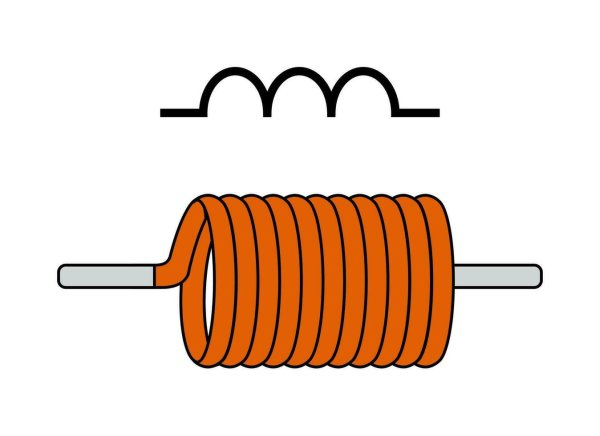

# Induktivni kalem

[wiki](https://sh.wikipedia.org/wiki/Induktor)

**Induktivni kalem** (**prigušnica**, **namotaj**, **induktor** ili samo **kalem**) je električna komponenta koja se suprotstavlja promenama struje. Kada struja naglo raste ili opada, kalem stvara napon suprotnog smera i tako ublažava te promene. Kalemovi se često koriste za filtriranje, tj. odstranjivanje svih frekvencija sem željene.

Kada elektroni teku kroz namotaj žice, okolo se stvara magnetno polje. Ako se struja menja, magnetno polje se menja i indukuje suprotnu elektromotornu silu koja se suprotstavlja promeni struje (Lenzovo pravilo). Tako induktivni kalem usporava promene struje – ne dozvoljava da naglo raste niti pada. U jednosmernim kolima, kada struja dostigne stabilnu vrednost, kalem se ponaša kao običan provodnik i ima samo sopstveni otpor žice.

Induktivne kalemove nalazimo u mnogim električnim kolima i uređajima. U naizmeničnim izvorima napajanja kalemovi se koriste za smanjivanje šuma na 50 Hz. U radio-prijemnicima omogućavaju izdvajanje željenog signala: promenom podešavanja kalema i kondenzatora radio se podešava na tačnu frekvenciju, dok se svi ostali signali prigušuju.

### Induktivnost

**Induktivnost** je svojstvo kalema da skladišti energiju u magnetnom polju koje ga okružuje, kada kroz njega ide električna struja. Induktivnost je zapravo mera sposobnosti kalema da smanji napon signala naizmenične struje. 

Induktivnost se izražava henrijima (H ili h) ili češće milihenrijima (hiljaditim delovima henrija) i mikrohenrijima (milionitim delovima henrija). Obično se označava pomoću boja, kao kod otpornika. Često se vrednost induktivnosti kod većih kalemova štampa direktno na komponenti. 

### Vrste kalemova

Kalemovi mogu biti **stalni ili promenljivi**. Kod oba tipa, žica je omotana oko izolacionog jezgra. Broj namotaja žice, materijal od kojeg je napravljeno jezgro i prečnik žice određuju induktivnost kalema. Stalni kalemovi imaju konstantnu induktivnost, dok na promenljivima postoji dugme čijim okretanjem podešavamo induktivnost.

Jezgro kalema je najčešće od vazduha ili ferita (gvožđa).
