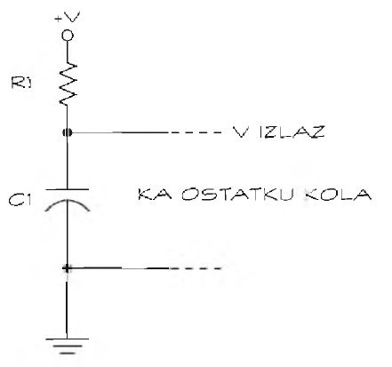

# Kombinacija kondenzatora i otpornika

Kondenzator i otpornik vezani u kolo čine jedan od osnovnih gradivnih blokova elektronskih kola. Kondenzator skladišti elektrone, dok otpornik upravlja njihovim tokom. Skupa, te dve komponente i mogu upravljati brzinom kojom elektroni pune i napuštaju kondenzator. Što je veća kapacitivnost, kroz kondenzator teče slabija struja, treba više elektrona da se napuni, i punjenje traje duže. Pravim izborom kondenzatora i otpornika možete podesiti trajanje punjenja i pražnjenja.

## Uključivanje i isključivanje kola



Izlazni napon (V izlaz) zavisi od toga koliko je napunjen kondenzator u kolu. Što je kondenzator puniji, izlazni napon je veći. Što je prazniji, izlazni napon, je manji. Pošto komponente koriste različite vrednosti izlaznog napona (tranzistor radi na naponu koji se razlikuje od nivoa napona integrisanog kola, na primer), možete izabrati otpornost i kapacitivnost koje će na određenoj učestanosti ili posle izvesnog vremena uključivati i isključivati kolo.

Šta ako želite da se kondenzator napuni za 30 sekundi? U kutiji s komponentama imate kondenzator kapacitivnosti 15 mikrofarada; korišćenjem otpornika otpornosti 2 megaoma podešava se vreme za koje kondenzator dostigne dve trećine svog kapaciteta.

Punjenje kondenzatora do dve trećine kapaciteta često obezbeđuje dovoljan izlazni napon za uključivanje sledeće komponente u kolu. Ako vam to ne pođe za rukom, upotrebite otpornik manje otpornosti da bi se kondenzator punio brže. U principu, sve to možete obaviti vrlo jednostavno: upotrebite kondenzator koji vam je pri ruci i izračunajte koliko je oma neophodno da bi se približili željenom vremenskom kašnjenju.

Vreme za koje se kondenzator napuni do dve trećine kapaciteta možete izračunati pomoću takozvane RC vremenske konstante. Pomnožite otpornost otpornika, u omima, kapacitivnošću kondenzatora, u faradima, i dobićete vreme za koje se kondenzator napuni do dve trećine kapaciteta.

```
RC vremenska konstanta = R * C = 2.000.000 oma * 0,000015 farada = 30 sekundi
```

Ako želite da fino podesite kašnjenje, upotrebite otpornik neznatno manje otpornosti od potrebne i redno vežite potenciometar. Pošto je ukupna otpornost jednaka zbiru otpornosti otpornika i potenciometra, možete je podešavati sve dok ne dobijete željeno kašnjenje.
