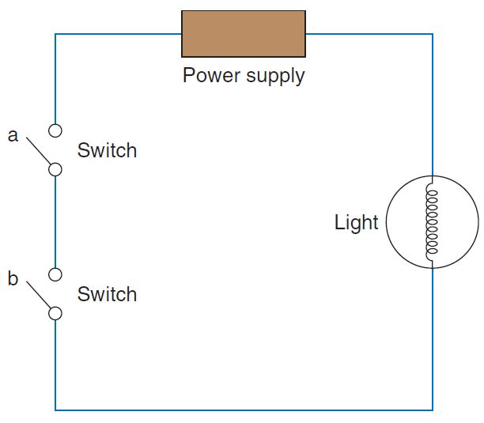
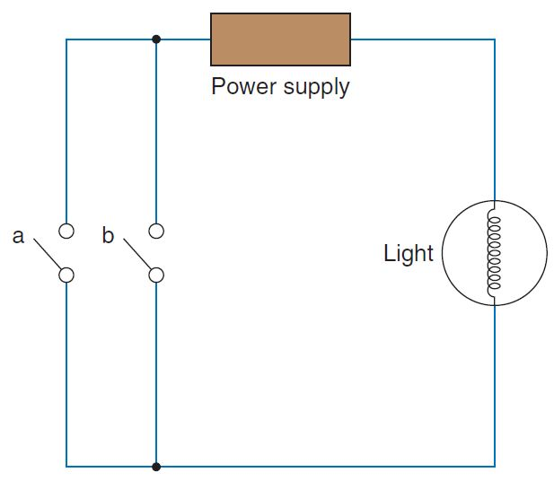

# Logička kola

[wiki](https://sh.wikipedia.org/wiki/Logi%C4%8Dka_kapija)

**Logička kola** su integrisana kola koja na osnovu ulaznih vrednosti i logičkih pravila određuju izlaznu vrednost. Obično imaju dva ulaza, dok invertor ima samo jedan, a postoje i logička kola s više ulaza. 

Vrednost ulaza i izlaza može biti visoka (1) ili niska (0). U elektronici, visok ulaz znači da kolo ima napon oko 5 volti. Nizak ulaz znači da je napon približno 0 volti.

## Najčešća logička kola

U elektronici ćemo koristiti neko od pet najčešćih tipova logičkih kola: 
- I
- ILI 
- NE (invertor) 
- NI (I kolo za kojim sledi invertor) 
- NILI (ILI kolo za kojim sledi invertor)

U integrisanim kolima se najčešće nalazi više logičkih kola, kao što je integrisano kolo sa četiri dvoulazna I kola (četvorostruko dvoulazno I kolo).

## Logička kola pomoću prekidača

### Logičko I kolo

Logičko I kolo dobija se rednim povezivanjem dva prekidača. Struja će teći samo ako su oba prekidača zatvorena (oba uslova ispunjena).

### Logičko ILI kolo

Logičko ILI kolo dobija se uporednim povezivanjem dva prekidača. Struja će teći ako je bilo koji prekidač zatvoren (bilo koji uslov ispunjen).

Ako umesto prekidača stavimo foto-otpornike ili druge senzore u kombinaciji sa tranzistorima, možemo graditi kompleksniju logiku (npr. da signal krene ako ima svetla i/ili pokreta).
