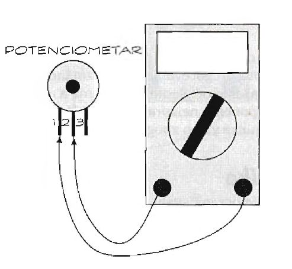
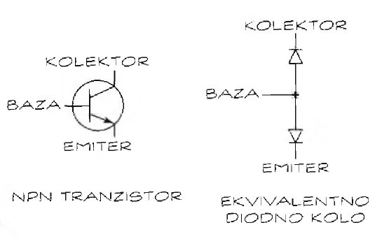

# Merenja multimetrom

Pošto ste uključili multimetar i kalibrisali ga, možete obaviti prva merenja. 

## Merenje napona

Napon se može meriti u svim tačkama kola, a ne samo na polovima baterije. Npr, možemo meriti napon preko otpornika ili LED diode. Kada merimo napon pojedine komponenete kačimo multimer za njene nožice (crna sonda može na uzemljenje?), a kada merimo celo kolo onda za napajanje.

Ako kolo emituje oscilujuće signale, oni se mogu menjati tako brzo da ih ne možemo izmeriti multimetrom. Odgovaraja oprema za merenje brzomenjajućih signala su logička sonda i osciloskop.

## Merenje struje

Da bi izmerili struju, potrebno je redno vezati multimetar u kolo. Tako se meri ukupna struja koju kolo crpi. Oprez, mnogi multimetri mere struju samo do određene jačine!

Možemo izmeriti i struju koja teče kroz deo kola, ili kroz samo jednu komponentu. 

## Ispitivanje kontinuiteta

Ispitivanjem kontinuiteta proveravate da li je kolo kompletno ili nije. Kontinuitet ćemo najlakše opisati ako jednu žicu smatramo kolom:
* Kratak spoj pokazuje da postoji veza između dve tačke jedne žice. Multimetar to stanje prikazuje kao otpornost vrednosti 0 (nula) oma.
* Otvoreno kolo znači da u kolu ne postoji kontinuitet, odnosno u žici postoji prekid. Multimetar to stanje prikazuje kao beskonačnu otpornost, to jest otpornost toliko velike vrednosti da multimetar ne može da je registruje.

Kada ispitujete kabl s nekoliko žica, proverite da li se žice u njemu dodiruju (prave kratak spoj).

Ispitivanje žica:
* Ispitivanje kontinuiteta žice. Povežite sonde multimetra s krajevima žice. Trebalo bi da očita otpornost blizu 0 oma. Očitavanje od nekoliko oma ukazuje na mogući prekid u kolu.
* Ispitivanje kratkog spoja između žica koje ne bi trebalo da su povezane. Povežite sonde multimetra s ogoljenim krajem dveju žica. Trebalo bi da očita gotovo beskonačnu otpornost. Ako se očita nula verovatno postoji kratak spoj.

Ako ispitujete dve odvojene žice, dobićete rezultat od beskonačno mnogo oma, zar ne? U većini slučajeva je tako. Međutim, takva veza može da ima određenu otpornost, pa ne brinite previše ako se ne očitava beskonačna vrednost.

### Čak i žica pruža otpor

Zašto multimetar ne pokazuje nula oma kada ispitujete žicu, posebno dugačku? Sva električna kola suprotstavljaju se toku elektrona. Čak i kratki komadi žice imaju otpornost, ali je ona obično manja od jednog oma i nije važna za ispitivanje kontinuiteta.

Što je žica duža, otpornost je veća, posebno ako je prečnik mali. S druge strane, što je žica deblja, otpornost je manja.

## Ispitivanje prekidača i preklopnika

* Kada je prekidač ili preklopnik u položaju isključeno, multimetar bi trebalo da pokaže beskonačnu otpornost.
* Kada je prekidač ili preklopnik u položaju uključeno, multimetar bi trebalo da pokaže nula oma. 

Najjednostavniji prekidač je jednopolni (običan). Ima dva izvoda: ulaz i izlaz. On omogućava ili sprečava proticanje struje, zavisno od položaja. Jednopolni prekidači (i preklopnici) uključuju/isključuju samo jedan deo kola. Dvopolni prekidač je zadužen za dva zasebna kola (recimo jedno napona 12 volti i drugo 5 volti). Ovi prekidači mogu da budu tipa uključeno-uključeno ili da imaju središnji položaj tipa uključeno-isključeno-uključeno. 

Prekidače ćete najlakše ispitati kada nisu u kolu. Ako prekidač u kolu postavite u isključen položaj, multimetar možda neće pokazati beskonačnu otpornost. Preklopnik često nema položaj isključeno, već samo dva položaja uključeno. Njega možete ispitati kao da je reč o dva prekidača.

Položaj i funkcija izvoda prekidača mogu da se razlikuju, pa ćete eksperimentisanjem otkriti razlike.

## Ispitivanje osigurača

Ako kolo počne da crpi previše struje, može da se pregreje, zapali i izazove požar. Osigurač štiti elektronsko kolo, tako što pregori kada struja kroz njega premaši dozvoljenu jačinu. Osigurač može da pregore i iz drugih razloga, kao što je naponski udar usled udara groma.

Da proverite osigurač, birač multimetra postavite u položaj za merenje otpora. Krajeve osigurača dodirnite sondama multimetra. Očitana vrednost bi trebalo da bude 0 (nula) oma. Ukoliko multimetar pokaže beskonačnu otpornost, osigurač je pregoreo i morate ga zameniti.

## Vizuelno ispitivanje

Pošto je cilj ispitivanja utvrđivanje da li je komponenta ispravna, prvo je osmotrite. U nekim slučajevima, već na prvi pogled se vidi da je uništena. Kad komponenta izgleda kao da je spržena, sigurno je pregorela. Ako se neka elektronska komponenta pregreje - obično zbog prejake struje - može da se istopi ili eksplodira. Kada otkrijete spaljenu komponentu, neophodno je da saznate zašto je pregorela kako bi sprečili da se to ponovi.

Oštećene komponente ćete otkriti ako potražite sledeće znake:
* U slučaju otpornika, pogledajte ima li uočljivo ispupčeno središte, promenjene boje.
* Kada ispitujete kondenzator, proverite postoji li ispupčenje na vrhu ili krajevima i curi li nešto (elektrolit).
* Na diodi, tranzistoru ili integrisanom kolu potražite očigledne promene boje na štampanoj ploči.
* Nemojte prevideti komponentu koja se raspala.

Izbegavajte kontakt sa sirupastom tečnošću iz elektrolitskog kondenzatora. Može da vas opeče. Odmah operite ruke toplom vodom i sapunom ako dodirnete tu tečnost. Ne dozvolite da vam kapne u oči! Ukoliko se to dogodi, dobro isperite oči mlazom vode i zatražite hitnu medicinsku pomoć.

Naravno, komponenta može biti oštećena, čak i ako nema vidljivih znakova pregorevanja. Zato vizuelno ispitivanje koristite samo za pronalaženje očiglednih oštećenja a ne za konačan sud o ispravnosti komponente.

## Ispitivanje otpornika

Otpornici ograničavaju tok struje ili dele napon u kolu. Oni imaju vrlo različite otpornosti. 

Otpornike možete ispitati multimetrom na sledeći način:
1. Podesite multimetar za merenje otpornosti. Počnite s visokim opsegom pa ga postepeno smanjujte.
2. Postavite sonde na krajeve otpornika. Ne dodirujte izvode prstima, jer ćete usled otpornosti tela dobiti netačan rezultat.
3. lzmerite otpornost i zabeležite očitavanje.

Neispravan otpornik može da daje znake otvorenog kola (multimetar prikazuje beskonačnu otpornost) ili kratkog spoja (multimetar pokazuje nula oma).

Kada ispitate otpornik, proverite i da li se otpornost koju prikazuje multimetar slaže s vrednošču na samom otporniku. Očitavanje mora da bude u granicama tolerancije otpornika. Na primer, ako otpornik ima toleranciju od 10 procenata a nominalna otpornost je 1K oma, prihvatljivi rezultati merenja moraju da budu u opsegu od 900 do 1100 oma.

## Ispitivanje potenciometara

Potenciometar je promenljivi otpornik. Sonde multimetra se povezuju za izvode. Kada su sonde postavljene u tačke 1 i 2, okretanjem birača u jednom smeru otpornost se povećava. Kada su sonde postavljene u tačke 2 i 3, okretanjem birača u drugom smeru otpornost se smanjuje.

Dok okrećete osovinu potenciometra, pratite šta multimetar pokazuje i uočite svaku naglu pramenu otpornosti, jer ona ukazuje na oštećenje u unutrašnjosti potenciometra. U tom slučaju, zamenite potenciometar.

## Ispitivanje dioda

Dioda je najjednostavniji oblik poluprovodnika. Diode obavljaju mnogo „čudnih“ poslova u elektronskim kolima, uključujući pretvaranje naizmenične struje u jednosmernu, blokiranje napona, ograničavanje napona i osvetljenje. Da li dioda pravilno radi ili ne, možete proveriti ako imate digitalni multimetar s funkcijom ispitivanja dioda.

Da bi ispitali diodu multimetrom s funkcijom proveravanja dioda, pratite sledeće korake:
1. Postavite birač multimetra u odgovarajući položaj za ispitivanje dioda.
2. Postavite sonde multimetra na izvode diode. Vodite računa o polaritetu. Crvenu sondu povežite sa anodom (pozitivni izvod) diode, a crnu s katodom (negativni izvod; katoda je obeležena trakom tako da je lako možete identifikovati). Ne zaboravite da nikako prstima ne smete dodirivati sonde.
3. Očitajte rezultat koji daje multimetar.
4. Zamenite mesta sondama i ispitajte ponovo.

Iako se ovo ispitivanje može koristiti za većinu dioda, ne daje dobre rezultate za svetleće diode - njihovu ispravnost možete proveriti vizuelno.

### Ispitivanje diode pomoću otpornosti

Većinu dioda možete ispitati merenjem otpornosti, na sledeci način:
1. Postavite birač multimetra u položaj za merenje malih otpornosti.
2. Crnu sondu povežite s katodom a crvenu sa anodom diode. Multimetar bi trebalo da prikaže malu otpornost.
3. Zamenite mesta sondama. Multimetar bi trebalo da prikaže beskonačnu otpornost.

## Ispitivanje kondenzatora

Kondenzatori se koriste za skladištenje elektrona na kraći period vremena. Kondenzatori mogu da otkažu zbog brojnih razloga:
* Starosti: Određeni tipovi kondenzatora, uglavnom oni s tečnim elektrolitom, se vremenom isuše i prestaju da rade.
* Previsokog napona: Svi kondenzatori su predviđeni za određen radni napon, a veći ih može oštetiti.
* Pogrešnog polariteta: Polarizovani kondenzator može bukvalno da se raspadne ako ga pogrešno povežete s kolom.

Kondenzator možete ispitati i multimetrom koji nema specijalnu funkciju za to. Nećete dobiti sve rezultate, ali će vam pomoći da odredite trenutak kada bi trebalo da ga zamenite. Pratite sledeće korake:
1. Pre ispitivanja, otpornikom od 1 ili 2 megaoma spojite izvode kondenzatora. Izvode morate spojiti pošto kondenzatori mogu da zadrže izvesnu količinu naelektrisanja duže vreme. Otpornik sprečava da kondenzator bude kratko spojen, što ga može učiniti neupotrebljivim. 
2. Postavite birač multimetra u položaj za merenje otpornosti.
3. Sondama multimetra dodirnite izvode kondenzatora. Ako radite s polarizovanim kondenzatorom, crnu sondu povežite s negativnim izvodom kondenzatora, a crvenu sondu s pozitivnim. Sačekajte sekundu ili dve i očitajte rezultat. 

Ispravan kondenzator daje beskonačnu otpornost. Otpornost od 0 oma može značiti da je kondenzator u kratkom spoju. Kondenzator koji „curi“ ili gubi sposobnost da zadrži elektricitet, daće rezultat između beskonačnosti i nula oma.

Ovim ispitivanjem nećete moći da utvrdite da li je kondenzator u stanju otvorenog kola, što se događa ako je komponenta strukturno oštećena. Da bi izveli odgovarajuće ispitivanje, morate imati multimetar s funkcijom ispitivanja kondenzatora. Još jedna prednost korišćenja multimetra s funkcijom ispitivanja kondenzatora jeste mogućnost merenja kapacitivnosti.

## Ispitivanje tranzistora

Multimetar možete iskoristiti za ispitivanje većine bipolarnih tranzistora. Tim ispitivanjem nećete dobiti detaljne rezultate, ali možete otkriti neispravan tranzistor. Bipolarni tranzistori su u osnovi dve diode u jednom pakovanju. Zato tranzistor možete ispitati tehnikom za ispitivanje dioda. 

Pratite sledeće korake (ako multimetar ima funkciju ispitivanja dioda) da bi otkrili je li tranzistor ispravan ili nije:
1. Postavite birač multimetra u položaj za ispitivanje dioda.
2. Povežite sonde multimetra sa izvodima tranzistora.
3. Obavite merenje i zabeležite rezultat. U tabeli dati su rezultati koje bi trebalo da očekujete pri ispitivanju ispravnih tranzistora.

Spoj                 | Očitavanje
---------------------|---------------------------
Spoj baza-emiter     | Provodljivost u jednom smeru
Spoj baza-kolektor   | Provodljivost u jednom smeru
Spoj kolektor-emiter | Bez provodljivosti u oba smera

Ispitivanjem multimetrom možete oštetiti neke tipove tranzistora, posebno FET tranzistore! Zato ovom metodom ispitujte samo bipolarne tranzistore. Ako multimetar ima funkciju ispitivanja tranzistora, obavezno ju koristite umesto ove metode.
