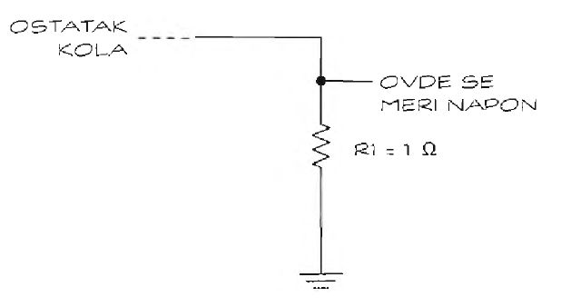

# Merenje struje naponom

Multimetri mogu da izmere struju samo do određene jačine. Kada je struja koja protiče kroz kolo prejaka da bi je neposredno izmerili multimetrom, možete multimetrom izmeriti pad napona na otporniku i izračunati jačinu struje na osnovu tog pada napona. Na slici 7-7 prikazano je kolo u koje je umetnut otpornik vrlo male otpornosti da bi merenje bilo moguće bez promena ostalih vrednosti u kolu.



U ovom primeru, otpornik se vezuje redno sa ostalim komponentama kola da bi se odredila jačina struje koja protiče kroz kolo. Upotrebićete otpornik otpornosti 1 om i snage 10 vati, pošto uglavnom ne morate mnogo voditi računa o promeni ukupne otpornosti kola za jedan om; snaga od 10 vati u većini kola sprečava da otpornik pregori.

Multimetrom možete izmeriti pad napona na otporniku, od tačke merenja napona (označene na slici 7-7) do uzemljenja. Pomoću Omovog zakona zatim možete izračunati jačinu struje. Ako, na primer, multimetar izmeri 2 volta, jačinu struje izračunaćete na sledeći način:
```
I = V / R = 2 volta / 1 Ω = 2 ampera
```

Trebalo bi proveriti snagu koju otpornik podnosi, kako ne bi bio spaljen. Na osnovu drugog oblika Omovog zakona, izračunajte snagu:
```
P = R * I^2 = 1 Ω * (2 ampera)^2 = 4 vata
```

Pokušajte da ograničite snagu na 25 % nominalne snage otpornika ili će postati ZAISTA vruć.

U većini slučajeva otpornik snage 10 vati biće dovoljan za jednostavan elektronski projekat. Ako se ipak desi da spalite otpornik snage 10 vati, onda ste sigurno iz sveta elektronike kao hobija prešli u profesionalno carstvo.
