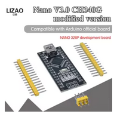

# Mikrokontroler

[wiki](https://sh.wikipedia.org/wiki/Mikrokontroler)

Mikrokontroleri su programabilna kola. Kao i računare, možemo ih programirati da rade šta želimo.

Iako liče na obična integrisana kola, nude mnogo više: mikrokontroleri omogućavaju konstruisanje najboljih i najmodernijih elektronskih uređaja. Na primer, ako vozite noviji auto, vrlo je verovatno da je u njega ugrađen ne jedan, već desetak mikrokontrolera. Svaki od njih odgovoran je za po neki deo automobila, počev od kočnice, preko elektronskog paljenja, do sistema za aktiviranje vazdušnih jastuka.

## Kako radi?

Mikrokontroler je integrisano kolo smešteno na štampanoj ploči koja sadrži i druge komponente za povezivanje mikrokontrolera s računarom, motore, prekidače itd. Kada programiramo mikrokontroler, koristimo razvojno okruženje koje mu omogućava da se poveže s računarom.

Za razliku od tradicionalnih kola, ne moramo premeštati žice, vaditi otpornike i kondenzatore i menjati komponente da bi izmenili funkciju mikrokontrolera. Umesto toga, pišemo programski kod. Jedan mikrokontroler možemo programirati da obavlja hiljade različitih poslova!

Prvobitna svrha mikrokontrolera bila je komunikacija računara i elektronskih spravica iz spoljašnjeg sveta. Još uvek se koriste za to, ali i za mnoge druge stvari.

Većina mikrokontrolera namenjena je za komercijalne uređaje, i možda čete imati poteškoća u njihovom programiranju. Mikrokontrolere namenjene hobistima lako ćete programirati, a neće vas mnogo koštati.

### Arduino Nano 3.0

Arduino Nano 3.0 je mikrokontrolerska ploča zasnovana na ATmega328P mikrokontroleru, sa ugrađenim bootloader-om, koja ima sve periferije, programira se preko USB-a i povezuje sa Arduino projektima. Arduino Nano je manji od Arduino Uno i pogodniji za projekte sa malo prostora.

Postoje mnoge kompatibilne ploče kineskih proizvođača koje se mogu koristiti umesto originalnog Arduino Nano 3.0.

## Delovi mikrokontrolera

Evo delova tipičnog mikrokontrolera:
* **Mali računar**: Ovaj ugrađeni računar je srce mikrokontrolera. Nije moćan kao onaj na radnom stolu, ali mikrokontrolerima to nije potrebno. Od računara očekujemo da odjednom izvršava više zadataka, a tipičan mikrokontroler radi samo jedan posao.
* **Postojana memorija**: Program koji izvršava računar mikrokontrolera, čuva se u postojanoj memoriji. Ova memorija opstaje i kada isključimo mikrokontroler.
* **Ulazno-izlazni priključci (I/O)**: Omogućavaju da mikrokontroler komunicira sa okolinom, da upravlja svetlom, motorima, relejima, senzorima, prekidačima, LCD ekranima, čak i drugim mikrokontrolerima. I/O priključci dobavljaju mikrokontroleru informacije na osnovu kojih upravlja uređajima. Na primer, mikrokontroler može da aktivira LED diodu kada pritisnemo prekidač ili pokrene motor kada senzor detektuje prolazak.

## Primer: LEGO robot

Dobar primer za funkcionisanje mikrokontrolera jeste mozak LEGO Mindstorms robota. Kao i sve mikrokontrolere, mozak Mindstorms robota programiramo tako što mu šaljemo programske naredbe. Te naredbe prvo sastavljamo na računaru, potom ih šaljemo robotovom mozgu preko infracrvenih talasa. Pošto pošaljemo naredbe mikrokontroleru, one se čuvaju u trajnoj memoriji dok ih ne zamenimo novim naredbama. Kad izmenimo program, robot može da radi sledeće:
* Pronađe najjači svetlosni izvor u prostoriji i ide ka njemu,
* Umesto da priđe najjačem izvoru svetlosti, udalji se od njega.
* Reaguje na prekidače za sudare koji se nalaze na njegovim bokovima tako da, kad udari u neku prepreku, uzmakne i krene u drugom smeru.
* Prepozna crnu liniju na parčetu belog papira i prati je.

Mogućnosti programiranja mikrokontrolera skoro su beskrajne.
