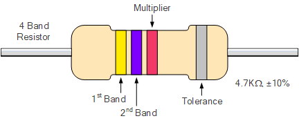
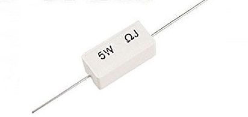

# Otpornici

[wiki](https://sh.wikipedia.org/wiki/Otpornik)


Sve komponente pružaju otpor električnom toku, a otpornici su napravljeni da samo to rade. **Otpornike možemo smatrati „kočnicama“ za elektrone**. Njima kontrolišemo tok elektrona kroz kolo. Otpornici se koriste za:
* **Smanjenje struje i zaštita komponenti**: Otpornici služe da kontrolišu koliko struje prolazi kroz neku komponentu. Tako sprečavaju da elementi poput LED dioda, tranzistora ili integrisanih kola prime previše struje i pregore.
* **Smanjenje napona u delu kola**: Nekad je potrebno obezbediti različit napon za različite delove kola. To se postiže pomoću dva otpornika spojena da čine [razdelnik napona](https://sh.wikipedia.org/wiki/Razdelnik_napona). Npr, ako imamo dva ista otpornika, napon između njih je tačno upola manji od napona u ostatku kola.
* **Upravljanje naponom i strujom na ulazu komponenti**: Na primer, kondenzator koji se puni i prazni kroz otpornik stvara efekat peščanog sata. Otpornik na ulazu tranzistora ograničava struju i time utiče na stepen pojačanja signala.

Vrednost otpora izražava se u omima (simbol je grčko slovo omega Ω). Što je vrednost veća, veći je otpor.

## Vrste otpornika

Postoje dve osnovne vrste otpornika:
* **Stalni otpornik** pruža unapred određen otpor električnoj struji. Oznake u boji određuju vrednost otpora. Obeležavanje bojama počinje od kraja tela otpornika, a oznaka se sastoji od četiri, pet traka različitih boja. Precizni otpornici imaju odštampanu vrednost otpora.
* **Promenljivi otpornik** ili **potenciometar**, omogućava podešavanje otpora od 0 oma do neke maksimalne vrednosti. Na potenciometru je obično odštampana najveća vrednost otpora.

## Oznake u boji

Oznake u boji su standard u elektronici. Otpornik može imati četiri ili pet traka u boji, zavisno od preciznosti (standardna ili visoka). Kod otpornika standardne preciznosti:
* Trake jedan, dva i tri određuju vrednost otpora.
* Traka četiri označava toleranciju otpornika, obično unutar ±5 ili ±10 %.

Donja tabela prikazuje vrednosti oznaka u boji. 


Ne označavaju se svi otpornici bojama. Precizni otpornici imaju odštampanu vrednost otpora.

Ukoliko ne znamo vrednost otpora nekog otpornika, možemo je izmeriti multimetrom.

### Primer



Pretpostavimo da je otpornik označen žuto-ljubičasto-crveno-srebrnom trakom. Prve dve trake ukazuju na prve dve cifre vrednosti. Dakle, žuta predstavlja broj 4 a ljubičasta broj 7, pa su značajne cifre 47. Treća traka je množilac. U našem primeru ta traka je crvena, pa je vrednost 100. Pomnožimo 47 sa 100 i dobijamo 4700 oma. 

Često se vrednosti veće od 1000 izražavaju slovom k (kilo, oznaka za 1000), pa je otpor otpornika 4,7 kilo oma.

## Tolerancija otpornika

Poslednja traka na otporniku označava njegovu toleranciju (dozvoljeno odstupanje). Iako je na otporniku možda navedena vrednost otpora od 2000 oma, stvarna vrednost otpora je verovatno neznatno veća ili manja. Potencijalna varijacija otpora naziva se tolerancija i ona se izražava u procentima (na primer, tolerancija od ±5% znači da otpor može biti 5% veći ili manji). U većini slučajeva, neznatna odstupanja ne utiču na normalan rad električnog kola. 

Uzmimo ponovo kao primer žuto-ljubičasto-crveno-srebrni otpornik. Ako pogledamo tabelu, videćemo da srebrna boja ukazuje na toleranciju od +10%. To znači da vrednost otpora otpornika može da se razlikuje plus ili minus deset procenata od naznačene vrednosti. Ako otpornik ima naznačenu vrednost otpora od 4,7 kilooma s tolerancijom od deset procenata, stvarna vrednost otpora je između 4230 i 5170 oma.

## Zagrevanje

Otpornik pretvara električnu energiju u toplotu. Što više elektrona protiče, toplota je veća. Elektronske komponente mogu da podnesu tačno određenu količinu toplote pre nego što pregore. Otpornici imaju snagu u vatima (W), koja govori koliko toplote otpornik može da izdrži. 

Snaga u vatima se izračunava formulom:

```
P = I * V
```

**P** je snaga u vatima; **I** je električna struja u amperima, koja protiče kroz otpornik; **V** je napon na krajevima otpornika. Na primer, pretpostavimo da je napon 5 volti, a da kroz otpornik protiče struja od 25 miliampera. Da bi izračunali snagu, pomnožite 5 sa 0,025. Dobićete 0,125 ili 1/8 vata.

Na otpornicima je retko odštampana vrednost snage u vatima. Umesto toga, moramo proceniti snagu na osnovu veličine otpornika, ili tu informaciju tražimo od proizvođača. Otpornici koji se koriste u kolima sa velikim opterećenjem, kao što su motor ili upravljački uređaj za lampu, moraju biti veće snage od uobičajenih. Snaga najvećeg broja otpornika koji se koriste u hobi projektima iznosi 1/4 ili 1/8 vata.

Otpornici velike snage mogu biti različitog oblika. Otpornici snage veće od 5W najčešće imaju epoksidni ili neki drugi vodonepropusni i vatrostalni omotač, i pravougaoni su a ne cilindrični. Otpornici velike snage ponekad čak imaju i sopstveni hladnjak za odvođenje toplote.



## Promenljivi otpornik - potenciometar

Promenljivi otpornici, potenciometri, omogućavaju „biranje“ otpora. Gornja granica potenciometra određuje opseg otpora. Većina potenciometara obeležena je tom gornjom vrednošću - 10K, 50K, 100K, 1M i tako dalje. Na primer, s potenciometrom od 50K možete izabrati bilo koji otpor od 0 do 50.000 oma. 

Imajte na umu da je opseg potenciometra samo približan. Ako na potenciometru nema oznake, upotrebite multimetar da odredite opseg.
