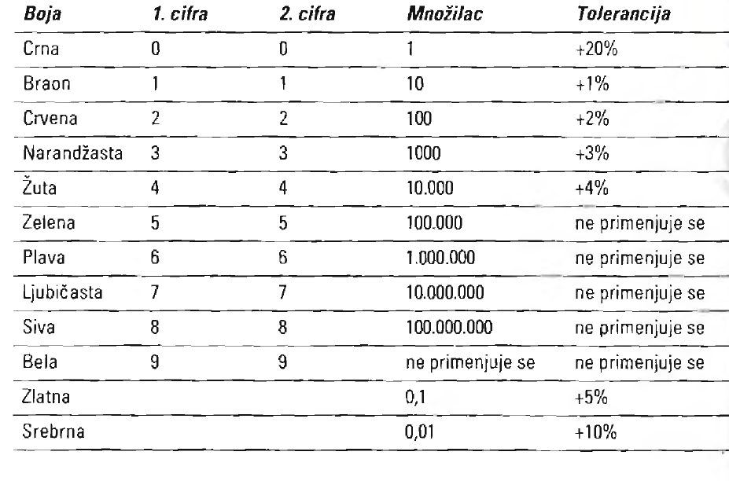

# Otpornici

[wiki](https://sh.wikipedia.org/wiki/Otpornik)


Sve komponente pružaju otpor električnom toku, a otpornici su napravljeni da samo to rade. Otpornike možemo smatrati „kočnicama“ za elektrone. Njima kontrolišemo tok elektrona kroz kolo.

Otpornici su osnovni gradivni blokovi električnih kola. Možete ih koristiti za:
* Ograničavanje struje koja stiže do komponenti: Neke komponente, kao svetleće diode (LED), troše struju kao što dete jede čokoladu. Pokušaće da pojedu sve što im date. Međutim, za LED diode to može biti pogubno - pregorevaju od previše električne struje. Zato treba upotrebiti otpornik i ograničiti tok struje do njih.
* Smanjivanje napona u delu kola: U mnogim električnim kolima neophodno je obezbediti različite napone za različite delove tog kola. To čete lako učiniti pomoću otpornika. Dva otpornika spojena na način prikazan na slici 4-1 čine razdelnik napona. Kad imate dva istovetna otpornika, koji podjednako „koče“ tok struje, napon između njih je tačno upola manji od napona u ostatku kola.
* Upravljanje naponom/strujom koji ulaze u druge komponente: Kombinacija otpornika i kondenzatora, na primer, daje neku vrstu elektronskog peščanog sata. Otpornik možete postaviti na ulaz tranzistora da bi upravljali stepenom pojačanja signala u tranzistoru.
* Zaštitu ulaza osetljivih komponenti: Previše struje uništava elektronske komponente. Postavljanjem otpornika na ulaz osetljivog tranzistora ili integrisanog kola, ograničavate struju koja stiže do njih. Ova jednostavna tehnika može da vam uštedi mnogo vremena i novca.

## Vrednosti otpornika

Vrednost otpora izražava se u omima, a simbol je grčko slovo omega Ω. Što je vrednost u omima veća, veći je otpor komponente.

Da bi razumeli kako podešavati otpor, treba znati da postoje dve osnovne vrste otpornika: stalni i promenljivi.
* Stalni otpornik pruža unapred određen otpor električnoj struji. Oznake u boji određuju vrednost otpora. Obeležavanje bojama počinje od kraja tela otpornika, a oznaka se sastoji od četiri, pet i ponekad šest traka različitih boja.
* Promenljivi otpornik, koji se naziva potenciometar, omogućava kontinualno podešavanje otpora od 0 oma do neke maksimalne vrednosti. Na potenciometru je obično odštampana najveća vrednost otpora.

Ne označavaju se svi otpornici bojama. Na telima nekih otpornika vrednost otpora je odštampana. To su precizni otpornici.

## Oznake u boji

Oznake u boji su svetski prihvaćen standard i koriste se u elektronici decenijama. Otpornik može imati četiri ili pet traka u boji, zavisno od preciznosti (standardna ili visoka). Evo šta predstavljaju trake na otporniku standardne preciznosti:
* Trake jedan, dva i tri određuju vrednost otpora.
* Traka četiri označava toleranciju otpornika i obično je unutar ±5 procenata ili ±10 procenata (opseg vrednosti otpora).

Donja tabela prikazuje vrednosti oznaka u boji. Pretpostavimo da je otpornik označen žuto-ljubičasto-crveno-srebrnom trakom. Prve dve trake ukazuju na prve dve cifre otpora otpornika. Dakle, žuta predstavlja broj 4 a ljubičasta broj 7, pa su značajne cifre 47. Treća traka je množilac. U našem primeru ta traka je crvena, pa je vrednost 100. Pomnožite 47 sa 100 i dobijate 4700 oma. Često se vrednosti veće od 1000 izražavaju slovom k (kilo, oznaka za 1000), pa je otpor otpornika 4,7 kilo oma.



## Tolerancija otpornika

Poslednja traka na otporniku označava njegovu toleranciju (dozvoljeno odstupanje). Iako je na otporniku možda navedena vrednost otpora od 2000 oma, stvarna vrednost otpora je verovatno neznatno veća ili manja. Potencijalna varijacija vrednosti otpora naziva se tolerancija i ona se izražava u procentima (na primer, tolerancija od ±5 procenata znači da otpor može biti 5 posto veći ili manji). U većini slučajeva, neznatna odstupanja ne utiču na normalan rad električnog kola. 

Uzmimo ponovo kao primer žuto-ljubičasto-crveno-srebrni otpornik. Ako pogledate tabelu, videćete da srebrna boja ukazuje na toleranciju od +10 procenata. To znači da vrednost otpora otpornika može da se razlikuje plus ili minus deset procenata od naznačene vrednosti. Ako otpornik ima naznačenu vrednost otpora od 4,7 kilooma s tolerancijom od deset procenata, stvarna vrednost otpora je između 4230 i 5170 oma.

Ukoliko ne znate vrednost otpora određenog otpornika, možete je izmeriti multimetrom.

## Zagrevanje

Kad god se elektroni kreću kroz neku sredinu, proizvode toplotu. Što je više elektrona, toplota je veća. 

Otpornici se klasifikuju i prema snazi. Ona se meri u vatima, a govori koliko vati otpornik može da izdrži - što je veća snaga izražena vatima, to je veća toplota. Elektronske komponente mogu da podnesu tačno određenu količinu toplote pre nego što se pretvore u bezličnu, neupotrebljivu masu. Snaga u vatima se izračunava formulom:

```
P = I * V
```

P je oznaka za snagu, izraženu u vatima; I predstavlja električnu struju u amperima koja protiče kroz otpornik; V je napon na krajevima otpornika. Na primer, pretpostavimo da je napon 5 volti, a da kroz otpornik protiče struja od 25 miliampera. Da bi izračunali snagu, pomnožite 5 sa 0,025. Dobićete 0,125 ili 1/8 vata.

Za razliku od otpornosti, na otpornicima je retko odštampana vrednost snage u vatima. Umesto toga, morate da procenite snagu na osnovu veličine otpornika, ili tu informaciju tražite od proizvođača. Otpornici koji se koriste u kolima sa velikim opterećenjem, kao što su motor ili upravljački uređaj za lampu, moraju biti veće snage od otpornika upotrebljenih u kolima s malom električnom strujom. Snaga najvećeg broja otpornika koji se koriste u amaterskim elektronskim projektima iznosi 1/4 ili čak 1/8 vata.

Otpornici velike snage mogu biti različitog oblika, od kojih su neki prikazani na slici 4-3. Otpornici snage veće od pet vati najčešće imaju epoksidni ili neki drugi vodonepropusni i vatrostalni omotač, i pravougaoni su a ne cilindrični. Otpornici velike snage ponekad čak imaju i sopstveni hladnjak za odvođenje toplote.

## Promenljivi otpornik - potenciometar

Promenljivi otpornici, potenciometri, omogućavaju „biranje“ otpora. Gornja granica potenciometra određuje opseg otpora. Većina potenciometara obeležena je tom gornjom vrednošću - 10K, 50K, 100K, 1M i tako dalje. Na primer, s potenciometrom od 50K možete izabrati bilo koji otpor od 0 do 50.000 oma. Imajte na umu da je opseg potenciometra samo približan. Ako na potenciometru nema oznake, upotrebite multimetar da odredite opseg.
