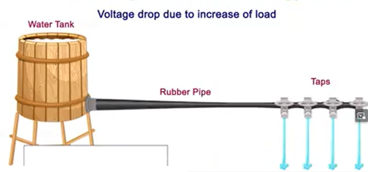
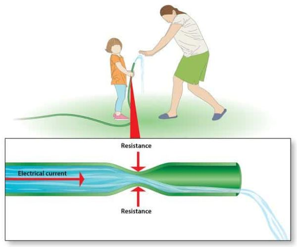

# Osnovni pojmovi

Da bismo razumeli elektricitet i električnu struju, neophodno je razložiti ih na sastavne delove.

## Elektroni

[wiki](https://sh.wikipedia.org/wiki/Elektron)

**Elektron je elementarna čestica sa negativnim naelektrisanjem**, koja spada u osnovne gradivne čestice prirode. Elektroni i protoni su izuzetno mali i nalaze se u svemu oko nas. Zrnce prašine sadrži milione elektrona i protona.

**Proton, pozitivno naelektrisana čestica, je suprotnost elektrona**. Elektroni i protoni imaju jednaku količinu naelektrisanja, ali suprotnog pola - elektroni su naelektrisani negativno, a protoni pozitivno. Suprotni polovi se privlače, kao kod magneta. Privlačenje elektrona i protona u mikrosvetu deluje kao lepak i sprečava nestajanje materije.

Dok su protoni relativno nepokretni, elektroni često prelaze s jednog predmeta na drugi. 

## Elektricitet

[wiki](https://sh.wikipedia.org/wiki/Elektricitet)

**Elektricitet** je prirodni fenomen koji potiče od prisustva i kretanja električnog naboja. Negativan električni naboj znači da čestica ima višak elektrona. Takve čestice se međusobno odbijaju, a privlače ih čestice sa pozitivnim nabojem.

Prošetajte po vunenom tepihu i dotaknite kvaku; elektroni koji putuju između vašeg prsta i kvake izazivaće varnicu. Munja je najupečatljiviji primer elektrona koji putuju između oblaka i površine zemlje. Ovo su primeri elektriciteta u "neobuzdanom" stanju.

## Električna struja

[wiki](https://sh.wikipedia.org/wiki/Elektri%C4%8Dna_struja)

**Električna struja (strujanje elektriciteta ili električni tok) je usmereno kretanje naelektrisanih čestica (obično elektrona) kroz provodnik.** Struja može biti:

- jednosmerna (DC): elektroni se kreću u jednom smeru.
- naizmenična (AC): elektroni se kreću čas u jednom čas u drugom smeru.

Elektricitet teče sve dok postoji razlika potencijala, odnosno napon. Kretanje elektrona uvek proizvodi toplotu, a može se pretvoriti i u druge vidove energije.

Jačina struje se meri u amperima (**A**), zbog čega se naziva i **amperaža**. Oznaka za struju je **I**. 

### Smer struje

Prvi istraživači su verovali da električna stru­ja nastaje usled toka pozitivno naelektri­sanih čestica. Oni su struju opisivali kao tok od višeg potencijala ka nižem, tj. od pozitivnog ka negativnom naponu (od + ka –). Nakon otkrića elektrona, naučnici su videli da se elektroni kreću od negativnog ka pozitiv­nom naponu (od – ka +), što je **stvarni smer struje**. 

Nažalost, konvencionalni smer struje se i dalje koristi u svim električnim šemama, označen strelicom suprotno od stvarnog kretanja.

### Provodnici i izolatori

Neki materijali bolje provode elektricitet od drugih. Uglavnom se kao **provodnici** koriste bakar i aluminijum. Najčešće korišćeni **izolatori** su plastika i staklo. Slobodni elektroni se u metalu ponašaju kao klikeri bačeni na led. Plastika, koja je izolator, više nalikuje na pesak. 

## Napon

[wiki](https://sh.wikipedia.org/wiki/Elektri%C4%8Dni_napon)

**Napon je razlika električnog potencijala između dve tačke**. Možemo ga zamisliti kao pritisak koji pokreće elektrone kroz provodnik. Napon se meri u voltima (**V**), zbog čega se naziva i **voltaža**. Oznaka za napon je **U**.

**Izvor napona** je uređaj (npr. baterija ili generator) koji održava razliku električnog potencijala između svojih polova. Izvor napona stvara električno polje između svojih polova, koje privlači elektrone ka pozitivnom polu i odbija od negativnog. **Elektromotorna sila** je sposobnost izvora da održava razliku potencijala između svojih polova.

### Pad napona

**Pad napona** je smanjenje napona dok struja prolazi kroz komponentu u kolu, obično zbog njenog otpora. Kada struja prolazi kroz otpornik, deo napona se „obara“ i pretvara u toplotnu energiju. Pad napona na potrošaču pokazuje koliko energije iz kola on prima i pretvara u korisnu formu, poput toplote, svetlosti ili kretanja.

Pad napona se javlja samo u serijskom spoju. Kod serijskog spoja imamo jedan napon na izvoru, a nakon svakog potrošača napon „opada“ za onoliko koliko je potrošač „pojeo“. U paralelnom spoju, napon ostaje isti za sve potrošače. 

## Otpor

[wiki](https://sh.wikipedia.org/wiki/Elektri%C4%8Dni_otpor_i_vodljivost)

**Otpor** je mera sposobnosti elektrona da se kreću kroz materijal. Širi provodnik pruža manji otpor kretanju elektrona od užeg. Otpor zavisi još od materijala i temperature.

U skoro svim elektronskim uređajima koriste se otpornici. Otpornici imaju zadatu vrednost, što omogućava upravljanje tokom elektrona kroz kolo.

## Poređenje sa vodom

[wiki](https://sh.wikipedia.org/wiki/Hidrauli%C4%8Dka_analogija)

Ako uzmemo žicu i jedan kraj povežemo s pozitivnim polom baterije a drugi s negativnim, elektroni počinju da teku od negativnog ka pozitivnom polu. Taj tok elektrona zove se električni tok (ili struja). Da bismo lakše razumeli električni tok, koristimo analogiju sa vodom:

* Više vode teče kroz istu cev pod većim pritiskom, a više elektrona kroz isti provodnik pod većim naponom.
* Kroz širu cev teče više vode pod istim pritiskom, a kroz širi provodnik više elektrona pod istim naponom.

<!--  -->