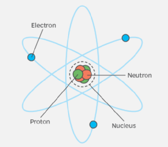
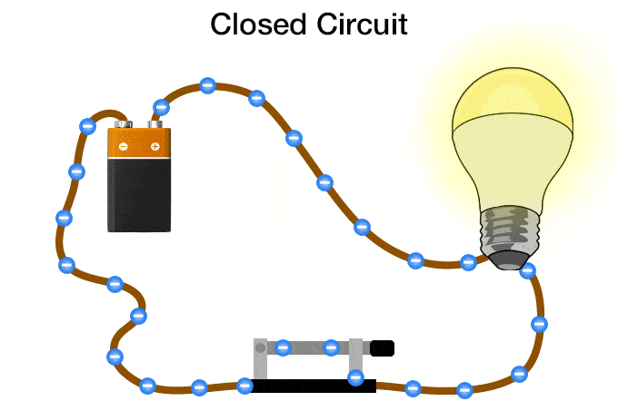
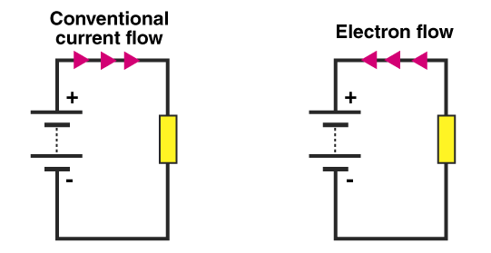

# Osnovni pojmovi

wiki: [elektricitet](https://sh.wikipedia.org/wiki/Elektricitet) i [električna struja](https://sh.wikipedia.org/wiki/Elektri%C4%8Dna_struja)

Da bismo razumeli kako nastaju elektricitet i električna struja, neophodno je da ih razložimo na sastavne delove.

## Elektroni

**Elektroni** spadaju u osnovne gradivne čestice prirode. Oni su suprotnost protona. Elektroni i protoni su izuzetno mali i nalaze se u svemu oko nas. Zrnce prašine sadrži milione elektrona i protona.

Elektroni i **protoni** imaju jednaku količinu naelektrisanja, ali suprotnog pola - elektroni su naelektrisani negativno, a protoni pozitivno. Suprotna naelektrisanja se privlače, slično kao kod magneta. Privlačenje elektrona i protona u svetu mikroskopskih razmera deluje kao lepak i sprečava nestajanje materije.

Dok su protoni relativno nepokretni, elektroni često prelaze s jednog predmeta na drugi. 

## Elektricitet

**Elektricitet** je prirodni fenomen koji potiče od prisustva i kretanja električnog naboja.

Prošetajte po vunenom tepihu i dotaknite kvaku; elektroni koji putuju između vašeg prsta i kvake izazivaće varnicu. Munja je najupečatljiviji primer elektrona koji putuju između oblaka i površine zemlje. Ovo su primeri elektriciteta u "neobuzdanom" stanju.

## Električna struja

**Električna struja (ili električni tok) je kretanje naelektrisanih čestica kroz provodnik.** Struja može biti:

- jednosmerna (DC): elektroni se kreću u jednom smeru.
- naizmenična (AC): elektroni se kreću čas u jednom čas u drugom smeru.

Elektricitet teče sve dok postoji razlika potencijala, odnosno napon. Kretanje elektrona uvek proizvodi toplotu, a može se pretvoriti i u druge vidove energije.

Jačina struje se meri u amperima (**A**), zbog čega se naziva i **amperaža**. Oznaka za struju je **I**. 

### Smer struje

Prvi istraživači su verovali da električna stru­ja nastaje usled toka pozitivno naelektri­sanih čestica. Oni su struju opisivali kao tok od višeg potencijala ka nižem, tj. od pozitivnog ka negativnom naponu (od + ka –). Nakon otkrića elektrona, naučnici su videli da se elektroni kreću od negativnog ka pozitiv­nom naponu (od – ka +), što je **stvarni smer struje**. 

Nažalost, konvencionalni smer struje se i dalje koristi u svim električnim šemama, označen strelicom suprotno od stvarnog kretanja.

### Provodnici i izolatori

Neki materijali bolje provode elektricitet od drugih. Uglavnom se kao **provodnici** koriste bakar i aluminijum. Najčešće korišćeni **izolatori** su plastika i staklo. Slobodni elektroni se u metalu ponašaju kao klikeri bačeni na led. Plastika, koja je izolator, više nalikuje na pesak. 

## Napon

**Napon** je razlika električnog potencijala između dve tačke. Možemo ga zamisliti kao pritisak koji tera elektrone da se kreću kroz provodnik. Negativno naelektrisani elektroni kreću se kroz provodnik ka pozitivnom naponu. Napon se meri u voltima (**V**), zbog čega se naziva i **voltaža**. Oznaka za napon je **U**.

**Elektromotorna sila** je vrsta napona koju proizvodi izvor struje (npr. baterija ili generator) da bi pokrenuo elektrone kroz kolo.

## Otpor

**Otpor** je mera sposobnosti elektrona da se kreću kroz materijal. Šira žica pruža manji otpor kretanju elektrona od uže žice. Otpor zavisi još od materijala i temperature.

U skoro svim elektronskim uređajima koriste se otpornici. Otpornici imaju unapred određenu vrednost otpora, što omogućava upravljanje tokom elektrona kroz električno kolo.

## Poređenje sa vodom

[wiki](https://sh.wikipedia.org/wiki/Hidrauli%C4%8Dka_analogija)

Ako uzmemo provodnik i jedan kraj povežemo s pozitivnim polom baterije a drugi s negativnim, elektroni počinju da teku od negativnog ka pozitivnom polu. Taj tok elektrona zove se električna struja. 

Da bismo lakše razumeli kako napon i provodnik utiču na struju, zamislimo kako pritisak vode i prečnik cevi utiču na tok vode:

* Više vode teče kroz cev pod većim pritiskom, a više elektrona kroz provodnik pod većim naponom.
* Kroz širu cev teče više vode pod istim pritiskom, a kroz širi provodnik više elektrona pod istim naponom.
