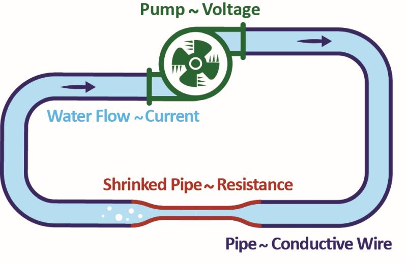
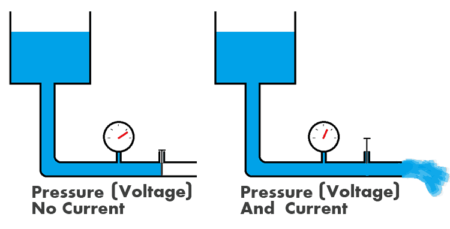

# Poređenje sa vodom (hidraulična analogija)

[wiki](https://sh.wikipedia.org/wiki/Hidrauli%C4%8Dka_analogija)

Ako jedan kraj žice povežemo s pozitivnim polom baterije a drugi s negativnim, elektroni počinju da teku od negativnog ka pozitivnom polu. To se zove električni tok ili električna struja. Da bismo lakše razumeli električni tok, koristimo analogiju sa vodom. 

## Osnovni pojmovi

- **Provodik** - cev; usmerava tok
- **Napon (V)** - pritisak (p); podstiče tok.
- **Razlika potencijala** - visinska razlika: brzina potoka ovisi o visinskoj razlici, a jačina struje o razlici električnog potencijala. 
- **Struja (eletrični tok, I)** - vodeni tok (Q); količina koja protiče u jedinici vremena.
- **Otpor (R)** - hidraulični otpor (R); sve što se suprotstavlja toku.
- **Otpornik** - suženje cevi; slabi tok.
- **Kondenzator** - rezervoar; skladišti količinu (naelektrisanja ili vode).
- **Količina naelektrisanja (električni naboj)** - količina vode.
- **Izvor napona (baterija)** - pumpa ili vodo-toranj; stvara razliku pritisaka.
- **Prekidač** - ventil; zatvara i pušta vodeni tok.
- **Dioda** - jednosmerni ventil; dozvoljava tok samo u jednom smeru.

## Osnovne paralele:

- Više vode teče kroz istu cev pod većim pritiskom - više elektrona kroz isti provodnik pod većim naponom.
- Kroz širu cev teče više vode pod istim pritiskom - kroz širi provodnik više elektrona pod istim naponom.

<!--  -->