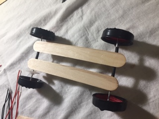
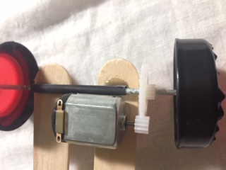

# Autić

Točkovi se prave od čepova oblepljenih izolirkom. Konstrukcija se pravi od štapića za sladoled. 

Osovine su šipkice (može drveni štapići, mine za hemijsku...), a držači osovina su slamčice.

Na kraju se još stavi motor i baterija i spreman je!

## Delovi

- elektromotor
- žice
- lepak
- lemilica
- 9V baterija
- 9V baterija kućište
- izolirka
- 2 štapića od sladoleda
- 4 čepa
- zupčanik
- 2 šipkice od 10-ak cm
- 2 slamčice

Izvor: https://www.wikihow.com/Make-a-Simple-One%E2%80%90Direction-Electric-Toy-Car
