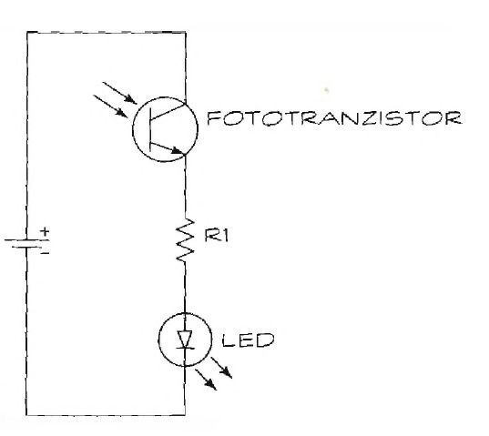

# Detektor infracrvenog zračenja

Kolo ima samo tri komponente, plus napajanje. Možete dodati i prekidač između pozitivnog pola baterije i fototranzistora. 

Šema detektora infracrvenog zračenja prikazana je na slici. Obratite pažnju da koristimo fototranzistor, ne fotodiodu. Spolja izgledaju isto, zato proverite šta piše na kutiji. Osim toga, važna je i pravilna orijentacija fototranzistora i LED diode.

## Delovi

Delovi za ovaj projekat:
* Fototranzistor za infracrveno zračenje (npr. RadioShack 276-0145, ali može bilo koji fototranzistor)
* R1: Otpornik od 330 oma
* LED dioda

## Primena

Pomoću ovog detektora možemo proveriti emituje li nešto infracrveno zračenje. Evo dva predloga primene:
* Pošto se u daljinskim upravljačima koristi infracrveno zračenje, da bi proverili ispravnost daljinskog, postavite ga pred fototranzistor. Pritisnite bilo koje dugme na daljinskom; ako LED dioda vašeg detektora zasvetli, daljinski je ispravan.
* Proverite ima li skrivenih kamera u prostoriji. Mnoge kamere vide u mraku jer imaju izvor infracrvenog zračenja. Isključite svetla i skenirajte sobu detektorom. Ako LED zasvetli, čak i ako ne vidite izvor svetla, moguće da ste upravo otkrili kameru!

Fototranzistor za infracrveno zračenje reaguje i na vidljivu svetlost, pa je najbolje detektor koristiti u slabo osvetljenoj prostoriji.
