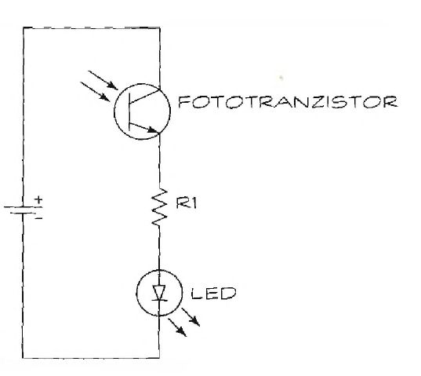

# Detektor infracrvenog zračenja

Kolo ima samo tri komponente (i bateriju). Ukoliko hoćete da učinite kolo zanimljivim, dodajte mu prekidač između pozitivnog pola baterije i fototranzistora. U jednostavnijoj varijanti, ako želite da isključite detektor, isključite bateriju.

Šema detektora infracrvenog zračenja prikazana je na slici 14-5. U ovom kolu koristimo fototranzistor, ne fotodiodu. Spolja izgledaju isto, zato proverite šta piše na kutiji. Osim toga, važna je i pravilna orijentacija fototranzistora i LED diode.

Pomoću ovog detektora možete proveriti da li nešto emituje infracrveno zračenje. Evo dva predioga primene:
* Pošto se u daljinskim upravljačima koristi infracrveno (IC) zračenje, da bi proverili ispravnost daljinskog, postavite ga pred fototranzistor za infracrveno zračenje. Pritisnite bilo koje dugme na daljinskom; ako LED dioda vašeg detektora zasvetli, daljinski je ispravan.
* Proverite ima li skrivenih kamera u vašoj sobi. Novije minijaturne kamere vide u mraku zato je u njih ugrađen izvor infracrvenog zračenja. Isključite svetla i skenirajte sobu s detektorom u rukama. Ako LED zasvetli, čak i ako ne vidite izvor svetla, moguće je da ste upravo otkrili kameru!

Premda je fototranzistor za infracrveno zračenje najosetljiviji na ovaj opseg spektra, reaguje i na vidljivu svetlost. Najbolje rezultate postići ćete ako detektor koristite u slabo osvetljenoj prostoriji.

## Delovi

Kratka lista delova za ovaj projekat:
* Ql: Fototranzistor za infracrveno zračenje (mi smo koristili RadioShack 276-0145, ali biće dobar bilo koji fototranzistor)
* Rl: Otpornik od 330 oma
* LED: LED dioda
