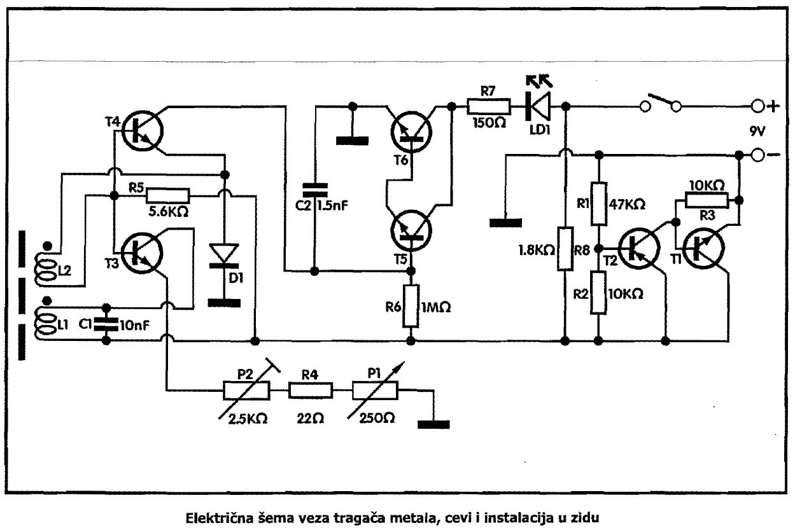

# Tragac metala, cevi, instalaciia u zidu

Nikakvi majstorski radovi ne bi smeli da počnu pre nego se ispitaju instalacije u zidu. Pre bušenja obavezno proveriti da li se na tom mestu ne nalazi vodovodna ili gasna cev ili elektricni kabl.

## Šema

Šema se sastoji od šest tranzistora: dva su oscilator za traženje, dva rade kao indikator i dva kao stabilizator napona.

Podešavanje i rukovanje ovim uređajem je prosto. Potenciometar P1 stavite na sredinu, a sa trimerom P2 dovodi se prag paljenja LE diode. Približite kalemu tragača neki metalan predmet - LED će se upaliti. Probajte da podesavate P1 i P2 da vidite kada je najosetljiviji sistem. Ugradite uređaj u neku plastičnu kutiju. Kalem pričvrstite lepljenjem, bez vijaka. Vruć vosak ili parafin je najlakši za upotrebu - sveću obično imate u kući. 

Imamo dva kalema: 
- L1 sa 90 namotaja bakarne žice, prečnika 0.2-0.3 mm 
- L2 sa 30 namotaja žice, prečnika 0.2-0.3 mm namotane navojak do navojka, a na rastojanju 2 mm od kalema L1. 

Oba kalema motaju se u istom smeru a krajevi se fiksiraju koncem. Dužina feritnog jezgra kalema je stotinak milimetara. Prečnik ferita je 8-10 mm. Kod povezivanja kalemova pazite gde treba da idu krajevi obeleženi na šemi tačkama, inače uređaj neće raditi.

Napajanje je iz baterije napona 9V.

## Delovi

- R1, Otpornik, 47 Kn (zuta-ljubičasta-narandžasta-zlatna) .......................................... 1
- R2, R3, Otpornik, 10 Kn (braon-crna-narandžasta-zlatna) ......................................... 2
- R4, Otpornik, 22 0 (crvena-crvena-crna-zlatna) ........................................................ 1
- R5, Otpornik, 5.6 Kn (zelena-plava-crvena-zlatna) .................................................... 1
- R6, Otpornik, 1 MO (braon-crna-zelena-zlatna) ......................................................... 1
- R7, Otpornik, 1500 (braon-zelena-braon-zlatna) ...................................................... 1
- R8, Otpornik, 1.8 Kn(braon-siva-crvena-zlatna) ....................................................... 1
- P1, Trimer potenciometar, 2500, veliki, lezeci, sa ručicom ........................................ 1
- P2, Trimer potenciometar, 2.5 KO, mali, stojeći ........................................................ 1
- C1, Blok kondenzator, 10 nF, raster 5.08mm............................................................. 1
- C2, Keramicki kondenzator, 1.5 nF (obelezen sa 152)................................................ 1
- Dl, Dioda, 1N4148 ................................................................................................. 1
- Tl, T3, T4, T5, T6, Tranzistor NPN tipa BC546B, BC547C -BC550 .................................. 5
- T2, Tranzistor PNP tipa BC556B, BC557C -BC560 ..................................................... 1
- LE dioda, crvena, 5 mm ........................................................................................... 1
- Taster za uključivanje tipa DT-6 ............................................................................... 1
- Priključak za bateriju, IEC 6LR61, napona 9V ............................................................ 1
- Feritno jezgro kalema prečnika 8-10mm i duzine oko 100 mm ................................... 1
- žica prečnika 0.2-0.3 mm 
- CuL za motanje kalema
