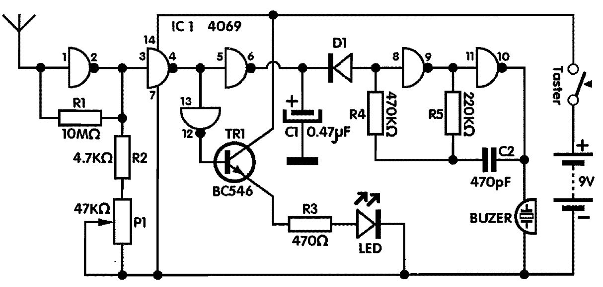

# Detektor strujnih vodova

Tragač strujnih vodova, za razliku od detektora metala, namenjen je otkrivanju vodova pod naponom gradske mreze. Oko kablova se stvara elektromagnetno polje, koje pomoću improvizovane antene tragača primamo, pojačavamo i svetlosno i zvucno identifikujemo.

Dakle, elektromagnetno polje dolazi na pin 1, IC kola 4069, koje je šestostruki invertor, na prvi invertor koji je "prigušen" otpornikom Rl od 10 MΩ. Signal se pojačava u ovom prvom kolu.

Napajanje kola vrsi se preko pina 14 sa plus i preko pina 7 na minus polom baterije napona 9V. Dalje imamo dva invertora, sa izvodima 3-4 i 12-13 koji sa tranzistorom TRl pale LE diodu kod postojanja signala na ulazu, odnosno na pinu 1, a pošto se nivo okidanja podesi trimer potenciometrom od 47 KΩ.

Nakon toga imamo akustički indikator koji se pobuduje preko diode D1, a sastoji se od inventora sa izvodima 8-9 i 10-11, kao i otpornika R4 i R5 i kondenzatora C2. Zvučna indikacija vrši se piezo rezonatorom BZ1, buzerom iii zujalicom. Signal iz zujalice modulisan je frekvencijom mreze, tj. 50 Hz.

Potrosnja mirne struje je 5mA, a kada detektujemo vod, ona iznosi l5mA. Baterija se ukljucuje pritiskom na taster tako da joj je usled male potrosnje vek trajanja vise godina.

## Delovi

- IC kolo 4069 
- IC podnozje 14 pina LC 
- LE dioda 
- D1, Dioda lN4148 
- Tl, Tranzistor BC547C 
- Cl, Tantal kondenzator O.47μF, min. 10V 
- C2, Keramicki kondenzator 470 pF 
- Taster za ukljucivanje uredaja, T113 
- Piezo buzer 20 mm
- Pl, Trimer potenciometar, mali lezeci, 50-100 KΩ 
- Otpornik, Rl, 10 MΩ (braon-crna-plava-zlatna) 
- Otpornik, R2, 4.7 KΩ (zuta-ljubicasta-crvena-zlatna) 
- Otpornik, R3, 470 Ω (zuta-ljubieasta-braon-zlatna) 
- Otpornik, R4, 470 KΩ (zuta-ljubicasta-zuta-zlatna) 
- Otpornik, R5, 220 KΩ (crvena-crvena-zuta-zlatna) 
- Priključak za bateriju napona 9V 

Izvor: Mala škola elektronike (pdf, str. 240)