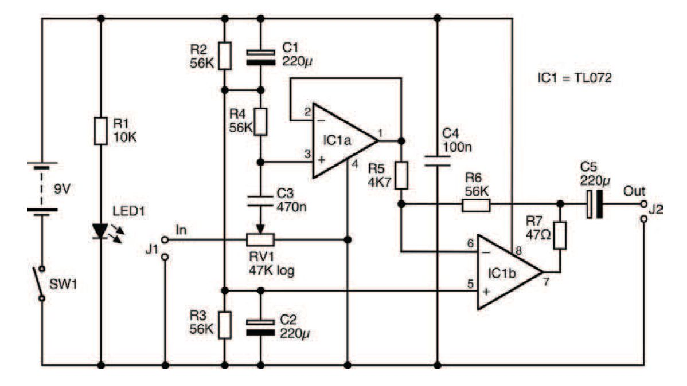
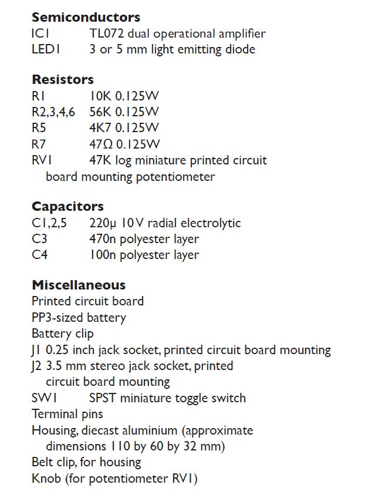

# Gitarsko pojačalo za slušalice

Zasniva se na dva operaciona pojačivača, koji zajedno pojačavaju signal električne gitare do nivoa dovoljnog za prosečne slušalice. Potenciometar RV1 omogućava kontrolu izlazne jačine zvuka.

## Šematski dijagram

## Spisak delova

