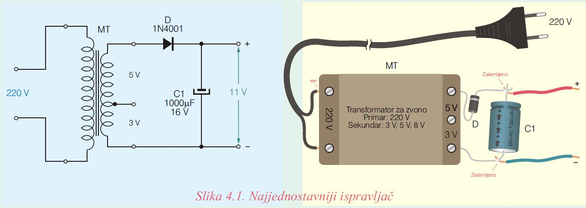
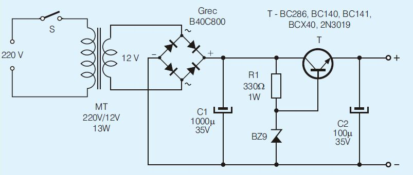
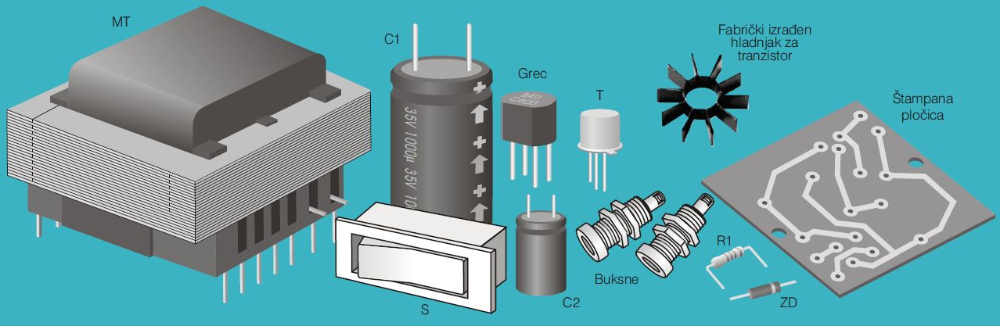
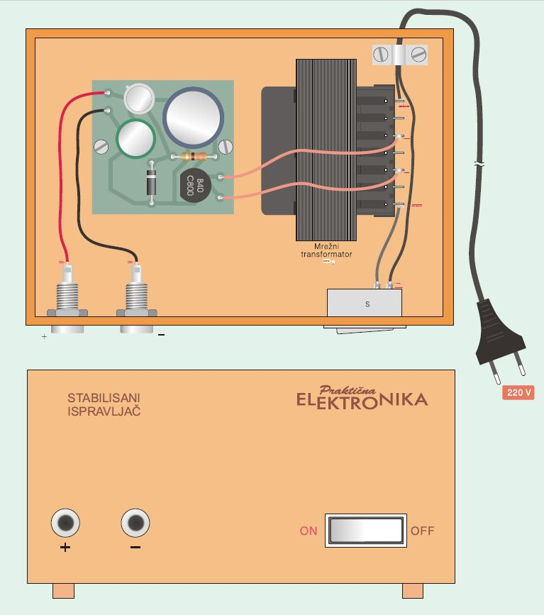
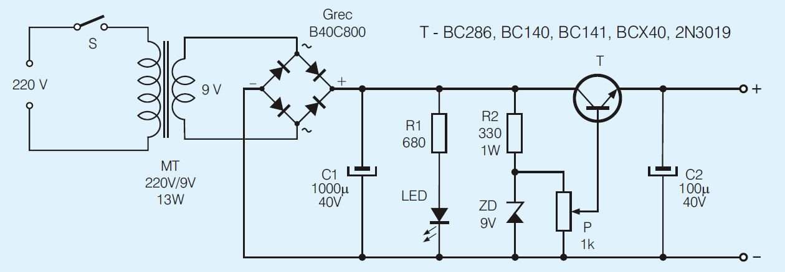
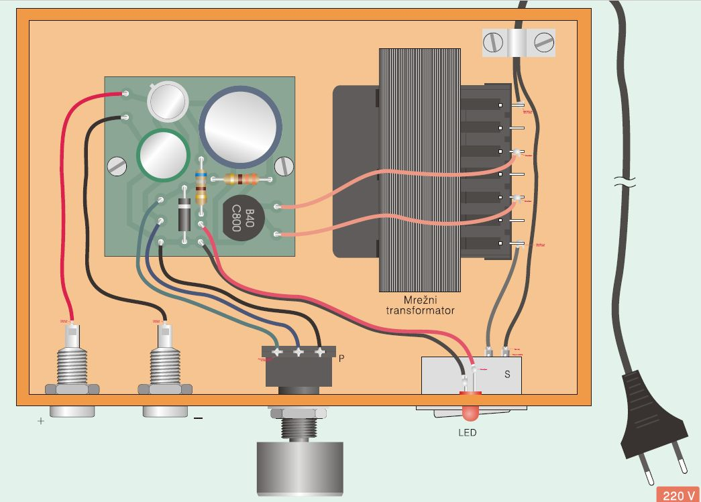

# Prost ispravljač

Najprostiji ali sasvim dobar ispravljač se sastoji od: 
- mrežnog transformatora, pomoću kog se napon od 220 V transformiše na neki niži naizmenični napon (recimo 8 V),
- ispravljačke diode, pomoću koje se vrši usmeravanje struje, i 
- kondenzatora, pomoću kog se vrši "peglanje" usmerenog napona. 

## Šema

Električna šema ispravljača i način njegove realizacije prikazani su na slici. Kao mrežni transformator upotrebljen je transformator za električno zvono. On ima jedan primarni namotaj na koji se priključuje mrežni napon od 220 V i dva sekundarna namotaja na kojima su naponi 3 V i 5 V. Ova dva namotaja su vezana redno, tako da je napon između početka prvog i kraja drugog mamotaja 8 V. Ovih 8 V predstavljaju tzv. efektivnu vrednost naizmeničnog napona, a maksimalna vrednost je 1,41 puta veća i iznosi približno 11 V. Kondenzator se, preko diode, puni na maksimalnu vrednost, pa je jednosmerni napon na njemu, a to je izlazni napon ispravljača, približno 11 V.

Ako se anoda diode premesti u srednji priključak, tada će izlazni napon biti oko 4 V. Ako se u srednji priključak premesti provodnik spojen sa donjim krajem kondenzatora, napon će biti oko 7 V. 

## Delovi 

* Pri nabavci transformatora treba voditi računa da njegov primar i sekundar (napon i struja) imaju potrebne vrednosti. Transformatori veće sekundarne struje su bolji (ali skuplji i veći), jer mogu da napajaju uređaje većih snaga. 
* Ispravljačka dioda treba da je sposobna da izdrži struju sekundarnog namotaja, i da joj je inverzni napon dvostruko veći od maksimalnog sekundarnog napona. 
* Kapacitivnost kondenzatora C je 1000 mF, ali bolje ako je veća kapacitivnost. Radni napon kondenzatora treba da je veći od izlaznog napona (u našem primeru od 11 V). 
* Za dovođenje 220 V do transformatora najbolje je koristiti kabl sa utikačem skinut sa nekog rashodovanog uređaja.

Bolje i sigurnije je ispravljač smestiti u kutiju. Na prednjoj strani montirajte dve buksne (plus i minus) sa kojih ćete "uzimati" jednosmerni napon.

# Stabilisan isparavljač

Prost ispravljač jeste jeftin i jednostavan ali izlazni napon nije stabilan - menja se pri promeni napona mreže i pri promeni struje koju elektronski uređaj "vuče" iz ispravljača.

## Šema

Na slici je data šema ispravljača čiji izlazni napon je stabilisan, te ne zavisi od promena napona mreže ni struje potrošača. Maksimalna izlazna struja je oko 100 mA, što je dovoljno za napajanje sitnijih uređaja. 

## Delovi 

Komponente ovog ispravljača su:
1. Mrežni transformator MT sa sekundarnim naponom bilo koje vrednosti u granicama od 9 V do 14 V i maksimalnom strujom sekundara od 0,1 A ili većom.
2. Grecov usmerač sa radnim naponom od 40 V, ili većim, i maksimalnom strujom od nekoliko stotina miliampera ili većom. Upotrebljeni usmerač ima oznaku B40C800 iz koje se vidi da mu je maksimalni radni napon 40 V a maksimalna struja 800 mA. Naravno, umesto ovog Greca, mogu da se koriste i četiri posebne diode 1N4001.
3. Elektrolitski kondenzator C1 kapacitivnosti jednake ili veće od 1000 mikrofarada, i radnim naponom jednakim ili većim od dvostruke vrednosti sekundara.
4. Bilo koji tranzistor NPN tipa koji može izdržati struju od 100 mA, kao što su BC286, BC140, BC141, BCX40, 2N3019 itd. Za manje struje hladnjak nije potreban. Za veće struje, na tranzistor treba nataknuti hladnjak u obliku rebrastog prstena. U amaterskim uslovima, ovaj hladnjak se pravi od komada tankog savitljivog lima dimenzija 12cm 1cm koji se namota oko ravnog dela burgije prečnika 8 mm. Kada se skine sa burgije ovaj komad, gledan odozgo, je u obliku spirale. On se natakne na tranzistor. Poboljšanje prenosa toplote sa kućišta tranzistora na hladnjak se ostvaruje tako što se, pre stavljanja hladnjaka, kućište premaže tankim slojem specijalne silikonske paste koja dobro provodi toplotu.
5. Zener dioda za napon oko 9 V. Ova dioda je na slici obeležena BZ9 ali oznaka proizvođača može biti drugačija: ZPD9.1, ZPY9.1, ZD9.1, BZK83C9V1 itd. Sa ovom diodom, izlazni napon će biti oko 8,5 V, što je dovoljno za uređaje koji se napajaju iz baterije od 9 V (nova baterija ima napon 9 V, ubrzo po uključenju se smanjuje). Ako vam je potreban manji izlazni napon, recimo 3 ili 5 V, zamenite diodu BZ9 drugom diodom čiji je Zenerov napon za oko 0,7 V veći od potrebne vrednosti izlaznog napona. Na primer, za izlazni napon od 4,5 V treba koristiti diodu ZPD5.1, ili neku drugu u čijoj se oznaci pojavljuje i brojka 5.1. Jedina komponenta koju pri zameni diode možda treba promeniti je otpornik R1.
6. Elektrolitski kondenzator C2 čiji radni napon treba da je veći od izlaznog napona ispravljača. Dobra mera opreza je ako radni napon ovog kondenzatora bude jednak radnom naponu kondenzatora C1, jer na njemu može da se pojavi napon sa izlaza usmerača ako tranzistor "probije".
7. Otpornik R1 snage 0,25 W.

## Kućište 

Uz malo truda, može da se nacrta štampana pločica malih dimenzija, kako bi kolo bilo kompaktnije. Ispravljač treba smestiti u neku kutiju, kao na slici. Na donjoj i zadnjoj strani je izbušeno više rupa što omogućava protok vazduha i hlađenje. Na prednjoj strani su izbušene tri rupe: dve okrugle za buksne i jedna četvrtasta za prekidač.

Pločica je, pomoću dva zavrtnja i dva odstojnika, fiksirana za dno kutije. Transformator je zalepljen za dno, mada je bolje ako se iskoristi neka obujmica i dva zavrtnja. Žice kojima su povezane pločica, buksne transformator i prekidač su licnaste (sastavljene od više tankih žica), u PVC izolaciji.

# Stabilisan isparavljač sa biranjem napona

Ovaj ispravljač je poboljšana varijanta prethodnog: dodat je indikator uključenosti, a izlazni napon može da se podešava na potrebnu veličinu.

## Šema

## Kućište

