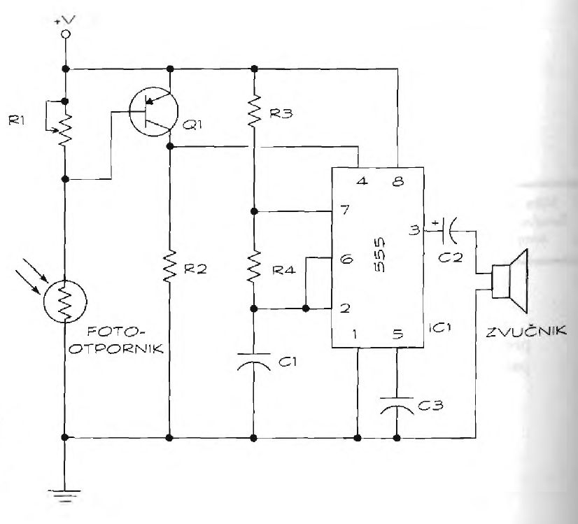

# Jutarnji alarm

Ako dođe svetlo, alarm se uključuje. Ovaj alarm može biti koristan u različitim situacijama:
* Stavite alarm u fioku (ili ostavu), da čuva vaše stvari. Ako neko otvori i svetlost uđe, alarm će zapištati.
* Stavite alarm pored prozora ako želite da se probudite u osvit zore.

## Šema

Srce projekta je tajmer LM555 koji se ponaša kao generator zvuka. Kada svetlost padne na fotootpornik, promena otpornosti uključuje tranzistor (Ql). To če aktivirati tajmer 555 koji će zapištati iz petnih žila. Osetljivost alarma možete podesiti pomoću potenciometra (Rl).

## Delovi

Evo liste delova alarma za svetlo:
* IC1: Tajmer LM555
* Q1: Tranzistor 2N3906 PNP
* Rl: Potenciometar 100K
* R2: Otpornik 3,9K
* R3: Otpornik 10K
* R4: Otpornik 47K
* Cl, C3: Blok kondenzator (nepolarizovani) od 0,01 pF
* C2: Elektrolitski ili tantalov (polarizovani) kondenzator od 1,0 pF
* Zvučnik: 0,5 vati, 8 oma
* Fotootpornik: Eksperimentišite s različitim veličinama; na primer, fotootpornik veće otpornosti povećaće osetljivost kola.
