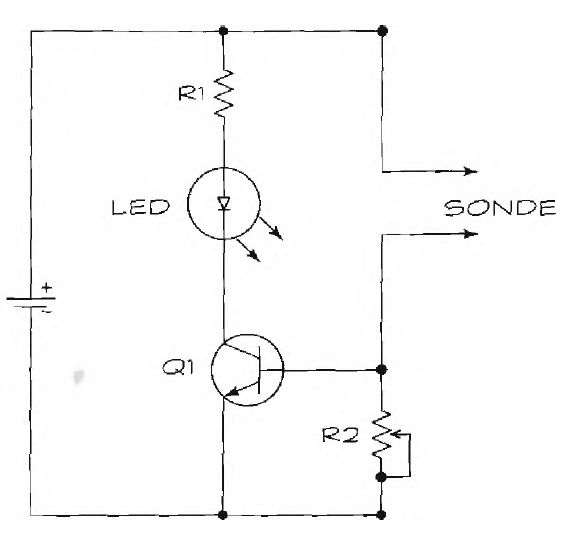

# Vlagomer

Sa meračem vlage možemo proveriti vlažnost tla i je li biljkama potrebno zalivanje.

Vlagomer je neviđeno jednostavan. Zasniva se na principu električne provodljivosti vode. Kada dva metalna izvoda stavimo u vlažno okruženje, usled provodljivosti vode zatvara se kolo. Struja uključuje tranzistor, a tranzistor svetleću diodu. Ako nema vlage, kolo nije zatvoreno, i LED ne svetli.

## Šema

Dva izvoda napravite od eksera. Postavite eksere na parče plastike, na rastojanju od oko 1,5 centimetara, da stoje paralelno. Zakucajte eksere u plastiku da je probiju, da mogu prodreti duboko u ispitivani materijal. Osetljivost merača podešavajte pomoću potenciometra (R2).

Vlagomer radi s naponom od 5 do 12 volti, dakle može baterija od 9 volti.

## Delovi

- Tranzistor 2N2222 NPN (Ql)
- Otpornik od 470 oma (R1)
- Potenciometar 50K (R2)
- LED dioda
- Dva eksera, dužine oko 4 cm (sonde)
