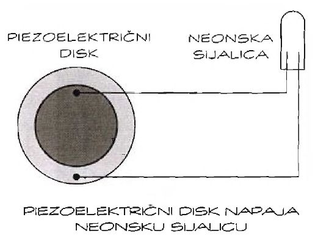

# Piezo-električni bubanj

Ovaj projekat sam stvara struju za sebe. U pitanju je svetlosni bubanj - neonsko svetlo sine kada udarimo piezoelektrični disk.

Reč *piezo* je grčka i znači „stisnuti“, „iscediti“. Pre mnogo godina, naučnici su otkrili su da se snažnim pritiskom na određene kristale može dobiti struja. Ispostavilo se da je to bilo važno otkriće, jer se piezoelektricitet danas koristi u nebrojeno mnogo uređaja, poput kvarcnih satova, alarma, startera za električni roštilj i mnoštva drugih spravica.

## Uputstvo

Običan piezoelektrični disk dovoljan je da na jednostavan i zabavan način eksperimentišete sa piezoelektricitetom. Kupite disk za koji su već zalemljene dve žice. Na slici prikazano je kolo s diskom i neonskom sijalicom (neonsku sijalicu možete kupiti u prodavnicama elektroopreme). Neonske sijalice se neće upaliti ako ih ne priključite na makar 90 volti. To je jaka struja! Ali, piezoelektrični disk lako će proizvesti toliki napon.

Da bi napravili kolo sa slike, sledite naredne korake:
1. Postavite disk na izolovanu površinu. Odgovarace drvena ili plastična tabla; nemojte koristiti metalnu površinu.
2. Povežite disk i neonsku sijalicu pomoću para kablova sa metalnim štipaljkama. Jednim kablom povežite crvenu žicu diska s jednim izvodom neonske lampe. Drugi kabl povezuje crnu žicu diska sa drugim izvodom neonske sijalice.
3. Položite disk na podlogu.
4. Blago udarite disk plastičnim krajem odvijača. Kad god udarite disk, neonska sijalica zasvetli.

Izbegavajte konktakt sa dve žice koje polaze od diska. Premda strujni udar nije opasan, nećete se osećati prijatno!

Znate li kako da iskoristite ovo da zadivite porodicu i prijatelje? Dve reči - svetlosni bubanj!

Zadivite prijatelje svojim svetlosnim bubnjem koji ćete napraviti na sledeći način:
1. Naređajte tuce piezo diskova i neonki naizmenično jedne do drugih.
2. Parove disk-neonka zalepite trakom ili lepkom za plastičnu osnovu.
3. Nabavite par palica za bubnjeve, zamračite sobu i lupajte po diskovima u ritmu omiljene pesme.

## Delovi

Za eksperiment sa piezoelektricitetom treba vam tek nekoliko komponenti:
* običan piezoelektrični disk (po mogućstvu sa dve zalemljene žice)
* neonska sijalica
* par metalnih štipaljki
* palice
