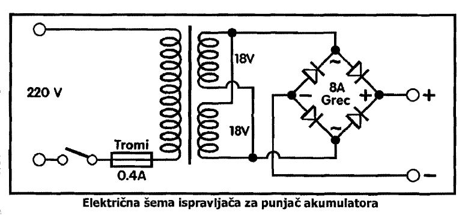
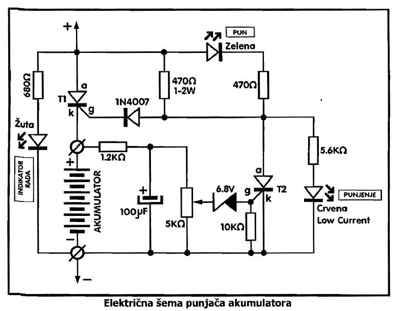
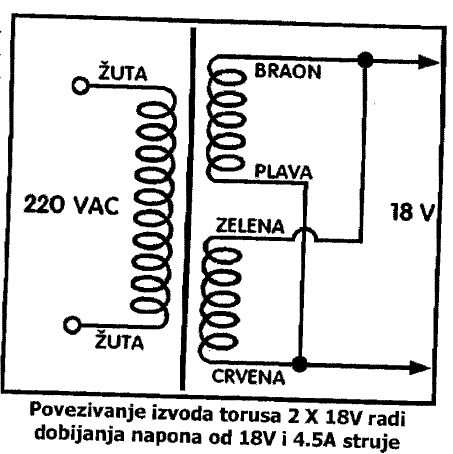
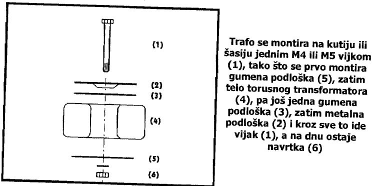

# Automatski punjač za akumulator

Automatski punjač akumulatora se automatski isključuje kada se akumulator napuni. Akumulator se puni do nekih 14V i tada ga treba isključiti. To u automobilu radi regler.

Sve to rade dva tiristora, jedna dioda i jedna zener dioda uz nekoliko otpornika. 

## Šema

### Ispravljač

Osnovu punjača čini ispravljač. On je standardan, tu su prekidač za uključenje na gradsku mrežu i osigurač torusni trafo 2 x 18V, 2 x 2.25A, grec ispravljač od 8-10A. Na desnoj strani šeme, imamo dve veze, plus i minus kojima trebamo da se povezemo sa sledećom šemom. 

### Regulator

Drugi deo automatskog punjača čini regulator sa indikatorima:

Osnovna funkcija je jednostavna - sam se uključuje, sam se isključuje. U principu to je jedna klackalica, koja se sastoji iz dva tiristora od kojih je Tl, jači, predviđen za ukopčavanje akumulatora. Drugi, T2, je slabiji koji se nalazi na našoj tiristorskoj klackalici. Klackalica se podešava u ravnotežu pomeranjem oslonca na levo ili na desno. Mi to radimo sa trimer potenciometrom i Zener diodom 6.8V. Jednostavno namestimo do kog napona se akumulator puni, odnosno kada se akumulator isključuje sa punjača.

Imamo i tri LE diode. Žuta pokazuje kada je punjač priključen na gradsku mrežu. Zelena pokazuje kada je akumulator pun i kada je skinut sa punjača. I najzad crvena LE dioda pokazuje kada se vrši punjenje akumulatora. 

Trimer potenciometrom se inicijalno podesi kada je akumulator pun. Za to trebamo voltmetar da merimo napon akumulatora. Kada postigne 13.5-14V, sigurno je pun. Najjednostavnije podesavanja ovog trimera je uzeti akumulator iz auta posle duže voznje i spojiti ga na punjač. Posle desetak minuta punjenja treba potenciometar podesiti da upali zelenu LED diodu koja kaze pun akumulator.

Može se punjaču ugraditi i ampermetar 5-15 A za kontrolu struje punjenja. On se montira iznad anode tiristora Tl, ka strelici "plus". Na njemu se može primetiti da struja punjenja ne prestaje trenutno, nego lagano, postepeno. To se opaža i po ledovima zelenom i crvenom koji znaju da svetle istovremeno, trepere i kolebaju se par minuta.

Na tiristoru T1 imamo pad napona od 1.5V. Sa strujom od 5A to je dovoljno da se tiristor greje. Da se ne bi grejao pričvrstite ga vijkom za metalnu kutiju punjača i svakako dodajte malo silikonske paste radi boljeg odvođenja toplote. Neki specijalni hladnjak nije potreban.

Transformator je predviđen za unutrašnju montažu u horizontalnom ili vertikalnom položaju, na suvom mestu gde je obezbeđena cirkulacija vazduha, dalje od izvora toplote. Montaža se vrši odgovarajućim priborom ili lepljenjem za podlogu silikonskim gitom. Budite pažljivi, obzirom da je transformator ekstremno osetljiv na mehanička oštećenja.

## Delovi

- T1, Tiristor, 12A, TIC126
- T2, Tiristor, lA, T106
- D, Dioda 1N4007
- Z, Zener dioda l.4W, ZY6.8V
- LE dioda, žuta
- LE dioda, zelena
- LE dioda, crvena
- P, Trimer potenciometar, veliki, 5 KΩ
- C, Elektrolitski kondenzator, stojeci, 100 μF, 25V min
- Otpornik, 2W, 470Ω (žuta-ljubičasta-braon-zlatna)
- Otpornik, 1/4W, 470Ω (žuta-ljubičasta-braon-zlatna)
- Otpornik, 1/4W, 680Ω (plava-siva-braon-zlatna)
- Otpornik, 1/4W, 1.2 KΩ (braon-crvena-crvena-zlatna)
- Otpornik, 1/4W, 5.6 KΩ (zelena-plava-crvena-zlatna)
- Otpornik, 1/4W, 10 KΩ (braon-crna-narandžasta-zlatna)
- Transformator 2 X 18V, 2 X 4A
- Grec 8A min
- Osigurač, tromi, O.4A
- Kućište osigurača
- Prekidač za uključivanje punjača
- Indikator, PM2, 100μA

Izvor: Mala škola elektronike (pdf, str. 81)