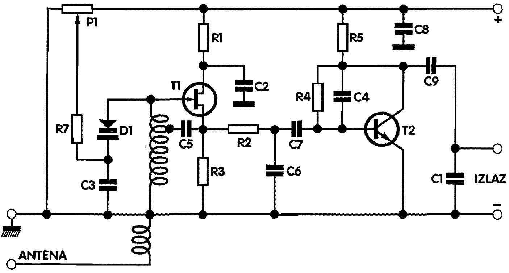
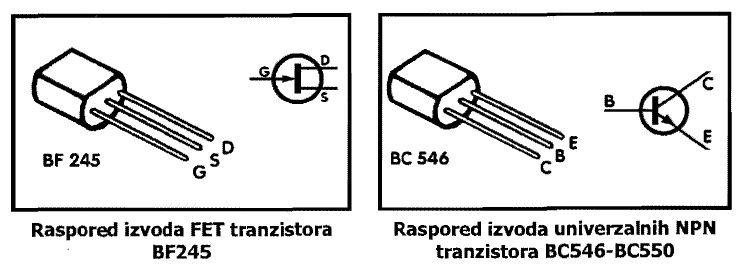

# FM Radio prijemnik

Prijemnik je predviđen za prijem FM stanica na frekvencijama od 82 do 145 MHz, tako da se pored običnih stanica mogu pratiti i vazduhoplovne, taxi i slične, kao i amaterske stanice. Jednako dobro prima i AM (amplitudno modulisane signale) kao i FM (frekventno modulisane signale). Kao antena služi komad zice. Moguć je priključak odgovarajuće spoljne antene, čime će se čujnost prijemnika uveliko povećati.

Napajanje prijemnika je iz baterije ili ispravljača 9 do 25 Volti. Potrošnja je minimalna. Osetljivost prijemnika je ispod 1 mikrovolta a niskofrekventni izlaz je 40 mW, što je dovoljno za slušanje na slušalicama impendanse 1-2 KΩ. Za prijem na zvučnik preporučujemo pojačavač.

Podešavanje frekvencije prijemnika vrši se sa varikap (kapacitivnom) diodom BB105G ili BB205G. Kapacitet ove diode, koja je preko kondenzatora C3 spojena paralelno kalemu oscilatornog kola, menja se promenom napona na diodi sa trimer potenciometrom P1 i zastitnim otpornikom R7. Radi lakšeg podešavanja trimer potenciometar se može zameniti sa potenciometrom sa ručicom.

> Što je napon veći, kapacitet varikap diode je manji, pa je frekvencija oscilatornog kola viša. Zapamtimo i za kalem - što je kalem manji, frekvencija oscilatornog kola je viša.

Kalem je na pločici kratkom vezom skraćen za jednu četvrtinu. Ako ga skratimo za ceo namotaj možemo primati i amaterske stanice na 145 Mhz.

Prvi tranzistor je FET tipa i spojen je kao audion sa super-reakcijom. On ima vrlo veliko pojačanje.

Drugi tranzistor, T2, spojen je kao NF pojačavač i omogućava prijem u slušalicama. Naravno, da ne zaboravite da stavite kratkospojnik na za to predviđeno mesto!

Radio prijemnik se može ugraditi u kutiju po izboru.

## Šema

## Delovi

- Kondenzatori, keramički, 2.2 nF ( C1,C2,C3,C4 ) obelezen sa 222 x 4
- Kondenzatori, keramički, 10 nF ( C5, C6 ) obelezen sa 103 x 2
- Kondenzatori, multilejer, 100 nF ( C7 , C8, C9 ) obelezen sa 104 x 3
- Trimer potenciometar 10 KΩ
- Otpornik R1, 100 Ω, braon-crna-braon-zlatna
- Otpornik R2, 1.5 KΩ, braon-zelena-crvena-zlatna 
- Otpornik R3, 3.9 KΩ, narandžasta-bela-crvena-zlatna 
- Otpornik R4, 1 Ω, braon-crna-zelena-zlatna 
- Otpornik R5, 10 KΩ, braon-crna-narandžasta-zlatna 
- Otpornik R7, 56 KΩ, zelena-plava-narandžasta-zlatna 
- Varikap dioda BBI05G ili BB205G 
- FET tranzistor BF245 (Tl) 
- Tranzistor BC550 (T2)

