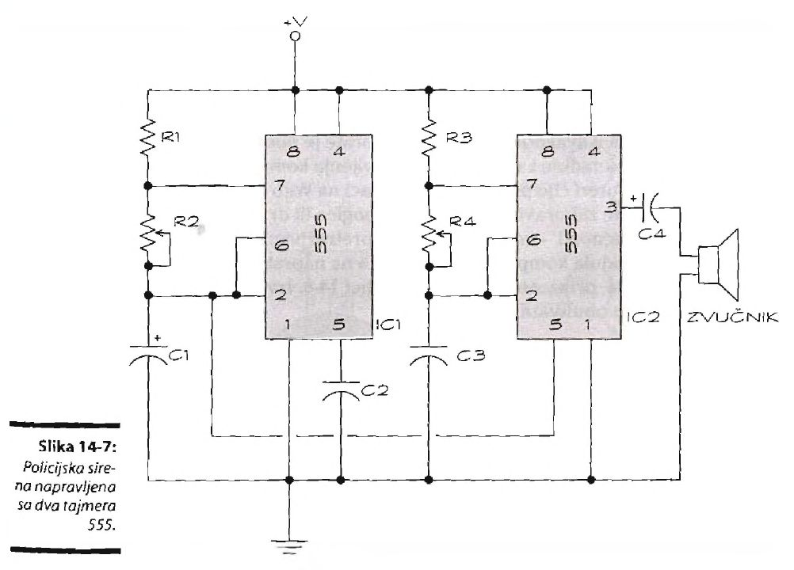

# Sirena

Ovo kolo koristi dva tajmera 555. Oba ćete upotrebiti kao *astabilne multivibratore*, što znači neprestano će menjati izlazni signal od niskog do visokog. Dva tajmera rade na različitim frekvencijama. Desni tajmer sa slike proizvodi čujne tonove. Ako njegov izlazni signal odvedete na zvučnik, čućete postojan ton srednjeg tonaliteta. Izlazni signal čipa 555 sleva - ton koji se sporije menja iz nižeg u viši i obrnuto - povezuje se s pinom 5 čipa 555 na desnoj strani slike. Zvučnik se povezuje sa izlaznim signalom čipa 555 na desnoj strani.

Podesite dva potenciometra, R2 i R4, da menjaju visinu i brzinu zavijajućeg zvuka sirene. Kada podesite vrednosti ova dva potenciometra moći ćete da proizvedete različite varijante sirene i druge zanimljive zvučne efekte. Ovo kolo može da radi s bilo kojim naponom između 5 i 15 volti.

## Spisak delova

Ako hoćete da iritirate komšiluk alarmom, kupite naredne komponente:
* IC1, IC2: Integrisano kolo, tajmer 555
* Rl, R3: Otpornik od 2,2 kilooma
* R2: Potenciometar od 50 kilooma
* R4: Potenciometar od 100 kilooma
* Cl: Elektrolitički (polarizovani) kondenzator od 47 pF
* C2: Blok kondenzator (nepolarizovani) od 0,01 pF
* C3: Blok kondenzator (nepolarizovani) od 0,1 pF
* C4: Elektrolitički ili tantalov (polarizovani) kondezator od 1 pF
* Zvučnik: 1 vat, 8 oma
