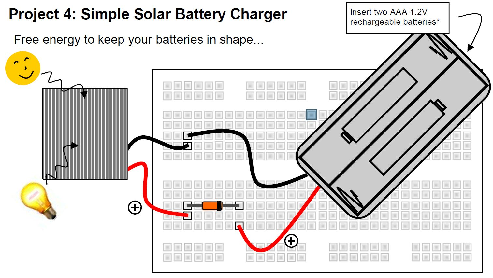
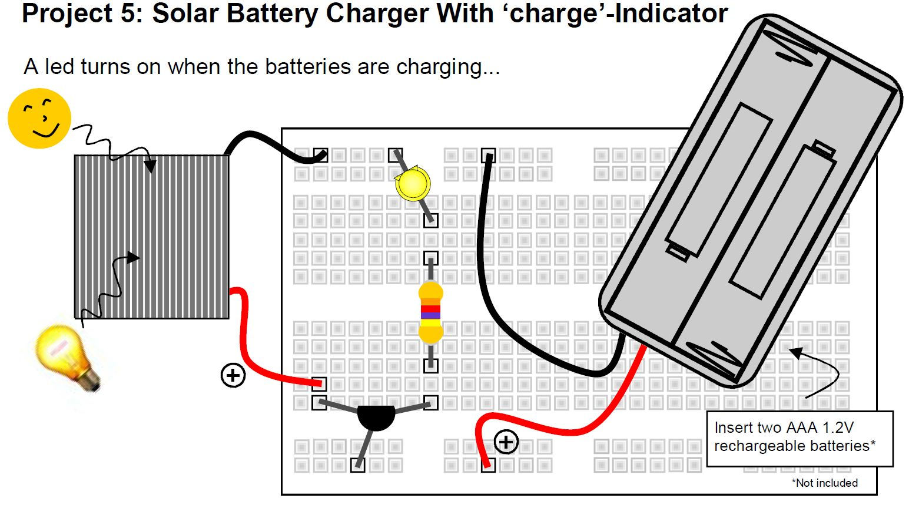
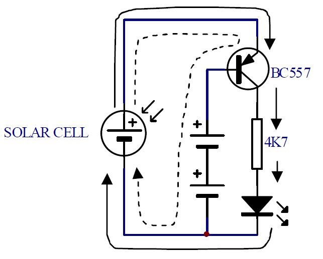

# Prost solarni punjač



Sve dok je solarna ćelija izložena svetlosti, struja će proticati iz solarnih ćelija kroz diodu do baterija i nazad do solarnih ćelija. Dioda sprečava pražnjenje baterija kroz solarnu ćeliju (npr. noću), jer dozvoljava prolaz struje samo u jednom smeru.

## Delovi

- solarna ćelija
- BAT85 dioda
- držač za dve AAA baterije
- dve AAA 1.2V punjive baterije

## Vreme punjenja

Na primer, ako baterije imaju kapacitet 360mAh, a solarna ploča struju od 30mA, puniće se:

```
360mAh / 30mA = 12 časova
```

# Solarni punjač sa indikatorom



LED se pali kada se baterije pune.

## Šema



Kada sunce sija, struja teče od (+) solarne ćelije preko emitera/baze tranzistora kroz baterije i nazad do solarne ćelije. To je bazna struja, označena isprekidanom linijom. Činjenica da struja teče između emitera i baze uzrokuje da se tranzistor uključi i potpuno provodi, kao da je prekidač. Dakle, struja može teći iz solarne ćelije preko tranzistora emitera/kolektora i otpornika do LED diode i nazad do solarne ćelije. Ova struja čini da LED dioda svetli (puna linija).

## Delovi 

- solarna ćelija
- BC557 tranzistor
- 4K7 otpornik (žuta, ljubičasta, crvena, zlatna)
- LED dioda
- držač za dve AAA baterije
- dve AAA 1.2V punjive baterije
