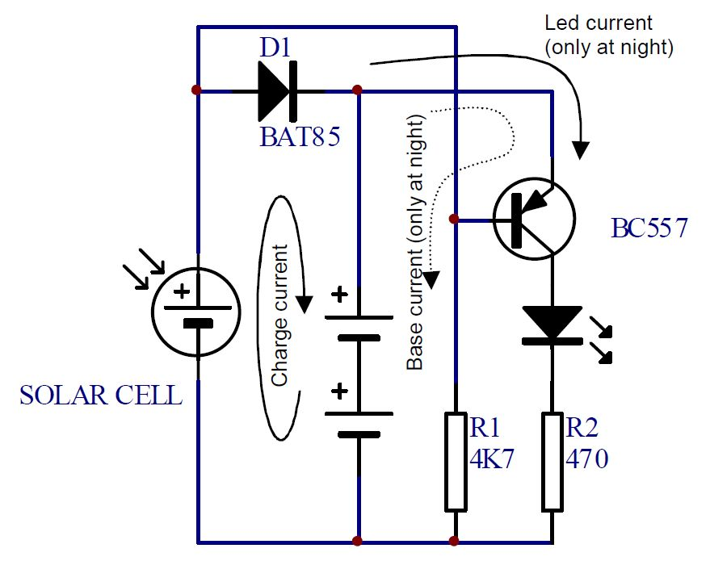

# Solarno baštensko svetlo

Led turns on at dusk and turns off at dawn.

## Delovi

- solarna ćelija
- BC557 tranzistor 
- 4K7 otpornik (žuta, ljubičasta, crvena, zlatna)
- 470 oma otpornik (žuta, ljubičasta, braon, zlatna)
- BAT85 dioda
- LED dioda 
- držač za dve AAA baterije
- dve AAA 1.2V punjive baterije

## Šema

When the sun shines, the voltage generated by the solar cell will be higher than the voltage of the batteries, so a current will flow from the solar cell to the batteries. The BAT85 diode prevents discharging of the batteries trough the solar cell in low light conditions. 

The base of the transistor is tied to ground (-) by means of the 4K7 resistor. This causes the transistor to turn on and allows a current to flow from the batteries trough the transistor, the LED and via 470 ohm resistor back to the batteries. However, the base of the transistor is also tied to the (+) of the solar cell, so as long as the sun shines, the base of the transistor is kept high enough to prevent turn-on of the transistor.