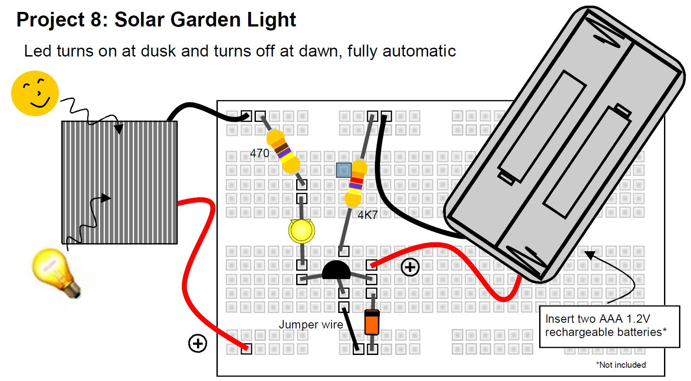

# Solarno baštensko svetlo

LED se uključuje u sumrak i gasi u zoru.

## Delovi

- solarna ćelija
- BC557 tranzistor 
- 4K7 otpornik (žuta, ljubičasta, crvena, zlatna)
- 470 oma otpornik (žuta, ljubičasta, braon, zlatna)
- BAT85 dioda
- LED dioda 
- držač za dve AAA baterije
- dve AAA 1.2V punjive baterije

## Šema

Kada sunce sija, napon koji generiše solarna ćelija biće veći od napona baterija, tako da će struja teći od solarne ćelije do baterija. BAT85 dioda sprečava pražnjenje baterija kroz solarnu ćeliju u uslovima slabog osvetljenja.

Baza tranzistora je vezana za masu (-) pomoću otpornika 4K7. Ovo dovodi do uključivanja tranzistora i omogućava struji da teče iz baterija kroz tranzistor, LED i preko otpornika od 470 oma nazad do baterija. Međutim, baza tranzistora je takođe vezana za (+) solarne ćelije, tako da sve dok sunce sija, baza tranzistora se drži dovoljno visoko da spreči uključivanje tranzistora.
