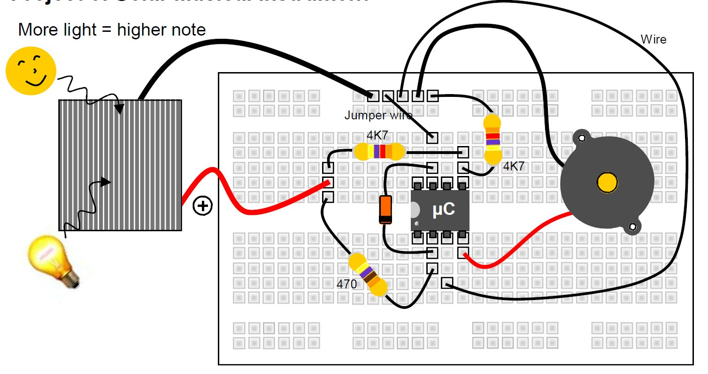
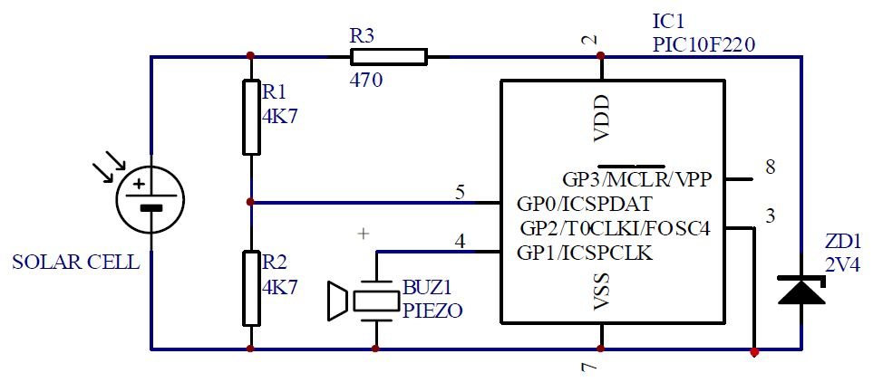

# Sunčev instrument

Solarna ćelija obezbeđuje napon napajanja za mikrokontroler. Kada primi 2V DC, počinje da pokreće svoj interni program.

Softver prevodi ulazni napon u audio frekvenciju (notu). Piezo sirena pretvara signal u zvuk. Uz malo vežbe, možete odsvirati melodiju tako što ćete mahnuti rukom ili baterijskom lampom iznad solarne ćelije.

## Delovi

- solarna ćelija
- mikrokontroler PIC10F220
- 2x 4K7 otpornik (žuta, ljubičasta, crvena, zlatna)
- 470 oma otpornik (žuta, ljubičasta, braon, zlatna)
- 2V4 zener dioda
- bazer (piezo sounder)

## Šema

Zener dioda i otpornik od 470 oma osiguravaju da napon napajanja kontrolera nikada ne prelazi 2,4 V, čak i na jakom suncu. Previsok napon može oštetiti uređaj. Napon koji generiše solarna ćelija se takođe deli na dva pomoću dva jednaka otpornika (4K7) i dovodi na analogni ulaz mikrokontrolera. Čak i na jakom suncu, ulaz ne dobija više od 4,5/2 = 2,25 V DC.

## Alternativna verzija

Bez solarnog napajanja: 
- Arduino 
- zvučnik
- fotootpornik

Za solarno napajanje treba još:
- solarna ploča
- baterija
- podizač napona
