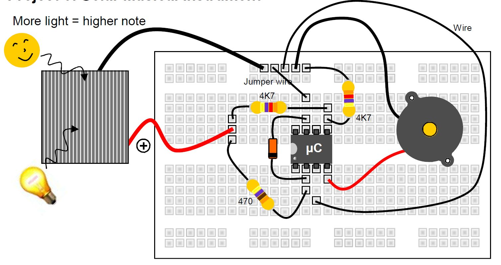

# Sunčev instrument

The solar cell provides the supply voltage for the microcontroller. Once it receives 2V DC it starts running its internal program. 

The software translates the input voltage to audio frequency (note). The piezo sounder converts the signal into sound. With a bit of practice, you could play a tune by waving your hand or a flashlight over the solar cell.

## Delovi

- solarna ćelija
- mikrokontroler (μC)
- 2x 4K7 otpornik (žuta, ljubičasta, crvena, zlatna)
- 470 oma otpornik (žuta, ljubičasta, braon, zlatna)
- 2V4 zener dioda
- bazer (piezo sounder)
- žice

## Šema

The zener diode and the 470 ohm resistor make sure the supply voltage of the controller never goes beyond 2.4V, even in bright sunlight. A too high voltage can damage the device. The voltage generated by the solar cell is also divided by two by means of two equal resistors (4K7) and fed to the analog input of the PIC. Even in bright sunlight, the input receives no more than 4.5/2 = 2.25VDC. 
